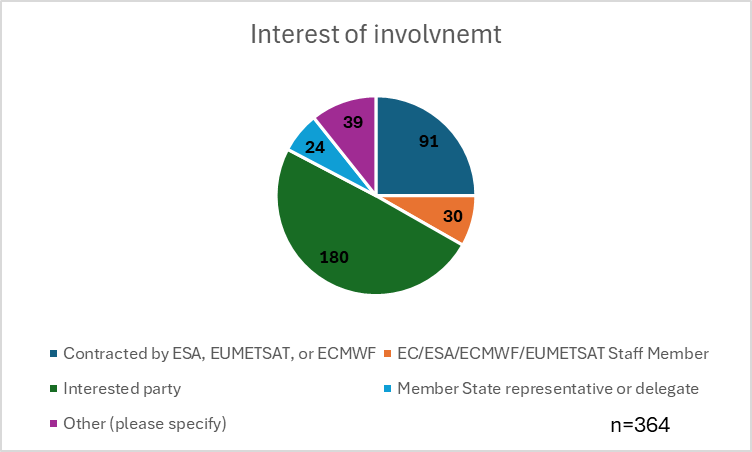
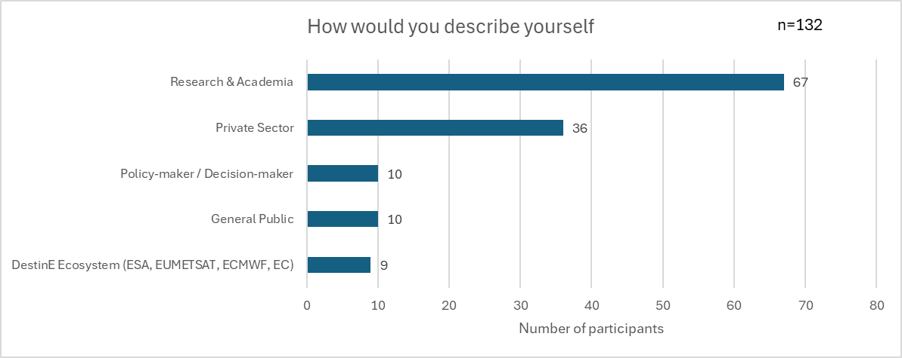
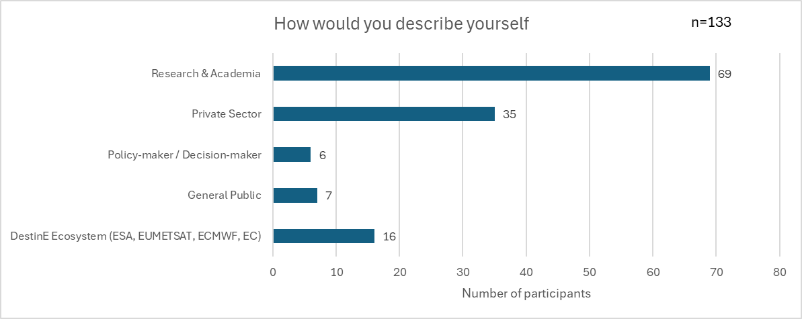
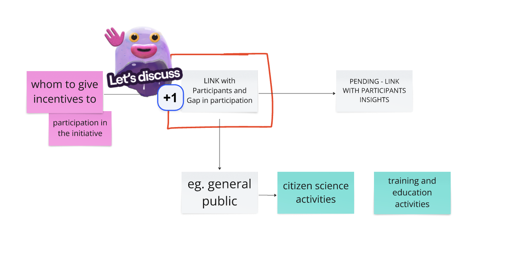

D2.3 ROADMAP FOR A WIDER DESTINE SYSTEM UPTAKE

<table>
<colgroup>
<col style="width: 28%" />
<col style="width: 71%" />
</colgroup>
<tbody>
<tr>
<td><strong>Lead Partner:</strong></td>
<td style="text-align: left;">Aristotle University of Thessaloniki
(AUTh)</td>
</tr>
<tr>
<td><strong>Reference:</strong></td>
<td style="text-align: left;">DEUC-RS-31-7</td>
</tr>
<tr>
<td><strong>Version:</strong></td>
<td style="text-align: left;">V5.1</td>
</tr>
<tr>
<td><strong>Status:</strong></td>
<td style="text-align: left;">Final</td>
</tr>
<tr>
<td><strong>Dissemination Level:</strong></td>
<td style="text-align: left;">Public</td>
</tr>
</tbody>
</table>

<table>
<colgroup>
<col style="width: 100%" />
</colgroup>
<tbody>
<tr>
<td style="text-align: left;"><strong>Deliverable Abstract</strong></td>
</tr>
<tr>
<td style="text-align: left;">This report presents a roadmap for
increasing the uptake of the Destination Earth (DestinE) Platform,
focusing on actionable recommendations informed by user engagement
activities, community input, and stakeholder feedback. Drawing from
workshops, webinars, conferences, and ideation challenges organized
under the DestinE Use Cases (DEUC) project, the report identifies key
themes critical to user adoption—such as co-design, communication,
training, data accessibility, and platform features. The analysis is
structured around ten strategic categories, each offering insights and
practical steps to bridge the gap between DestinE’s technological
potential and its effective use across research, policy, and operational
domains. The recommendations aim to support a more inclusive,
responsive, and impactful platform rollout that meets the diverse needs
of its current and future user base.</td>
</tr>
</tbody>
</table>

**  **

**COPYRIGHT NOTICE**

**DELIVERY SLIP**

<table>
<colgroup>
<col style="width: 20%" />
<col style="width: 34%" />
<col style="width: 19%" />
<col style="width: 26%" />
</colgroup>
<thead>
<tr>
<th><em>Date</em></th>
<th><em>Name</em></th>
<th><em>Partner/Activity</em></th>
<th><em>Date</em></th>
</tr>
</thead>
<tbody>
<tr>
<td>Prepared by:</td>
<td>Efstratios Stylianidis, Costas Bissas, Eleni Karachaliou, Anna
Dosiou, Zoi-Eirini Tsifodimou, Aikaterini Bakousi, Ioannis
Tavantzis</td>
<td>AUTh</td>
<td>21/09/2025</td>
</tr>
<tr>
<td>Reviewed by:</td>
<td>Antonio Romeo</td>
<td>Starion</td>
<td>21/09/2025</td>
</tr>
<tr>
<td>Approved by:</td>
<td>Antonio Romeo</td>
<td>Starion</td>
<td>21/09/2025</td>
</tr>
</tbody>
</table>

**DOCUMENT LOG**

<table style="width:98%;">
<colgroup>
<col style="width: 8%" />
<col style="width: 14%" />
<col style="width: 29%" />
<col style="width: 45%" />
</colgroup>
<thead>
<tr>
<th><em>Issue</em></th>
<th><em>Date</em></th>
<th><em>Comment</em></th>
<th><em>Author</em></th>
</tr>
</thead>
<tbody>
<tr>
<td>V1.0</td>
<td>31/07/2023</td>
<td>First Issue</td>
<td>Efstratios Stylianidis, Eleni Karachaliou, Aikaterini Bakousi</td>
</tr>
<tr>
<td>V2.0</td>
<td>12/07/2024</td>
<td>Second Issue</td>
<td>Efstratios Stylianidis, Costas Bissas, Eleni Karachaliou, Anna
Dosiou, Zoi-Eirini Tsifodimou, Aikaterini Bakousi, Ioannis
Tavantzis</td>
</tr>
<tr>
<td>V3.0</td>
<td>22/07/2024</td>
<td>Third Issue</td>
<td>Efstratios Stylianidis, Costas Bissas, Eleni Karachaliou,Zoi-Eirini
Tsifodimou, Aikaterini Bakousi, Ioannis Tavantzis</td>
</tr>
<tr>
<td>V4.0</td>
<td>30/5/2025</td>
<td>Fourth Issue</td>
<td>Efstratios Stylianidis, Costas Bissas, Eleni Karachaliou, Anna
Dosiou, Zoi-Eirini Tsifodimou, Ioannis Tavantzis, Ifigeneia Skalidi</td>
</tr>
<tr>
<td>V5.0</td>
<td>11/07/2025</td>
<td>Final Issue</td>
<td>Efstratios Stylianidis, Costas Bissas, Eleni Karachaliou, Anna
Dosiou, Zoi-Eirini Tsifodimou, Ioannis Tavantzis, Ifigeneia Skalidi</td>
</tr>
<tr>
<td>V5.1</td>
<td>21/09/2025</td>
<td>Edits after Final Review</td>
<td>Eleni Karachaliou, Antonio Romeo</td>
</tr>
</tbody>
</table>

**TERMINOLOGY**

<table>
<colgroup>
<col style="width: 26%" />
<col style="width: 73%" />
</colgroup>
<thead>
<tr>
<th><em>Terminology/Acronym</em></th>
<th><em>Definition</em></th>
</tr>
</thead>
<tbody>
<tr>
<td>DEDL</td>
<td>Destination Earth Data Lake</td>
</tr>
<tr>
<td>DESP</td>
<td>Destination Earth Service Platform</td>
</tr>
<tr>
<td>DestinE</td>
<td>Destination Earth</td>
</tr>
<tr>
<td>DG CNECT</td>
<td>EC’s Directorate-General for Communications Networks, Content and
Technology</td>
</tr>
<tr>
<td>EC</td>
<td>European Commission</td>
</tr>
<tr>
<td>ECMWF</td>
<td>European Centre for Medium-Range Weather Forecasts</td>
</tr>
<tr>
<td>Entrusted Entities</td>
<td>ESA, ECMWF and EUMETSAT</td>
</tr>
<tr>
<td>ESA</td>
<td>European Space Agency</td>
</tr>
<tr>
<td>EU</td>
<td>European Union</td>
</tr>
<tr>
<td>EUMETSAT</td>
<td>European Organization for the Exploitation of Meteorological
Satellites</td>
</tr>
<tr>
<td>3Es</td>
<td>Three Entrusted Entities</td>
</tr>
</tbody>
</table>

**Contents**

[1 Introduction [7](#introduction)](#introduction)

[2 Methodology [9](#methodology)](#methodology)

[**2.1** Activities where Users’ Community input was gathered
[9](#activities-where-users-community-input-was-gathered)](#activities-where-users-community-input-was-gathered)

[**2.2** Modes of user input
[10](#modes-of-user-input)](#modes-of-user-input)

[2.3 Organizing the User input
[11](#organizing-the-user-input)](#organizing-the-user-input)

[3 Insights from user engagement and reflections on community feedback
[15](#insights-from-user-engagement-and-reflections-on-community-feedback)](#insights-from-user-engagement-and-reflections-on-community-feedback)

[3.1 1st Destination Earth User eXchange
[15](#st-destination-earth-user-exchange)](#st-destination-earth-user-exchange)

[3.2 Roadshow Webinar 1: Participation and Upcoming Collaboration
Opportunities Today
[17](#roadshow-webinar-1-participation-and-upcoming-collaboration-opportunities-today)](#roadshow-webinar-1-participation-and-upcoming-collaboration-opportunities-today)

[3.3 Big Data in Space - BiDs - Ideating the Impact of DestinE: a
collaborative design session
[19](#big-data-in-space---bids---ideating-the-impact-of-destine-a-collaborative-design-session)](#big-data-in-space---bids---ideating-the-impact-of-destine-a-collaborative-design-session)

[3.4 2nd Destination Earth User eXchange- From Vision to Implementation:
Unravelling DESP interactive session
[20](#nd-destination-earth-user-exchange--from-vision-to-implementation-unravelling-desp-interactive-session)](#nd-destination-earth-user-exchange--from-vision-to-implementation-unravelling-desp-interactive-session)

[3.5 Roadshow Webinar 2: DestinE in action – meet the first DESP use
cases
[21](#roadshow-webinar-2-destine-in-action-meet-the-first-desp-use-cases)](#roadshow-webinar-2-destine-in-action-meet-the-first-desp-use-cases)

[3.6 2nd DestinE Platform Innovation Prize - Ideating the
Impact of the DestinE Platform – Online Challenge Launch
[22](#nd-destine-platform-innovation-prize---ideating-the-impact-of-the-destine-platform-online-challenge-launch)](#nd-destine-platform-innovation-prize---ideating-the-impact-of-the-destine-platform-online-challenge-launch)

[3.7 Leveraging Community Insights for Enhanced DEUC Contributions to
DestinE
[24](#leveraging-community-insights-for-enhanced-deuc-contributions-to-destine)](#leveraging-community-insights-for-enhanced-deuc-contributions-to-destine)

[3.8 EGU 2024 [28](#egu-2024)](#egu-2024)

[3.9 2nd DestinE Platform Innovation Prize - Ideating the Impact of the
DestinE Platform – presentation of winners
[28](#nd-destine-platform-innovation-prize---ideating-the-impact-of-the-destine-platform-presentation-of-winners)](#nd-destine-platform-innovation-prize---ideating-the-impact-of-the-destine-platform-presentation-of-winners)

[3.10 Roadshow Webinar 3: How DestinE can empower sustainable cities
[29](#roadshow-webinar-3-how-destine-can-empower-sustainable-cities)](#roadshow-webinar-3-how-destine-can-empower-sustainable-cities)

[3.11 1st Οnline Meeting of the Community of Practice (CoP) in Education
[30](#st-οnline-meeting-of-the-community-of-practice-cop-in-education)](#st-οnline-meeting-of-the-community-of-practice-cop-in-education)

[3.12 Roadshow Webinar 4: Renewable Energy Forecasting through the
DestinE Platform
[33](#roadshow-webinar-4-renewable-energy-forecasting-through-the-destine-platform)](#roadshow-webinar-4-renewable-energy-forecasting-through-the-destine-platform)

[3.13 Roadshow Webinar 5: UrbanSquare: DestinE Empowering Urban
Resilience Against Climate Challenges
[34](#roadshow-webinar-5-urbansquare-destine-empowering-urban-resilience-against-climate-challenges)](#roadshow-webinar-5-urbansquare-destine-empowering-urban-resilience-against-climate-challenges)

[3.14 QGIS User Conference 2024
[35](#qgis-user-conference-2024)](#qgis-user-conference-2024)

[3.15 3rd Destination Earth User eXchange
[37](#rd-destination-earth-user-exchange)](#rd-destination-earth-user-exchange)

[3.16 User Story Cards [39](#user-story-cards)](#user-story-cards)

[4 User Driven Recommendations
[43](#user-driven-recommendations)](#user-driven-recommendations)

[4.1 Participants [46](#participants)](#participants)

[4.2 Co-design [47](#co-design)](#co-design)

[4.3 Communication & Engagement
[53](#communication-engagement)](#communication-engagement)

[4.4 Networking [66](#networking)](#networking)

[4.5 Partnerships [70](#partnerships)](#partnerships)

[4.6 Incentives for community contribution
[72](#incentives-for-community-contribution)](#incentives-for-community-contribution)

[4.7 Training [77](#training)](#training)

[4.8 Platform [82](#platform)](#platform)

[4.9 Data [89](#data)](#data)

[4.10 Marketability [93](#marketability)](#marketability)

[5 Forward-looking recommendations
[96](#forward-looking-recommendations)](#forward-looking-recommendations)

[5.1 Co-design [**Error! Bookmark not
defined.**](#_Toc203484555)](#_Toc203484555)

[5.2 Communication & Engagement [**Error! Bookmark not
defined.**](#_Toc203484556)](#_Toc203484556)

[5.3 Networking [**Error! Bookmark not
defined.**](#_Toc203484557)](#_Toc203484557)

[5.4 Partnerships [**Error! Bookmark not
defined.**](#_Toc203484558)](#_Toc203484558)

[5.5 Training [**Error! Bookmark not
defined.**](#_Toc203484559)](#_Toc203484559)

[5.6 Platform [**Error! Bookmark not
defined.**](#_Toc203484560)](#_Toc203484560)

[6 ANNEX [99](#annex)](#annex)

Executive summary

The Destination Earth (DestinE) initiative represents a transformative
step in the European Union’s approach to leveraging advanced digital
technologies, Earth system models, and big data to support
decision-making in the face of climate change and other environmental
challenges. This roadmap presents a set of practical, targeted
recommendations for increasing the uptake and integration of the DestinE
Platform into professional, academic, business, and policy-making
workflows.

Drawing from a broad base of activities—including webinars, workshops,
conferences, ideation challenges, and user exchanges—this report
synthesizes community feedback, engagement outcomes, and observations
gathered over the course of multiple DestinE-related events. It
identifies current gaps and proposes clear, actionable paths forward to
bridge the divide between platform potential and real-world impact.

Key findings reveal that while there is a strong interest in DestinE,
current participation is heavily concentrated in the research and
academic communities. A broader engagement strategy is needed to include
more diverse users, such as policymakers, service developers, SMEs,
creative professionals, and other public and private stakeholders. This
report therefore emphasizes the importance of both internal and external
networking, incentives for community contribution, and user-centric
communication strategies.

The recommendations are presented across ten thematic categories:

- Participants – Understanding and expanding the user base beyond
  research institutions.

- Co-design – Positioning co-design as a method to include diverse
  perspectives in platform development.

- Communication & Engagement – Strengthening outreach with inclusive,
  transparent, and creative strategies.

- Networking – Facilitating both internal community ties and external
  cross-sector collaborations.

- Partnerships – Building new alliances to extend platform reach and
  relevance.

- Incentives for Community Contribution – Offering meaningful rewards
  and recognition to motivate user input and participation.

- Training – Developing accessible, targeted education pathways.

- Platform – Enhancing platform functionality, accessibility, and visual
  appeal to support broader use.

- Data – Ensuring quality, equity, and usability of data across domains.

- Marketability – Positioning DestinE’s unique value in a competitive
  digital ecosystem.

This roadmap is intended not only as a strategy document but as a call
to action. The success of DestinE will depend on its ability to
continuously integrate feedback, foster meaningful interactions, and
demonstrate tangible value to a wide range of users.

# Introduction 

The Roadmap for DestinE Platform Uptake is a forward-looking and
data-oriented document designed to guide the continued growth and
widespread adoption of the DestinE Platform. DestinE (Destination Earth)
represents a transformative step in Europe’s digital and environmental
ambitions—a platform that enables high-precision digital modelling of
the Earth to support climate adaptation, policy planning, and
environmental management. However, the success of DestinE depends not
only on its technical and scientific robustness, but also on its
usability, accessibility, and sustained engagement across its diverse
stakeholder community.

This roadmap focuses on practical and targeted recommendations that can
help increase awareness, foster user engagement, and promote the
integration of the DestinE Platform into professional, academic,
business and creative workflows. It aims to bridge the gap between
platform potential and real-world uptake by identifying what has been
done, what has been learned, and what still needs to be addressed moving
forward.

*Purpose and Scope*

The primary goal of this roadmap is to support the usability and
acceptance of the DestinE Platform among its current and future user
communities. It offers a structured overview of input collected so far
by the community, provides insights from implementation and user
engagement activities, and proposes a set of concrete recommendations to
enhance adoption in the years ahead.

*Intended Audience*

This document is primarily addressed to those involved in the
development, governance, and strategic oversight of the DestinE
initiative, including:

- The DestinE platform development teams responsible for user
  experience, service integration, and technical evolution.

- The three implementing entities—ESA, EUMETSAT, and ECMWF—each of which
  plays a critical role in shaping how the platform is delivered and
  positioned for uptake.

- European Union institutions, particularly those involved in digital
  strategy, environmental policy, and long-term funding frameworks, who
  are responsible for the broader vision and impact of the initiative.

*Methodology*

The roadmap was developed through a combination of internal team
analysis, stakeholder engagement, and structured reflection on past
activities conducted to promote platform uptake. It draws on feedback
gathered from workshops, events, and activities involving platform users
and community members. It leverages insights from team members working
on user engagement, communication, and platform development. It is
informed by metrics and qualitative outcomes related to awareness,
platform interaction, and user growth.

The structure of this document follows a clear logic, with each chapter
focusing on a different time dimension:

- Chapter 2 presents the methodology followed to (a) analyse the
  community feedback that was collected during the activities that DEUC
  project organized or participated in (b) translate this feedback into
  recommendations.

- Chapter 3 analyses insights and user feedback collected by all the
  activities held.

- Chapter 4 presents the recommendations generated by the users’
  feedback along with their status (implemented, in progress, etc.)

- Chapter 5 presents recommendations currently designated as 'candidate
  for the roadmap' items awaiting implementation. Each category details
  specific objectives, essential actions, and projected implementation
  timelines.

Through this structured and reflective approach, the roadmap seeks to be
both informative and actionable—supporting DestinE’s evolution from a
powerful digital tool to a widely adopted platform with real-world
impact.

# Methodology

The recommendations for the uptake of the DestinE platform have been
developed in a structured manner, incorporating feedback from users at
various stages. As DestinE continues to evolve rapidly, it is crucial to
actively consider the ideas, suggestions, and opinions of individuals
who will engage with the platform in different capacities—whether as end
users, service developers, platform operators, or other stakeholders.
This inclusive approach ensures that the platform’s growth is guided by
the needs and perspectives of those directly involved, leading to a more
effective and user-centered implementation.

## Activities where Users’ Community input was gathered

As part of its mission to support the uptake of the DestinE Platform,
the DEUC project has undertaken a series of targeted activities aimed at
disseminating the purpose of the initiative, raising awareness within
the broader DestinE community, and expanding its user base. These
efforts have not only focused on communication and outreach but have
also actively invited feedback and built on existing user experiences to
develop a rich understanding of how the platform is perceived, what
expectations exist among potential users, and how the community
envisions its future development.

In parallel, the DEUC project has taken part in a range of external
events and stakeholder engagements, enabling partners to interact with
diverse audiences across sectors and disciplines. These interactions
have helped shape the project's understanding of user needs and have
contributed to the formulation of concrete, user-informed
recommendations.

The following table (Table 1) outlines the key activities from which
insights and recommendations have been generated:

<table>
<caption>
Table 1: Activities that DEUC project organized or
participated in.
</caption>
<colgroup>
<col style="width: 8%" />
<col style="width: 5%" />
<col style="width: 17%" />
<col style="width: 35%" />
<col style="width: 18%" />
<col style="width: 15%" />
</colgroup>
<thead>
<tr>
<th style="text-align: left;"><strong>Year</strong></th>
<th style="text-align: center;"></th>
<th style="text-align: center;"><strong>Date</strong></th>
<th><strong>Event Title</strong></th>
<th><strong>Location</strong></th>
<th><strong>Organized by</strong></th>
</tr>
</thead>
<tbody>
<tr>
<td rowspan="5" style="text-align: left;">2023</td>
<td style="text-align: center;">1</td>
<td>15th of February</td>
<td>1st Destination Earth User eXchange</td>
<td>Frascati, Italy</td>
<td>External</td>
</tr>
<tr>
<td style="text-align: center;">2</td>
<td>19th of July</td>
<td>Roadshow Webinar 1: Participation and Upcoming Collaboration
Opportunities Today</td>
<td>online</td>
<td>Internal</td>
</tr>
<tr>
<td style="text-align: center;">3</td>
<td>6th of November</td>
<td>Big Data in Space - BiDs - Ideating the Impact of DestinE: a
collaborative design session</td>
<td>Vienna, Austria</td>
<td>External</td>
</tr>
<tr>
<td style="text-align: center;">4</td>
<td>13th of November</td>
<td>2nd Destination Earth User eXchange- From Vision to Implementation:
Unravelling DESP interactive session</td>
<td>Bonn, Germany</td>
<td>External</td>
</tr>
<tr>
<td style="text-align: center;">5</td>
<td>13th of December</td>
<td>Roadshow Webinar 2: DestinE in action – meet the first DESP use
cases</td>
<td>Online</td>
<td>DEUC project</td>
</tr>
<tr>
<td rowspan="10" style="text-align: left;">2024</td>
<td style="text-align: left;">6</td>
<td>20th of March</td>
<td>Ideating the Impact of the DestinE Platform – Online Ideation
Challenge</td>
<td>Online</td>
<td>DEUC project</td>
</tr>
<tr>
<td style="text-align: left;">7</td>
<td>26th of March</td>
<td>Leveraging Community Insights for Enhanced DEUC Contributions to
DestinE</td>
<td>Online</td>
<td>DEUC project</td>
</tr>
<tr>
<td style="text-align: center;">8</td>
<td>14-19 April</td>
<td>EGU 2024</td>
<td>Vienna, Austria</td>
<td>External</td>
</tr>
<tr>
<td style="text-align: center;">9</td>
<td>19th of June</td>
<td>Presentation of Online Ideation Challenge results &amp;
Networking</td>
<td>Online</td>
<td>DEUC project</td>
</tr>
<tr>
<td style="text-align: center;">10</td>
<td>25th of June</td>
<td>Roadshow Webinar 3: How DestinE can empower sustainable cities</td>
<td>Online</td>
<td>DEUC project</td>
</tr>
<tr>
<td style="text-align: center;">11</td>
<td>27th of June</td>
<td>1st Οnline Meeting of the Community of Practice (CoP) in
Education</td>
<td>Online</td>
<td>DEUC project</td>
</tr>
<tr>
<td style="text-align: center;">12</td>
<td>2nd of July</td>
<td>Roadshow Webinar 4: Renewable Energy Forecasting through the DestinE
Platform</td>
<td>Online</td>
<td>DEUC project</td>
</tr>
<tr>
<td style="text-align: center;">13</td>
<td>9th of July</td>
<td>Roadshow Webinar 5: UrbanSquare: DestinE Empowering Urban Resilience
Against Climate Challenges</td>
<td>Online</td>
<td>DEUC project</td>
</tr>
<tr>
<td style="text-align: center;">14</td>
<td>9-10 September</td>
<td>QGIS User Conference 2024</td>
<td>Bratislava, Slovakia</td>
<td>External</td>
</tr>
<tr>
<td style="text-align: center;">15</td>
<td>15-16 October</td>
<td>3rd Destination Earth User eXchange</td>
<td>Darmstadt, Germany</td>
<td>DEUC project</td>
</tr>
<tr>
<td style="text-align: left;">2023-2024</td>
<td style="text-align: center;">16</td>
<td colspan="4" style="text-align: center;">Collection of User Story
cards online or onsite in physical events</td>
</tr>
</tbody>
</table>

## Modes of user input

The input from participants of these activities was captured through
various means. Specifically, they have been captured through:

- Gathering quantitative statistics, such as demographics and location
  of participants.

- Disseminating online and offline questionnaires before, during and
  after selected activities.

- Hosting online interactive sessions on available platforms, e.g.
  Slido.

- Hosting and facilitating workshops designed to disseminate the
  platform and additionally gather recommendations.

- Designing material where users can reflect on their current needs and
  envision them met with the aid of the platform, e.g. printed and
  online version of “User Stories card”.

- Organising two Ideation Challenges where participants were invited to
  imagine the impact of the DestinE platform via delivering creative
  suggestions which imply recommendations.

- Hosting webinars which included Q&A sessions.

- Partaking in in-person conversations during physical community events.

Additionally, as the authors have been following the developments of the
Destination Earth initiative, understanding policies, politics,
developments and contributions from all three entities, they have been
trying to navigate the initiative’s progress and balance their
understanding in any given moment as the vastness of the initiative
plays out.

## Organizing the User input

The process of analyzing the Users’ Community Input to generate
recommendations was carried out in five systematic steps. In the first
step, all relevant information from each activity was thoroughly
documented. The second step involved analyzing this material to identify
emerging categories. In step three, the community input was reorganized
according to these categories, enabling a more structured approach. For
step four, this categorization facilitated the development of insights
specific to each area, which formed the foundation for step five: the
generation of final recommendations (Figure 1).

<figure>

<figcaption>
Figure 1: <em>From user input to recommendations: The
architecture for the development of recommendations in regards to the
DestinE Platform uptake in five steps</em>
</figcaption>
</figure>

In preparation for developing the Roadmap for the DestinE Platform
uptake and producing recommendations, the authors used an online
whiteboard (Miro) to place and organize the User input.

There, for steps 1 and 2 of the recommendation generation process, each
activity occupied its own own workspace section in Miro online tool
within which all information regarding the activity was congregated.
Leveraging the appropriate methods of user input stated in section 2.2,
per activity, the authors documented direct quotes, voiced comments and
written remarks by community members and activity participants. These
are color-coded as yellow post-it notes (Figure 2).

Additionally, as the authors combined direct quotes with other
inferences and knowledge regarding users and the DestinE initiative,
during and after the activities, they captured their own thoughts as
separate input. These data are color-coded as grey post-it notes.

Once all input was concentrated within each activity’s digital area -
yellow and grey post-its – they were clustered into groups of similar
themes for step 2. These themes have been named “categories”, and they
are color-coded as green wide post-it notes. The categories that emerged
from the analysis are as follows:

- Participants

- Co-design

- Communication & Engagement

- Networking

- Partnerships

- Incentives for Community Contribution

- Training

- Platform

- Data

- Marketability

 

Figure 2: *Αuthors working on two separate activities, placing yellow
and grey post-its (step 1), before clustering them under categories
(green post-its) for step 2 and generating early insights (pink
post-its)*

During the analysis for each activity in step 2, a number of similar
categories (green-post-its) emerged throughout. Thus, for steps 3 to 5
of the process, each category was given its own digital area in the
online whiteboard. Within this digital area, the authors gathered and
re-organized all user input and data that have been documented in all
activities. Thus, each category now had its own user data input from all
activities. Following, the authors were able to focus on each category
of input, across activities, to develop insights (step 4) and brainstorm
recommendations in step 5 (Figure 3).

Specifically, once all information of the category was concentrated in a
given area, this information was once again clustered as per the areas
of interest they indicated. This new clustering produced the author’s
insights, color-coded in pink wide post-its.

Following, each of these insights were used as starting points for the
brainstorming of recommendations. These recommendations are the final
deliverable for the DestinE Platform uptake, and are color-coded in
turquoise wide post-its.

<figure>

<figcaption>
Figure 3: <em>For the category “communication &amp;
engagement” (green post-it), user input and inferences from each
activity were placed within the top rectangle (step 3), clustered into
areas of interest producing insights (pink post-its) for step 4.
Following, for step 5, the insights were copied outside the rectangle,
and were used as brainstorming areas to develop recommendations for the
platform uptake (turquoise post-its).</em> 
</figcaption>
</figure>

# Insights from user engagement and reflections on community feedback

This chapter provides a comprehensive analysis of the valuable insights
gathered from past activities and engagement with the user community. It
delves into the feedback, observations, and data collected through
various methods and events, offering a clearer understanding of the
platform’s progress, challenges, and areas for improvement.

The analysis of results draws upon the community input captured through
multiple channels such as workshops, webinars, surveys, and ideation
challenges, each of which contributed to shaping a well-rounded picture
of how the platform is perceived, what users expect, and how they
envision its future development. By analysing the feedback, we can
identify key learnings that offer critical insights into the areas where
the platform has excelled, as well as areas that require further
attention and refinement.

In this chapter, we will present the insights gained from activity
participants and outline the key learnings derived from these insights.
These learnings will provide a solid foundation for the next phase of
the platform’s uptake strategy, guiding towards more informed decisions
and targeted actions that will help to increase awareness, foster user
engagement, and ensure the effective integration of DestinE across
various sectors.

<table>
<colgroup>
<col style="width: 100%" />
</colgroup>
<thead>
<tr>
<th><em>Note: Many of the events were held before the launch of DestinE
Platform and its subsequence updates.</em></th>
</tr>
</thead>
<tbody>
</tbody>
</table>

## 1st Destination Earth User eXchange

### Activity description

The first Destination Earth User eXchange was held on 15 February 2023
at ESA’s Centre for Earth Observations in Frascati, Italy, co-organised
by ESA, EUMETSAT, and ECMWF. This inaugural event marked the launch of a
regular forum aimed at fostering dialogue among DestinE stakeholders,
with the goals of sharing progress updates, identifying potential
partners, and building an engaged user community. The event saw strong
participation, with over 100 attendees onsite (limited by venue
capacity) and more than 300 joining virtually, representing 30
countries—including 23 EU Member States—with notable engagement from
Germany and Italy. Participants spanned government bodies, academia,
national meteorological and hydrological services, and industry. This
User eXchange initiated DestinE’s “open stakeholder dialogue,” a
cornerstone of its user engagement strategy, and revealed a high level
of interest across sectors. Presentations by ECMWF, ESA, and EUMETSAT
showcased the development status of DestinE’s core components after the
project’s first year. Participants welcomed the early engagement
opportunity and expressed strong expectations for the platform,
particularly its potential as a digital decision-support tool for
climate resilience. However, discussions also highlighted concerns
regarding system complexity, the need for user training and technical
support, and the importance of providing clear avenues for continued
stakeholder engagement from the outset.

### Community input

The input was gathered by the notes kept by DEUC project during the
event, the comments to a questionnaire that was shared to the community
before the event, and the report that followed the event. The identified
emerging categories for this include:

- **Platform**

It is clear from the community’s feedback that there is a significant
need for a “platform-space” that is specifically tailored to the unique
needs of its community. Such a dedicated space would foster stronger
connections, enhance engagement, and offer more relevant resources for
users. This community-focused platform could serve as a central hub for
collaboration, knowledge sharing, and interaction, ultimately improving
the overall user experience and promoting sustained engagement.

<table>
<colgroup>
<col style="width: 100%" />
</colgroup>
<thead>
<tr>
<th><em>Note: During the 1st User Exchange event the DestinE
Platform was still under development and thus users did not know at that
time much information about the platform.</em></th>
</tr>
</thead>
<tbody>
</tbody>
</table>

- **Training**

Training opportunities have emerged as a priority for many community
members, ranking second in importance when it comes to enhancing
platform engagement. Feedback highlights a clear demand for more
accessible and effective training resources, underlining the need for
ongoing educational material that supports users at all stages of their
journey with the platform. The community has also expressed a strong
desire for a collaborative approach to training content development.
Significant interest was documented in co-creating training and
educational materials. This collaborative effort would not only enrich
the quality and relevance of the resources but also ensure that the
materials are aligned with the diverse needs of the community. To
facilitate the onboarding of a wider range of users and to support
sustained engagement, it will be important to expand and diversify
training offerings. A more structured and community-driven approach to
training will help foster deeper platform interaction, increase user
proficiency, and build a more knowledgeable and confident user base.

- **Networking**

Networking opportunities were identified as a key area of interest by
the community, with feedback showing that users value connections both
online and in-person. A hybrid approach to networking—combining online
platforms with physical or hybrid events—was highlighted as an effective
means of fostering stronger relationships within the community. Users
expressed a clear desire for spaces where they can interact with others,
share insights, and collaborate on projects. Such opportunities not only
build engagement but also allow for the exchange of ideas, making it
easier for individuals and groups to leverage the platform's full
potential.

- **Incentives for Community Contribution**

Incentives for community contribution were also emphasized in the
feedback, as users are keen to see more recognition for their
involvement. Members are interested in a variety of ways to be
incentivized for their contributions, such as through access to
exclusive resources, acknowledgment of their efforts, or even
opportunities for co-developing platform features or educational
materials. By offering incentives that align with users' motivations
(e.g. cultivate research synergies and collaborations among its
members), the platform can stimulate greater levels of participation and
engagement. This not only enhances user satisfaction but also promotes
the long-term sustainability of the community, as active contributors
are more likely to stay engaged and attract new users.

- **Communication & Engagement**

Community feedback highlights that users prefer receiving updates
through reliable, digital channels, such as email newsletters and
regular event-based communications. This preference underscores the
importance of maintaining a consistent and dependable stream of
information. A strong focus on digital communication, especially through
newsletters and regular event announcements, is key to keeping the
community informed and engaged. Additionally, users have shown a clear
preference for DestinE-specific events, indicating that there is
substantial value in hosting events tailored to the platform’s goals and
its community. These events—whether physical, online, or hybrid—serve as
a vital tool for driving awareness, facilitating networking, and
providing direct interaction with the platform’s offerings. To further
improve communication and engagement, there is a strong call for a
“digital space” dedicated to the community. This would provide a
centralized location for users to access resources, interact with other
members, and participate in meaningful discussions. This would also
support the initiative’s long-term goal of increasing active
participation by fostering a space where users can easily contribute,
collaborate, and stay informed.

## Roadshow Webinar 1: Participation and Upcoming Collaboration Opportunities Today

### Activity description

This webinar, organized by the DEUC project, offered participants the
opportunity to explore ways for engaging with the DestinE initiative.
Focusing on co-development with users, the session highlighted how
DestinE is actively shaping its services to better meet the needs of
decision-makers across various sectors and geographic levels.

The webinar featured updates from ESA and its contractors, as well as
guest speakers from other Entrusted Entities who shared their progress
on different components of the initiative. Participants gained insights
into DestinE's collaborative approach and learned how they could play an
active role in influencing the platform's future development.
Additionally, the session introduced the new joint website, designed as
the primary communication and participation hub, where users can stay
informed and involved in the project's ongoing growth. This development
directly responds to feedback gathered during the first DestinE User
eXchange, where participants requested a more transparent and
centralised access point for updates and engagement.

<table>
<colgroup>
<col style="width: 100%" />
</colgroup>
<thead>
<tr>
<th>
Actions Taken Based on Prior Feedback:

<ul>
<li>
Launched joint DestinE website to serve as a centralised hub for
communication and participation (requested during 1st User
eXchange).
</li>
<li>
Increased transparency around project activities and user
involvement opportunities.
</li>
</ul></th>
</tr>
</thead>
<tbody>
</tbody>
</table>

The webinar has attracted a broad range of participants from diverse
sectors, with a significant portion coming from the research and
academic domains.

### Community Input

While this activity did not include a dedicated session for community
feedback gathering, valuable insights can still be derived by analyzing
the type of participants involved.

- **Participants**

<figure>

<figcaption>
Figure 4: Roadshow Webinar 1 – Participants’ interest of
involvement
</figcaption>
</figure>

Analysis of self-reported roles (Figure 4) shows that nearly half of
webinar and event attendees (48.1%, n = 186) identified as “Interested
party”—that is, external users keen to learn more about DestinE but not
formally affiliated with any Entrusted Entity. Those formally contracted
by ESA, EUMETSAT or ECMWF made up 17.6% (n = 68), while “Prospective
users” accounted for 15.0% (n = 58). Member State delegates represented
just 6.2% (n = 24), and a further 13.2% (n = 51) fell into an “Other”
category (including journalists, post-docs, students, and various
advisory or private-sector roles).

These figures highlight that broad external interest (Interested
parties + Prospectives = 63.1%) strongly outweighs institutional
participation, indicating significant untapped potential for formal
engagement. Core platform developers and Entrusted Entities
(ESA/EUMETSAT/ECMWF contractors) currently constitute under one-fifth of
the audience, suggesting opportunities to deepen and broaden internal
stakeholder involvement. Policy and government representation is low
(6.2%), suggesting a need for targeted outreach if DestinE aspires to
inform policy at national and EU levels. The “Other” segment
(13.2%)—though diverse—points to emerging interest from academia, media,
and niche experts, underlining the value of more finely tailored
communications and incentives for these groups.

The analysis of participant composition and engagement patterns also
highlighted the emerging need for structured co-design efforts. In
response, the Ideation Challenge as an initial step to initiate this
process and gather early co-design input was planned and implemented.

## Big Data in Space - BiDs - Ideating the Impact of DestinE: a collaborative design session

### Activity description

During the Big Data in Space conference, in Vienna, in November 2023,
the DEUC team organized a full day ideation challenge as part of the
first day of the conference’s program. As the platform was not live at
the time, the challenge posed to participants was to imagine a service
that uses capabilities of DestinE, inspired by a story handed to them,
which was based in the year 2050. Deliverables included a 5-minute
presentation and a presentation deck.

The proposals were judged based on their expected social impact, their
expected environmental impact, their novelty, their level of
feasibility, how well they fit with DestinE’s vision and how appropriate
they are presented through the visualised mock-up.

The awards presented were that of “**Most promising proposal”** - a
proposal that we can see happening from tomorrow morning, bringing a
fresh look into an unseen circumstance and **“Radical Realities”** - a
proposal that can have great impact on the lives of the people it serves
even if it cannot yet start materializing tomorrow morning, either due
to technical availability or people not willing to accept it in their
lives.

Judges represented EUMETSAT, ECMWF and RHEA Group (now Starion).

The activity was hosted as part of the conference’s program, scheduled
to take place a day prior to the main conference event. From the
individuals registering for the activity, 27 participants were selected
by the DEUC team to be part of the ideation challenge, 10 were chosen as
observers and 22 individuals remained in the waiting list.

.

After the event, a video was produced which, on the 2nd of
April 2025 counted 429 views on
[YouTube](https://www.youtube.com/watch?v=PUL9CW-pEwY).

### Community Input

The dissemination of the ideation challenge was solely dependent on the
conference program and no extra channel was available to DEUC to
communicate the challenge to conference participants. While the OSGEP
meetup was taking place concurrently in an adjacent room, the ideation
challenge was a non-data event located in a data conference, which might
explain the low turn-up rate. The emerging categories from this event
were:

- **Data**

One of the submitted proposals, in order to be somehow implemented would
need to use socioeconomic data, non-human data, crowdsourcing data from
different actors, eg animals and animal waste monitoring data.

- **Platform**

One of the proposals in the challenge proposed the use of Virtual
Reality and 3D imagery to immerse service users in simulations based on
real data.

- **Co-design**

Participants, in their feedback on the experience of the challenge noted
the importance of working in groups to produce results.

## 2nd Destination Earth User eXchange- From Vision to Implementation: Unravelling DESP interactive session

### Activity description

For the 2nd User eXchange organised by ECMWF in Bonn in
November 2023, the DEUC team followed the entire event and planned a
session to capture user needs in their day-to-day job function when the
platform was still not available, as well as capture their expectations
for the moment when the DestinE platform will be in operation. This data
was captured via a designed User Story Card, a printout handed out to
the event participants and also made available via an online form, after
the event.

Though the planned and prepared session did not take place due to its
onsite space allocation overlapping with the poster session and casual
drinks, the DEUC team disseminated printed stories and invited
responses. A total of 10 user cards were collected fully filled. These
User Story Cards have also been used in other activities and are
therefore discussed in a separate chapter (see section 3.18 of this
document).

### Community input

From following the full event, excluding User Stories Cards, the
following community input categories emerged

- **Platform**

Participants noted the importance of using data to tell stories, use
visual effects, animation and illustrations to make the platform content
more understandable, consider distilling the information in 10-point
checklists, showcase user driven solutions and consider the use of more
than climate data, eg, legislative or data regarding the larger context.
Additionally, they proposed the existence of material such as online
presentations made available on demand, a guide of good practices,
examples of what one can do on the platform and how, as well as make
resources available for scientists in order to help them combat
disinformation.

- **Data**

Participants mentioned the need for data to be harmonized but also for
the user to bring their own data into the services, to blend datasets
and manipulate data freely, to prove that DestinE Platform is not just
another data pool, but one can clearly see its added value.

- **Marketability**

Participants discussed whether the DestinE Platform provides reliable
and commercially valuable information, potentially supporting a
marketplace for services. However, one participant suggested that the
strategy should initially focus on attracting users through free access
before exploring monetization opportunities.

<table>
<colgroup>
<col style="width: 100%" />
</colgroup>
<thead>
<tr>
<th>Since then, several concrete steps have been taken in response to
such feedback, including the procurement of storytelling and data
harmonisation services, the early-stage design of a dedicated user space
on the platform, and the planning of webinars aimed at showcasing real
use cases to illustrate DestinE’s practical value.</th>
</tr>
</thead>
<tbody>
</tbody>
</table>

## Roadshow Webinar 2: DestinE in action – meet the first DESP use cases

### Activity description

The Roadshow Webinar: DestinE in Action – Meet the First DESP Use Cases
held on December 13, 2023, provided an opportunity to explore the
practical applications of the DestinE Platform (DESP). In this session,
participants learned about the first five use cases procured by ESA to
validate the platform, with a focus on sectors such as agriculture,
natural resource management, fisheries, and the polar area. Each use
case presented its approach to developing software applications that
leverage DestinE's data and services to create predictions that inform
climate change adaptation and extreme weather policy at various levels.
Attendees heard directly from the use case teams about their methods,
objectives, and the real-world impact they aim to achieve with DestinE.

The activity attracted 364 participants, with a significant portion
coming from the research and academic sectors (73%) Figure 5, and a
smaller number representing policy makers and the private sector. The
majority of participants identified as researchers or individuals from
academic institutions, with a notable presence from those working within
the DestinE Ecosystem. This indicates a strong interest from the
scientific community, especially in relation to earth sciences, climate
change, and environmental data.

The largest group, consisting of 180 participants (about 49%) Figure 6,
identified themselves as interested parties, representing a broad
spectrum of users and stakeholders outside the core entrusted entities.
Member State representatives or delegates accounted for 24 participants
– which is an increase in comparison to previous events, reflecting
governmental engagement in the initiative. Finally, 39 participants fell
under the “Other” category, which includes diverse roles and
affiliations, contributing to the richness of perspectives within the
community.

<figure>

<figcaption>
Figure 5: Roadshow webinar 2 – Type of
participants
</figcaption>
</figure>

<figure>

<figcaption>
Figure 6: Roadshow webinar 2 – Interest of
involvement
</figcaption>
</figure>

### Community Input

- **Participants**

The diverse representation from academic and research institutions
highlights the potential of the DestinE platform to play a critical role
in advancing research and policy decision-making related to climate
adaptation and sustainable development.

The participation data also reflects a need to expand the user base
beyond just researchers, as there is a clear opportunity to engage more
policy makers, industry professionals, and other stakeholders who can
help drive the platform's impact in diverse sectors. As a direct
response to this need, DEUC organised the 2nd ideation challenge.

## 2nd DestinE Platform Innovation Prize - Ideating the Impact of the DestinE Platform – Online Challenge Launch

### Activity description

In March 2024, a 2nd DestinE Platform Innovation Prize was
launched by the DEUC project. The platform was not publicly available
during this innovation prize. Following the footsteps of the
1st Ideation Challenge (see section 4.5 of this document),
this challenge was scheduled to run completely online, with multiple
touchpoints:

1.  a public presentation of the challenge, the DestinE Platform and the
    contribution of each entity (ECMWF, ESA and EUMETSAT),

2.  an online judging session among the Challenge judges and a DEUC
    facilitator, as well as

3.  an online session presenting the winning proposals, hosting
    presentations by the winners and leveraging input by the audience
    (for this activity, see section 4.12 of this document).

For this innovation prize, participants were given stories placed in the
year 2050, developed through foresight methods and were invited to
imagine a service that uses capabilities of DestinE that create a more
preferable future. The submissions did not necessarily need to be
feasible in the near future, and the imagination of the proposals was of
great importance.

Submitted proposals were judged based on their expected social and
environmental impact, their novelty, their level of feasibility, how
well they fit with DestinE’s vision and, how appropriate they are
presented through the visualised mock-up, judged by representatives from
EUMETSAT, ECMWF and SERCO.

The awards presented were that of “Most promising proposal” - a proposal
that we can see happening from tomorrow morning, bringing a fresh look
into an unseen circumstance, “Radical Realities”- a proposal that can
have great impact on the lives of the people it serves even if it cannot
yet start materializing tomorrow morning, either due to technical
availability or people not willing to accept it in their lives and
“BlueSky Proposal” - a proposal which stands out for its creativity and
the profound impact it could ultimately have, marking it as a truly
inspiring vision of the future, even if today it seems ambitious in
terms of feasibility.

In the public presentation of the challenge online, with a duration of 1
hour, from 121 participants in total, 74 (61.1%) were non DestinE
related, 11 (9%) were policymakers and 1 (0.8%) was non DestinE related
policymaker.

Once submissions were closed, the challenge had received five proposals,
with a total of 44 involved individuals. Four of the proposals occurred
from Greece and one from the Netherlands. Three submissions described
themselves as ‘Research and Academia’, one submission described
themselves as ‘Private Sector’ and one submission described themselves
as ‘General Public’. Interest to participate was expressed via email
from individuals and organisations which, however, were not eligible to
take part in the challenge, namely from Digital Twin Victoria (DTV), an
initiative by the Victorian Government in Australia and LocationHealth,
a startup based in Switzerland, which were participants of the EU
ClimAccelerator.

### Community Input

As the innovation prize concluded with the judged submissions, there are
emerging categories from the submissions themselves:

- **Participants**

The submitted proposals to the Innovation Challenge were far from
representative of the states of EU involved in developing the DestinE
initiative.

Participants described themselves mostly as Research and Academia. Less
participations came in from the Private Sector, the General Public and
none from Policy and Decision Makers.

- **Data**

The submissions indicate opportunities identified by participants
regarding the platform, that it might be a data supported sandbox for
cities, it may combine satellite and environmental data with AI to build
a chatbot and it can predict and be a mediator between extreme heat
events and first responders. Additionally, it might offer open services
and data for citizens to co-design their cities.

- **Platform**

Submissions showcased an interesting path in regards to the interaction
with the platform and its services, by using gamification, creating the
platform’s “voice” and even considering a user interface that can be
accessible to children.

<table>
<colgroup>
<col style="width: 100%" />
</colgroup>
<thead>
<tr>
<th>
<em><strong>Touchpoints</strong></em>

The organisation of an online innovation prize offered multiple
touchpoints between the community and the DestinE platform. From
presentations by DestinE experts, and the community inputting creative
and imaginative submissions, to the winners presenting their proposals
to the community, inviting their own network peers to be exposed to the
results and subsequently the platform, as well as engaging with DestinE
Platform developers to further discuss their proposals, this single
activity provided multiple opportunities for cross-pollination.
</th>
</tr>
</thead>
<tbody>
</tbody>
</table>

## Leveraging Community Insights for Enhanced DEUC Contributions to DestinE

### Activity Description

On 26 March, 2024 the first DEUC project’s Community Meeting was held
online, hosted by the Laboratory of Geoinformatics of Aristotle
University of Thessaloniki. The meeting served as a critical opportunity
to present the DEUC project’s goals and engage with the community. The
event was designed to incorporate user feedback, which is vital for the
development of a functional community that will support both the use and
further development of the DestinE Platform.

The meeting provided an overview of several key areas related to the
DEUC project. A strategic approach to fostering engagement, support, and
collaboration within the community was unveiled. This strategic plan
aimed to empower every member of the community to thrive and contribute
meaningfully to the platform’s development. Additionally, the meeting
addressed the core values and processes that guide the DEUC project
mission, emphasizing a collaborative approach that ensures focused and
purposeful interaction.

Another key topic of the meeting was the introduction of Communities of
Practice, which are groups focused on specific areas of interest. These
groups provide participants with an opportunity to deepen collaboration,
share knowledge, and sharpen their skills to support the broader mission
of the DEUC project.

Participants were invited to share their ideas, needs, and aspirations
regarding the potential of the DestinE platform and the effective
functioning of the DEUC project community. The most frequently mentioned
needs included the creation of more detailed documentation, including a
FAQ section and user support materials, as well as establishing clear
pathways for user participation. Attendees also emphasized the need to
facilitate networking, collaboration, and funding opportunities through
the platform. Furthermore, there were suggestions for including free and
diverse data sources, as well as a reliable bibliography to support
users’ work.

Additional feedback highlighted the demand for tools and data to model
anthropogenic impacts and their combined effects. There was also a
strong call for the organization of webinars, training courses, summer
schools, and conferences. Participants recommended expanding the range
of use case topics to increase the breadth of the platform’s
applications. Another key suggestion was the establishment of a forum
for community discussions was proposed, which would allow users to
interact, collaborate, and learn from one another.

The meeting was attended by a diverse group of participants, including
stakeholders from various sectors such as research, policy, and the
private sector, with research and academic representatives comprising a
substantial portion of the attendees.

<figure>

<figcaption>
Figure 7:” Leveraging Community Insights for Enhanced
DEUC Contributions to DestinE” - Type of participants
</figcaption>
</figure>

<figure>

<figcaption>
Figure 8: :” Leveraging Community Insights for Enhanced
DEUC Contributions to DestinE”- Interest of involvement
</figcaption>
</figure>

### Community input

The insights gained from this meeting can be categorised as follows:

- **Co-design**

Co-design is a central aspect of the DestinE platform's community-driven
development, and its success heavily relies on effective cooperation
among participants. One of the main challenges identified by the
community was the need to better understand how to cooperate and
collaborate effectively within the framework of the platform. The
concept of co-design, while compelling, requires that participants
clearly understand their roles and how to contribute meaningfully to the
collective process. Furthermore, community members expressed strong
motivation to be part of this collaborative effort, with many
highlighting the desire to take on active roles within the platform.
They emphasized the importance of having a clear path for participation
that defines roles, expectations, and opportunities for contribution. A
sense of belonging to a community and being part of a collective effort
are key drivers for sustained engagement, as participants want to feel
that their involvement directly contributes to the success and growth of
the platform. Incorporating these community motives and addressing the
challenges of cooperation will be crucial for fostering a productive and
dynamic co-design process. Ensuring that all participants have the
opportunity to contribute, while also providing a structured and clear
participation framework, will facilitate more active and meaningful
involvement in shaping the platform’s future.

- **Training**

Training remains a crucial area for enhancing user engagement and
ensuring the widespread uptake of the DestinE platform. The community
expressed a strong demand for accessible support and online training
resources. There is a clear expectation for detailed guidance on how to
access and use the platform effectively. Participants emphasized the
need for structured training that supports both newcomers and more
experienced users, ensuring that everyone can maximize their engagement
with the platform's capabilities. The community also expressed a desire
for more practical examples and realistic use cases. Users are looking
for concrete, actionable examples that showcase the platform's potential
in real-world scenarios. Providing practical guidelines, clear
instructions, and a robust understanding of how to implement use cases
will be critical. By offering these resources, the platform can better
equip users to apply their knowledge in relevant contexts, fostering
deeper engagement and more widespread application of the platform’s
tools. Thus, addressing these expectations—through comprehensive online
training, practical examples, and easily accessible support
materials—will be key to ensuring the platform’s success and broad
adoption across various user groups.

<figure>

<figcaption>
Figure 9: Screenshot from the slido poll run during the
event (a)
</figcaption>
</figure>

<figure>

<figcaption>
Figure 10: Screenshot from the slido poll run during the
event (b)
</figcaption>
</figure>

- **Communication & Engagement**

The community has emphasized the importance of effective communication
and engagement strategies to increase participation and ensure the
platform's success. There is a clear expectation for more knowledge
sharing, with users requesting better engagement and communication
methods. They highlighted the need to reach a broader audience,
particularly through in-person meetings and forums for open discussions.
These methods will help connect users with the platform more effectively
and foster a sense of belonging within the community. The community
expressed the need for more accessible and digestible information.

Another important challenge identified was the lack of clarity regarding
how to start or participate in the community. Users indicated that they
find it difficult to determine where to begin, which could lead to
frustration and disengagement. It is crucial to develop clearer pathways
for participation, ensuring that new users can easily identify how and
where to get involved.

There is also a strong desire to attract real users to the platform, not
just contributors. To do this, showcasing success stories and
demonstrating the platform’s real-world applications will be key.
Sharing impactful results and tangible outcomes will help build
credibility and encourage new users to join the community.

The feedback further suggested that additional engagement methods such
as social engagement on platforms, hosting summer schools, and setting
up private discussion channels or technical Q&A forums could help
increase interaction within the community. Users also expressed a desire
for a dedicated DestinE community platform where members can
collaborate, share knowledge, and stay informed about project
developments.

## EGU 2024

### Activity Description

The DEUC project actively participated in EGU24, hosted in April 2024 in
Vienna, Austria, by showcasing its work through two posters, providing
valuable insights into the ongoing work of the DestinE ESA Use Cases,
and the DEUC project community engagement. In addition to the posters,
the DEUC team engaged with participants at the dedicated ESA booth,
fostering conversations and collecting user story cards (see 3.16).
These cards are an essential component of the project’s engagement
strategy, allowing participants to share their thoughts, feedback, and
personal experiences with the platform.

### Community input

The feedback from this activity was processed and segmented as follows:

- **Platform**

> A significant challenge identified by the community is that the
> DestinE platform is perceived as a "black box," where its capabilities
> and functionalities are not fully transparent to users. This
> highlights a need for clearer communication about how the platform
> works and what makes it different from existing tools. While the
> platform offers advanced capabilities, it is crucial to define more
> explicitly what sets it apart from other tools currently in use. This
> will help users understand the unique advantages of the platform and
> why it is a valuable addition to their workflows.

- **Data**

> Users have highlighted accuracy and resolution as key challenges. The
> platform must ensure that the data it offers meets high standards for
> accuracy and reliability, particularly for applications in
> decision-making and policy development. In this context, metadata and
> data harmonization are crucial. Users have emphasized the need for
> accurate metadata to accompany datasets, ensuring that the data can be
> correctly interpreted and applied across various use cases.
>
> Another major concern is the homogeneity of the data provided, with
> users requesting uniform datasets that are consistent across different
> regions and time periods. To support diverse user needs, especially
> for large-scale environmental monitoring and climate change adaptation
> strategies, it is essential that the platform integrates data of high
> resolution and consistent quality.

## 2nd DestinE Platform Innovation Prize - Ideating the Impact of the DestinE Platform – presentation of winners

### Activity Description

As a follow-up activity from the 2nd Innovation Prize (see
section 3.6), in this online activity, the results of the prize were
presented to the community, with the winners having time to present and
describe their proposals. Following, the audience was engaged with an
online interactive tool in order to gauge the creative and diverse
thoughts that the winning proposals generated to them.

The 78 participants on this live activity have been amplified by the 140
views of the [recording](https://www.youtube.com/watch?v=EUO9gZ0Qe68)
hosted online and the 1288 views on the
[article](https://destination-earth.eu/news/latest-challenge-unveils-future-ideas/)
presenting the winners.

### Community Input

From the interactive tools used after the presentation of the winning
proposals of the 2nd Innovation Prize, the participating community
members brought the following categories forward.

- **Data**

Participating community members suggested the integration of “human
data” in the platform – i.e. data produced from people daily activities,
and develop links with local authorities.

- **Platform**

Some community members suggested the development of seamless
interactions for the users in the platform, and the thematic of urban
resilience as a direction.

- **Co-design**

The community members, upon being asked to share initiatives,
technologies or possible interested stakeholders with the winners,
responded by offering a number of stakeholders, showing diversity of
thinking but also willingness to contribute and further aid the
development of proposals.

## Roadshow Webinar 3: How DestinE can empower sustainable cities

### Activity Description

The Roadshow Webinar: How DestinE Can Empower Sustainable Cities, held
on June 25, 2024, introduced participants to CITYNEXUS—an innovative
urban planning tool powered by the DEUC project. Designed to address the
complex challenges of urban development, CITYNEXUS leverages advanced
data integration and AI-driven simulations to support decision-making in
cities like Copenhagen. The webinar showcased how the tool enables
dynamic "what-if" scenario planning, with applications in urban
sustainability, public health, and environmental resilience. The session
also explored the potential for scaling CITYNEXUS to other cities,
highlighting its role in fostering data-informed, community-focused
planning for a smarter, more sustainable urban future.

The webinar gathered 132 participants, with a significant representation
from the research and academic sectors (67 participants). There was also
participation from the private sector (36 participants) and a limited
number of policy makers (10 participants), highlighting a predominantly
academic and research-oriented audience. Of the attendees, a notable
portion (71.4%) were from outside the DestinE-related community,
indicating the potential interest and relevance of the platform to
broader audiences.

<figure>

<figcaption>
Figure 11: Roadshow webinar 3 – Type of
participants
</figcaption>
</figure>

<figure>

<figcaption>
Figure 12: Roadshow webinar 3 – Interest of
involvement
</figcaption>
</figure>

### Community Input

- **Participants**

> The participant composition underscores the continuing need to
> diversify outreach strategies, especially towards policy-making bodies
> and the private sector, to facilitate wider integration of DestinE
> solutions into urban planning and sustainability initiatives.

## 1st Οnline Meeting of the Community of Practice (CoP) in Education

### Activity Description

The first online meeting of the DestinE Platform Community of Practice
(CoP) in Education was held on 27 June 2024, gathering professionals
from various disciplines and educational institutions to explore the
potential applications of the DestinE platform. The event was attended
by post-secondary educators, predominantly from the field of Earth
Sciences, and participants were primarily from Greece, Germany, the
Netherlands, and Spain. This geographical diversity sparked meaningful
discussions about how the platform could be integrated into different
educational contexts, particularly in relation to Earth sciences. The
event was attended by a total of 131 participants. The majority of
participants were from Research & Academia, with 79 attendees, making up
the largest segment of the group. This was followed by representatives
from the Private Sector (18 participants) and the General Public (19
participants). A smaller group of Policy-makers/Decision-makers
attended, with 5 individuals present. In terms of the DestinE Ecosystem,
a total of 10 participants were affiliated with the DestinE Ecosystem
(ESA, EUMETSAT, ECMWF, and EC), representing a relatively small portion
of the overall attendees. A notable observation was that 94 participants
(71.7%) were not directly related to DestinE, which emphasizes the
platform’s broader appeal and potential to engage a wider audience. Of
the 131 participants, 3.8% (5 individuals) were policy-makers, with 2.2%
(3 individuals) being non-DestinE related policymakers.

<figure>

<figcaption>
Figure 13: 1st CoP on Education meeting type
of participants
</figcaption>
</figure>

After an initial survey, a 15-minute video presentation provided an
overview of the DestinE platform, showcasing its services and
capabilities. Following the presentation, participants used a
collaborative Padlet board to share their insights on several critical
questions, with feedback organized according to the level of education
they teach—primary, secondary, or higher education.

### Community Input

The feedback received during this activity was analysed and categorized
as follows:

- **Participants**

There is a clear call for the DestinE Platform to create activities that
are more open and geographically inclusive. Expanding the platform’s
activities to engage a broader, more diverse range of participants from
different regions would enhance its global relevance and foster more
inclusive participation. Moreover, there is a need to clearly identify
the platform’s geographic scope and how it plans to engage participants
from underrepresented areas. This will be crucial in ensuring that the
DestinE Platform can fully realize its potential in terms of
international collaboration and engagement.

- **UI/UX**

The discussions highlighted several important aspects related to the
UI/UX design of the DestinE platform. A key suggestion was to adapt the
UI/UX design to better meet the needs of students. A significant concern
raised was the lack of multilingual content within the platform.
Participants emphasized that providing content in native languages is
essential for inclusivity, ensuring that educators and students from
different regions can fully engage with the platform’s resources.

The need for more approachable language was also emphasized. Users
suggested that the platform's communication should move away from highly
specialized scientific discourse and instead use language that is more
accessible and friendly. This would make the platform more user-friendly
and welcoming, particularly for those new to the platform or younger
audiences.

Additionally, the potential of DestinE as a playful educational
environment was recognized.

- **Training**

The interaction with this CoP revealed a strong need for training to
effectively use the DestinE platform. Participants expressed that both
students and educators require training sessions to become familiar with
the platform’s services and data analysis capabilities. Specifically,
educators need training that focuses on preparing lessons and engaging
students with environmental issues, providing access to relevant data,
and equipping students with skills in data analysis and interpretation
to solve real-world problems.

A major concern raised by participants was the insufficient knowledge of
the platform among educators, which limits the platform’s potential for
integration into educational contexts. This lack of understanding
hinders educators’ ability to guide students effectively and integrate
the platform into their lessons. As a result, the need to organize
training sessions for educators emerged as a key priority. These
sessions should emphasize practical skills in service presentation, data
analysis, and interpretation, all geared toward solving real-world
issues.

Furthermore, participants pointed out the skill gaps among both students
and educators regarding data analysis and interpretation. This gap
represents a significant challenge in effectively leveraging the
platform’s full potential. The platform has the capacity to facilitate
the training of students, helping them tackle real-world problems by
enhancing their data literacy. However, to realize this potential, both
students and educators need to be properly trained.

- **Platform**

One key topic emerging from feedback is the need to clearly articulate
the unique advantages of the DestinE platform compared to other
platforms. There is a recognized need to communicate these benefits more
effectively, especially in the context of education. For educators to
embrace the platform, they must clearly understand how it connects
environmental issues and challenges with everyday classroom activities.
This connection could drive student engagement by providing access to
innovative data and tools, thereby enhancing awareness of pressing
environmental issues.

Additionally, there is a call for testing the platform in the classroom
to better understand how it functions in real-world educational
settings. This testing phase should be accompanied by adequate support
to address any challenges that may arise, ensuring that teachers and
students can maximize the platform's potential. As an educational tool,
DestinE could provide substantial benefits by linking environmental
issues to practical learning experiences, offering students access to
state-of-the-art algorithms, fostering research, and encouraging
collaboration across different disciplines.

Moreover, while the platform’s applications in Earth Sciences are clear,
there is also potential for its use in the Social Sciences. Educators in
this field noted that DestinE could be adapted to help students in these
disciplines engage with complex social data and environmental factors,
enhancing their ability to address social issues in socially responsible
ways.

## Roadshow Webinar 4: Renewable Energy Forecasting through the DestinE Platform

### Activity Description

The Roadshow Webinar: Renewable Energy Forecasting through the DestinE
Platform held on July 2, 2024, focused on how the DestinE platform can
enhance renewable energy forecasting. The session highlighted the
Destination Renewable Energy (DRE) project and the Hybrid Renewable
Energy Forecasting System (HYREF), which aims to improve the accuracy of
solar and wind energy predictions. As the world faces the challenges of
climate change, this webinar explored how HYREF leverages advanced data
sources, such as satellite observations and digital twins, to provide
more reliable energy forecasts. The session also discussed the future of
HYREF within the DestinE platform and its potential impact on the
renewable energy industry, emphasizing the importance of data-driven
solutions for a sustainable energy future.

The event attracted a diverse group of 133 participants, including
representatives from research and academia, the private sector, and
policy-making. Notably, a large portion of participants came from the
research and academic sectors, demonstrating significant interest in
renewable energy and data-driven approaches.

<figure>

<figcaption>
Figure 14: Roadshow Webinar 4 – type of
participants
</figcaption>
</figure>

<figure>

<figcaption>
Figure 15: Roadshow Webinar 4 -interest of
involvement
</figcaption>
</figure>

### Community Input

- **Participants**

There is a need for continued outreach to further engage policy makers
and industry professionals. Expanding the platform’s reach to these
groups will be essential for ensuring its broader adoption and practical
application in the renewable energy field.

## Roadshow Webinar 5: UrbanSquare: DestinE Empowering Urban Resilience Against Climate Challenges

### Activity Description

The UrbanSquare: DestinE Empowering Urban Resilience Against Climate
Challenges webinar, held on July 9, 2024, focused on UrbanSquare, a
powerful tool designed to support decision-makers in addressing
climate-related urban challenges. As cities increasingly face the
impacts of climate change, including heatwaves, urban heat islands, and
flooding, UrbanSquare provides a data-driven solution for assessing
urban climate risks and enhancing resilience. The webinar explored how
UrbanSquare leverages DestinE's Digital Twins to offer dynamic
simulations, combining short-term hazard assessments with long-term
planning. This enables stakeholders to manage immediate threats while
working toward sustainable urban futures. Additionally, the session
discussed UrbanSquare's future scalability, expanding beyond initial use
case objectives to tackle a broader range of urban climate issues.

The UrbanSquare webinar attracted 199 participants, with a majority
coming from the research and academic sectors. Of the total
participants, 77 were from research & academia, indicating a strong
interest in urban resilience and climate change solutions. Participants
also included policy makers, private sector professionals, and
contracted entities from ESA, EUMETSAT, ECMWF, and other relevant
organizations. Notably, 130 participants were from non-DestinE related
sectors, emphasizing the potential for the platform to engage broader
audiences outside of its core user base.

<figure>

<figcaption>
Figure 16: Roadshow webinar 5 – type of
participants
</figcaption>
</figure>

<figure>

<figcaption>
Figure 17: Roadshow webinar 5 – Interest of
involvement
</figcaption>
</figure>

### Community Input

This webinar did not include interactive sessions specifically aimed at
gathering feedback from participants. However, insights can still be
inferred from the composition of the audience.

- **Participants**

Once again, the majority of participants came from the research and
academic sectors, while representation from policy-making bodies and
other critical stakeholders remained relatively low. This indicates a
continuing need for strategic outreach efforts to broaden the platform's
appeal and actively involve diverse user groups beyond academia,
particularly policy-makers and industry professionals. Expanding the
participant base in this way will be crucial for maximizing the
platform’s practical impact in supporting urban resilience and climate
adaptation initiatives.

## QGIS User Conference 2024

### Activity Description

In September 2024, the DestinE Platform Use Cases (DEUC) project hosted
a workshop at the 2024 QGIS User Conference in Bratislava, Slovakia.
This workshop was designed to engage QGIS users and introduce them to
the potential applications of the Destination Earth (DestinE) platform
in their work.

During the DEUC workshop, the team provided an overview of the DestinE
initiative, explaining its goals and functionality. This workshop served
as a key opportunity to familiarize the QGIS user community with the
platform’s capabilities and potential.

The session highlighted the benefits of integrating DestinE with QGIS,
emphasizing the complementary nature of the two platforms.

Participants were invited to share their thoughts and feedback on the
platform’s usefulness, offering valuable insights for improvement. The
workshop also provided an opportunity to discuss the business
applications of DestinE. Users recognized the platform’s potential for
commercial applications, particularly in industries requiring timely and
accurate environmental data.

Additionally, the DEUC team engaged with participants in a dedicated
booth throughout the conference. In this interactive setting, attendees
were able to discuss their user experiences, provide recommendations for
future developments, and learn more about the advantages of integrating
DestinE with QGIS. These discussions proved to be highly valuable,
offering critical feedback and suggestions for enhancing the platform’s
usability and broadening its appeal to a wider audience.

The majority of participants in the DestinE workshop and booth came from
the research and academic sectors. This reflects the platform's initial
appeal to those already involved in geospatial research and data
analysis. However, a significant portion of the audience was unfamiliar
with the DestinE initiative and its purpose, highlighting a crucial need
to raise awareness among a broader group of potential users.

### Community Input

The insights collected from this activity were analysed and classified
as follows:

- **Platform**

> The DestinE platform is highly regarded for its potential in various
> sectors, with users recognizing the necessity for the platform to
> adhere to industry standards, such as those set by the Open Geospatial
> Consortium (OGC). There is a need to clearly explain the long-term
> reliability, stability, and advantages of using the platform,
> especially in business applications. Users have called for better
> documentation on the platform, especially for those without a
> background in Earth sciences or programming.

- **UI/UX**

> There is strong feedback pointing to the DestinE platform’s
> overwhelming interface, which many users find difficult to navigate.
> Users have expressed a clear need to simplify the interface, using
> fewer code names and more intuitive descriptions. Services should be
> categorized clearly with descriptions that explain their functions and
> highlight the benefits of each service. This would improve usability
> and accessibility, making the platform more user-friendly.
> Additionally, users have suggested mentioning the perks of using each
> service in the service descriptions to further enhance user
> understanding and ease of use.

- **Communication & engagement**

> One of the key challenges identified in the feedback is the low level
> of awareness of the DestinE initiative, even within such a large and
> diverse geospatial community. There is a strong need to attract
> open-source communities by highlighting the platform’s openness, the
> diverse user base it serves, and its integration with various tools.

- **Data**

> The DestinE platform hosts mostly global-scale data, which is not
> always useful for local or regional projects. There is a need to
> better showcase and categorize real-time natural hazard data, which is
> essential for stakeholders involved in emergency planning and disaster
> management. Users have emphasized the importance of updating this data
> in real-time, particularly during natural disasters, to provide
> immediate actionable information. Additionally, there is a need to
> ensure transparency in the validation process for user-uploaded data,
> especially for public-sector data, to establish trust among users.
> Clear communication regarding how data quality and accuracy are
> ensured will strengthen the platform’s reliability and user
> confidence. In addition, clearer categorization of data types (e.g.,
> temperature, precipitation) would help users better navigate and
> understand the available datasets.

## 3rd Destination Earth User eXchange

### Activity Description

During the 3rd Destination Earth User eXchange, the DEUC team members
were observers of the event and additionally, organized a “Community
Forum” session. In this activity, the milestones for the community
development were initially presented. Following, the “Spectrum Session”
invited a range of individuals on stage, - members of the community, the
3 entrusted entities (ECMWF, ESA and EUMETSAT) and representatives of
DestinE Use Cases. They were invited to respond as to how strongly or
not they agree to statements which inquired on the Platform's assets,
its capacity-building, its openness to other similar initiatives, the
Use Case’s impact and its data sharing, standardization and
interoperability. Invited individuals, after their initial response,
were given the opportunity to voice their thoughts on-stage, while the
audience was able to participate simultaneously by showing their
response on each statement on a projected interactive tool within the
room. Finally, in the Community Pulse session, the audience was asked
via an online interactive tool to respond to a set of questions in
regard to the development of the community.

### Community Input

From observing the User eXchange and navigating the Community Forum
session, the emerging categories are:

- **Co-design**

During discussions in the User eXchange, it was mentioned that
“Co-design is user-pushed rather than technology-pushed". Participants
following the Community Forum explicitly asked the facilitators that
they “want to see the co-design" and are interested in future activities
which drive their involvement. Additionally, responses during the
Spectrum Session indicated the need to design “with” the user, instead
of “for” the user, additionally implicating that the end user will be
policymaker's advisors, rather than policymakers themselves.
Policymakers were rendered as recipients of semantic conclusions drawn
from the platform’s data. Unless the output of the platform services is
provided in a way that aids the development of stories (i.e. data
informed arguments and narratives) the platform itself becomes
irrelevant to policymakers. Furthermore, the importance of implementing
co-design activities in Phase II of the DestinE initiative could ensure
that users are being included in the development and capacity building
and training on the platform minimized.

- **Training**

As the platform was operational during this activity, community members
and User eXchange participants discussed training on the platform. They
highlighted that though a well-designed platform requires as little
training as possible, thus, ongoing engagement, capacity building and
support will be required. It was shared that users and policymakers do
not require extensive training to use data, instead they need clear and
intelligible communication about its use.

<figure>

<figcaption>
Figure 18: Insights from the questionnaire shared during
the event
</figcaption>
</figure>

- **Platform**

In this activity, it was shared that the platform is understood as the
gateway to the initiative, which, given quality data that can be
translated into services in the likes of the current Use Cases, can
offer the private sector visibility, access to a large audience and
trustworthiness. Additionally, a distinction between Use Cases and
services on the platform regarding whether they exist to help companies
build services or to immediately serve end users is highly desired,
since, as stated, decision makers can start with the visual and
storyline simulations but ultimately understand risk and need tools
rather than simulations.

- **Data**

In this activity, participants noted that data is the most important
asset of the DestinE Platform, not just for its quantity, but also its
quality and the ability to be translated into services. In order to
support cross sector collaboration, a multidisciplinary approach can be
the first step to produce a holistic point of view, before
standardization is used as a response to share data. Standardization can
be a trade-off between swift development and long-term collaboration.
Openness can be useful to allow freedom to users to move freely, and
standards can permit this movement. In Phase II, testing will take place
to build trust in the system and additionally priority users will
request simulations, given that they are expensive.

- **Community & engagement**

Participants of the 3rd User eXchange raised various points in regards
to developing the community and engaging with the platform. The main
networking opportunities they are eager to participate are User
eXchange, online webinars and social events. They suggested that the
online community could have features such as expert moderators and
facilitators, a helpdesk, a forum and regular updates with easy access
to resources and available events calendars. The majority of
participants proposed a quarterly interaction within the Platform
community. Additionally, they highlighted the importance of having a
multidisciplinary community, where diverse teams can work together on
complex problems, and develop a network of individuals across
geographies who can exchange knowledge, bottlenecks, solutions and
experiences. Community members share that openness and shareability are
vital for the greater good of the initiative, learning from other
similar initiatives globally and sharing learnings, in order to grow. It
is important for the DestinE initiative to identify the moment when this
opening-up to others is best to happen.

## User Story Cards

### Activity Description

The User Story Cards were originally designed for the “Unravelling DESP”
interactive session during the 2nd User eXchange (see section
3.6 of this document) as a handout to session participants. However, it
was additionally used in further occasions as a handout or an online
questionnaire. It was shared during the 1st DestinE Community
meeting and EGU 2024 (see sections 3.11 and 3.8 of this document). In
total 15 cards have been collected.

In this Card, used at a time when the Platform was still under
development and not available to the public, activity participants and
potential DestinE Platform users shared information on their current
role and how they expect the DestinE Platform to change this role. They
shared what their need to do and how they fulfil it, along with
challenges they face. Following, they were given the opportunity to
express their expectations on how the DestinE platform might help them
better fulfil their professional role, and what future challenges might
be.

<figure>

<figcaption>
Figure 19: <em>Front page of the printed User Story
Card</em>
</figcaption>
</figure>

Figure 20: Back page of the printed User Story Card

### Community Input

The User Story Card produced rich qualitative information in regards to
the DestinE Platform. The emerging categories from users were:

- **Platform**

The community suggested the platform to provide data, impact
assessments, and scenario modelling to support decision-making, estimate
crisis scenarios along with their likelihoods, and outcomes and
ultimately inform users about extreme weather conditions by location to
minimize business disruptions. They stated the importance of delivering
user-driven solutions on a global scale, ensuring new models are
accurate and effective and discussed the need to improve coordination
between DestinE and Copernicus. It was deemed important to develop tools
and gather extensive data for modelling anthropogenic impacts and their
combined effects and integrate advanced climate modelling capabilities
into biodiversity research. Furthermore, there could be the ability to
test the efficiency of nature-based solutions during extreme events and
possibly the platform to help facilitate exploration of specific topics
such as GIS, Remote Sensing, 3D-4D Models, Climate Change strategies,
Atmospheric Dynamics, Air Pollution Modelling, Natural Disasters,
Building Exposure, and Land Use Change Modelling.

- **Data**

Participants considered that data on the platform should ensure the
protection of Intellectual Property Rights (IPR) for users, enable
better study and visualization of data scarcity, data quality, and
multi-scale process modelling, ensure accurate wind speed determination
alongside methane observations from space, and provide access to
high-resolution methane data, including lidar data at the poles. The
platform should offer global data for risk management and extensive
databases for modelers, supply high-resolution, open-access data,
including climate change scenarios and provide climate and weather data
for use in energy systems.

- **Communication & engagement**

Participants expressed that the platform should provide information on
common social questions to help the general population understand and
address global problems collectively, present realistic examples,
projects, applications, and teams already working in sectors similar to
those which DestinE addresses. It could aid the creation of new Use
Cases related to climate risk and interoperability with other Digital
Twin initiatives and EO platforms. The platform could be a vehicle to
publish user achievements, make them shareable on social media for
broader recognition, offer support from program organizers and experts,
highlight how Earth Observation data and AI can enhance DestinE's
accuracy and impact, improving data sharing and collaboration.
Additionally, it should feature a forum for community discussions,
allowing users to interact, learn from each other, and collaborate on
projects and research enhancing cooperation and communication. It could
describe clearly the societal impact of outputs and social engagement
efforts, provide a clear path for user participation, enable contact
through the platform for networking, collaboration, and funding
opportunities, organize Q&A sessions, provide answers to common
questions and ensure the visibility of user profiles for community
recognition and nurture the contact with pioneering initiatives.

- **Training**

It was suggested that the platform provide clear analytical explanations
of DestinE’s capabilities, vision, and project planning and develop
comprehensive documentation and technical support for the platform. The
platform could propose a bibliography of trustworthy resources to help
users gain in-depth knowledge in relevant themes, ensure users have
access to sample datasets, Machine Learning models, and organize
available open sources for easy use. Furthermore, the platform could be
used as a data source for teaching programming classes with curated
data, host tutorials, training sessions, webinars, and online courses
and even be the point of reference to organize summer schools focused on
environmental topics and protection strategies.

- **Networking**

Users proposed that the platform could create relationships and be the
starting point to organize joint events or conferences with other
communities to promote networking with partners, companies, and experts
and even develop a GitHub[1] organisation with projects for participants
to explore, evolve, and contribute to individually or in teams. It is
worth to highlight that the GitHub organisation dedicated to DestinE (
<https://github.com/destination-earth>) has been established by ESA at
the early stage of the project and managed by the project consortium.

- **Incentives for community contribution**

Participants suggested the platform to be a vehicle to provide financial
support opportunities for community member research and encourage user
contributions to project development by involving teams in Use Case
development and application creation.

# User Driven Recommendations

In this chapter, recommendations are presented based on insights derived
from the community engagement activities discussed in Chapter 3.
Following the approach outlined in Chapter 2, the DEUC team consolidated
community input from all activities into clearly defined thematic
categories. Within each category, input was systematically clustered to
generate targeted insights, which were then translated into actionable
objectives and recommendations aimed at enhancing the uptake and
long-term sustainability of the DestinE Platform.

To refine and validate these recommendations, a dedicated workshop was
held on 12 June 2025 at ESA-ESRIN with key stakeholders from ESA and
SERCO and other DestinE contractors involved in the development of the
DestinE Platform. The aim of the workshop was to:

- Communicate and share the community-informed recommendations developed
  by the DEUC team;

- Assess which recommendations are already in progress or under
  consideration;

- Identify areas that align with evolving strategies and could be
  prioritised in future planning;

- Flag recommendations that may be out of scope.

<table>
<caption>
Figure 21: Workshop on the Roadmap at ESA-ESRIN
12/6/2025
</caption>
<colgroup>
<col style="width: 52%" />
<col style="width: 47%" />
</colgroup>
<thead>
<tr>
<th style="text-align: center;"></th>
<th style="text-align: center;"></th>
</tr>
</thead>
<tbody>
<tr>
<td colspan="2" style="text-align: center;"></td>
</tr>
</tbody>
</table>

Given the extensive number of recommendations and limited time and
resources, the ten recommendation categories were first prioritised.
During the workshop, participants were divided into three working
groups. Each group was assigned one or more categories to review in
detail and was tasked with classifying the recommendations within a
“Three Horizons” framework:

- Horizon 1 – Actions that are already underway or should be addressed
  in the short term. These are often linked to existing infrastructure
  and current initiatives.

- Horizon 2 – Initiatives that should be launched in the near future to
  enable the long-term development and transformation of the platform.

- Horizon 3 – Activities that reflect a long-term vision, representing
  strategic and transformative objectives that may require significant
  time and investment.

The categories addressed during the workshop were:

- Data

- Platform

- Communication & Engagement

- Marketability

- Training

- Incentives for Community Contribution

- Co-Design

The remaining categories — Participants, Partnerships, and Networking —
were addressed in a follow-up activity by the platform developers
through offline contributions in the days following the event.

The Horizon Framework exercise encouraged participants to consider not
just the value of each recommendation, but also the optimal timing for
its implementation. While activities under each horizon may exist
simultaneously, the bell-shaped curve for each horizon (Figure 22)
serves to illustrate when effort on each cluster of recommendations is
expected to peak.

The next section presents the refined roadmap, structured by category,
and incorporating both the community-generated insights and
stakeholder-validated horizons.

<figure>

<figcaption>
Figure 22: Results of 3-Horizon workshop
exercise
</figcaption>
</figure>

The following sections present the complete set of recommendations
generated through this process, organized by thematic category. Each
recommendation includes its current status as discussed and validated
during the workshop and subsequent feedback rounds: those already
addressed or implemented, those currently in progress, and those planned
for the future roadmap of DestinE platform development. This structure
offers both a comprehensive overview of current achievements and a clear
vision for ongoing and future actions needed to advance the platform's
uptake and impact.

## Participants

Effective platform uptake hinges on understanding and diversifying the
user base. Feedback collected during activities and webinars indicates
that current participation is heavily skewed toward academia and
research, while other important user types remain underrepresented. To
ensure DestinE meets its full potential, participant engagement
strategies should be broadened and aligned with end-user diversity.

<table style="width:98%;">
<colgroup>
<col style="width: 8%" />
<col style="width: 6%" />
<col style="width: 27%" />
<col style="width: 13%" />
<col style="width: 13%" />
<col style="width: 13%" />
<col style="width: 13%" />
<col style="width: 1%" />
</colgroup>
<thead>
<tr>
<th style="text-align: center;"></th>
<th style="text-align: left;"></th>
<th style="text-align: center;"></th>
<th style="text-align: center;">✅ Already addressed</th>
<th style="text-align: center;">🔄In progress</th>
<th style="text-align: center;">📌 Not Addressed – Candidate for
Roadmap</th>
<th colspan="2" style="text-align: center;">🚫 Out of Scope</th>
</tr>
</thead>
<tbody>
<tr>
<td style="text-align: center;">Category</td>
<td style="text-align: center;"></td>
<td style="text-align: center;">Recommendations</td>
<td></td>
<td></td>
<td></td>
<td colspan="2"></td>
</tr>
<tr>
<td rowspan="7" style="text-align: center;">Participants</td>
<td style="text-align: center;">4.1.1</td>
<td style="text-align: left;">The platform should broaden the focus
beyond researchers and academics to include policymakers, private sector
actors, businesses etc.</td>
<td style="text-align: center;">X</td>
<td></td>
<td></td>
<td colspan="2"></td>
</tr>
<tr>
<td style="text-align: center;">4.1.2</td>
<td style="text-align: left;">The initiative should define specific
target groups for uptake, based on expected usage patterns, needs, and
sector relevance.</td>
<td style="text-align: center;">X</td>
<td></td>
<td></td>
<td colspan="2"></td>
</tr>
<tr>
<td style="text-align: center;">4.1.3</td>
<td style="text-align: left;">If the platform is intended for multiple
distinct user types, it should consider partitioning access and
experiences accordingly.</td>
<td></td>
<td style="text-align: center;">X</td>
<td></td>
<td colspan="2"></td>
</tr>
<tr>
<td style="text-align: center;">4.1.4</td>
<td style="text-align: left;">The platform should allow users to define
their user type upon login (e.g., researcher, policymaker, private
sector) and should deliver custom UIs and experiences that align with
their expected needs and capabilities.</td>
<td style="text-align: center;">X</td>
<td></td>
<td></td>
<td colspan="2"></td>
</tr>
<tr>
<td style="text-align: center;">4.1.5</td>
<td style="text-align: left;">DestinE Platform should invest more in
outreach and public visibility, especially to reach end users who are
currently unaware or disconnected from the initiative.</td>
<td style="text-align: center;">X</td>
<td></td>
<td></td>
<td></td>
<td></td>
</tr>
<tr>
<td style="text-align: center;">4.1.6</td>
<td style="text-align: left;">Extroversion should be a deliberate
strategy, using events, storytelling, accessible demos, and
user-centered communication.</td>
<td style="text-align: center;">X</td>
<td style="text-align: center;"></td>
<td style="text-align: right;"></td>
<td style="text-align: right;"></td>
<td></td>
</tr>
<tr>
<td style="text-align: center;">4.1.7</td>
<td style="text-align: left;">The User eXchange format should be
re-evaluated, as current participation levels by actual end users remain
minimal.</td>
<td></td>
<td style="text-align: center;">X</td>
<td style="text-align: right;"></td>
<td style="text-align: right;"></td>
<td></td>
</tr>
</tbody>
</table>

## Co-design

Co-design – a flagship approach for the DestinE initiative. Based on the
community input, a number of interesting insights are categorised below,
with their respective recommendations.

### Who co-designs

The community has been inquiring who participates and will be
participating in the co-design and how the method is included and used
for the platform uptake.

<table>
<colgroup>
<col style="width: 10%" />
<col style="width: 6%" />
<col style="width: 28%" />
<col style="width: 13%" />
<col style="width: 13%" />
<col style="width: 13%" />
<col style="width: 13%" />
</colgroup>
<thead>
<tr>
<th style="text-align: center;"></th>
<th style="text-align: left;"></th>
<th style="text-align: center;"></th>
<th style="text-align: center;">✅ Already addressed</th>
<th style="text-align: center;">🔄In progress</th>
<th style="text-align: center;">📌 Not Addressed – Candidate for
Roadmap</th>
<th style="text-align: center;">🚫 Out of Scope</th>
</tr>
</thead>
<tbody>
<tr>
<td style="text-align: center;">Sub-category</td>
<td style="text-align: center;"></td>
<td style="text-align: center;">Recommendations</td>
<td></td>
<td></td>
<td></td>
<td></td>
</tr>
<tr>
<td rowspan="4" style="text-align: center;"><em>Who co-designs</em></td>
<td style="text-align: center;">4.2.1.1</td>
<td style="text-align: left;">Interdisciplinary workgroups can be formed
to work together on themes of the platform. These workgroups could find
policymakers, researchers and developers around the same table</td>
<td style="text-align: center;"></td>
<td style="text-align: center;"></td>
<td style="text-align: center;">X</td>
<td style="text-align: center;"></td>
</tr>
<tr>
<td style="text-align: center;">4.2.1.2</td>
<td style="text-align: left;">End users should be invited in
participatory workshops, to share insights, outlook and information that
will be the basis for development of the platform.</td>
<td></td>
<td style="text-align: center;">X</td>
<td></td>
<td style="text-align: center;"></td>
</tr>
<tr>
<td style="text-align: center;">4.2.1.3</td>
<td style="text-align: left;">Platform developers can be invited to
collaborate with end users in a more elaborate and immersive way, not
just as considering end users as data entry nodes, but rather as
collaborators in low-mid technicality problem solving.</td>
<td style="text-align: center;"></td>
<td style="text-align: center;"></td>
<td style="text-align: center;">X</td>
<td></td>
</tr>
<tr>
<td style="text-align: center;">4.2.1.4</td>
<td style="text-align: left;">The EC and 3Es must actively participate
in the process of co-design with a listening and feedback receiving
attitude</td>
<td></td>
<td style="text-align: center;">X</td>
<td style="text-align: center;"></td>
<td style="text-align: center;"></td>
</tr>
</tbody>
</table>

### Inclusivity in the co-design process

As co-design is a method inviting different stakeholders to the table,
it should consider equitable representation and treatment of individuals
involved in co-designing.

<table>
<colgroup>
<col style="width: 10%" />
<col style="width: 6%" />
<col style="width: 28%" />
<col style="width: 13%" />
<col style="width: 13%" />
<col style="width: 13%" />
<col style="width: 13%" />
</colgroup>
<thead>
<tr>
<th style="text-align: center;"></th>
<th style="text-align: left;"></th>
<th style="text-align: center;"></th>
<th style="text-align: center;">✅ Already addressed</th>
<th style="text-align: center;">🔄In progress</th>
<th style="text-align: center;">📌 Not Addressed – Candidate for
Roadmap</th>
<th style="text-align: center;">🚫 Out of Scope</th>
</tr>
</thead>
<tbody>
<tr>
<td style="text-align: center;">Sub-category</td>
<td style="text-align: center;"></td>
<td style="text-align: center;">Recommendations</td>
<td></td>
<td></td>
<td></td>
<td></td>
</tr>
<tr>
<td rowspan="3" style="text-align: center;"><em>Inclusivity in the
co-design process</em></td>
<td style="text-align: center;">4.2.2.1</td>
<td style="text-align: left;">Contributors in the co-design process can
be identified via open calls to interested parties.</td>
<td style="text-align: right;"></td>
<td style="text-align: right;"></td>
<td style="text-align: center;">X</td>
<td style="text-align: right;"></td>
</tr>
<tr>
<td style="text-align: center;">4.2.2.2</td>
<td style="text-align: left;">Currently non-eligible participants can be
considered to be involved in parts of the process, in order to bring
onboard diverse, alternative and fresh perspectives.</td>
<td style="text-align: right;"></td>
<td style="text-align: right;"></td>
<td style="text-align: center;">X</td>
<td style="text-align: right;"></td>
</tr>
<tr>
<td style="text-align: center;">4.2.2.3</td>
<td style="text-align: left;">Diversity Equity and Inclusivity (DEI)
metrics should be implemented to monitor the inclusivity of the
co-design process.</td>
<td style="text-align: right;"></td>
<td style="text-align: right;"></td>
<td style="text-align: center;">X</td>
<td style="text-align: right;"></td>
</tr>
</tbody>
</table>

### How to co-design

Co-design is an established methodology and the initiative has already
taken steps to use it and apply it further. The recommendations follow:

<table>
<colgroup>
<col style="width: 10%" />
<col style="width: 6%" />
<col style="width: 28%" />
<col style="width: 13%" />
<col style="width: 13%" />
<col style="width: 13%" />
<col style="width: 13%" />
</colgroup>
<thead>
<tr>
<th style="text-align: center;"></th>
<th style="text-align: left;"></th>
<th style="text-align: center;"></th>
<th style="text-align: center;">✅ Already addressed</th>
<th style="text-align: center;">🔄In progress</th>
<th style="text-align: center;">📌 Not Addressed – Candidate for
Roadmap</th>
<th style="text-align: center;">🚫 Out of Scope</th>
</tr>
</thead>
<tbody>
<tr>
<td style="text-align: center;">Sub-category</td>
<td style="text-align: center;"></td>
<td style="text-align: center;">Recommendations</td>
<td></td>
<td></td>
<td></td>
<td></td>
</tr>
<tr>
<td rowspan="5" style="text-align: center;"><em>How to
co-design</em></td>
<td style="text-align: center;">4.2.3.1</td>
<td style="text-align: left;">Co-design frameworks that have worked on
similar initiatives, for uptaking platforms and developing communities
around the platform, ought to be be used for the uptake of DestinE
Platform Platform.</td>
<td></td>
<td style="text-align: center;">X</td>
<td></td>
<td></td>
</tr>
<tr>
<td style="text-align: center;">4.2.3.2</td>
<td style="text-align: left;">Processes to consistently gather used
requirements should be established.</td>
<td style="text-align: center;">X</td>
<td></td>
<td></td>
<td></td>
</tr>
<tr>
<td style="text-align: center;">4.2.3.3</td>
<td style="text-align: left;">Co-design can work within the safe space
of Communities of Practice.</td>
<td></td>
<td style="text-align: center;">X</td>
<td></td>
<td></td>
</tr>
<tr>
<td style="text-align: center;">4.2.3.4</td>
<td style="text-align: left;">Co-design can materialize through
organizing activities that include more than one individual placed
within teams, such as hackathons and innovation challenges.</td>
<td style="text-align: center;">X</td>
<td></td>
<td></td>
<td></td>
</tr>
<tr>
<td style="text-align: center;">4.2.3.5</td>
<td style="text-align: left;">A virtual space and hub for experts and
community members to discuss trends and solutions can serve as a
building block for co-design activities.</td>
<td style="text-align: center;">X</td>
<td></td>
<td></td>
<td></td>
</tr>
</tbody>
</table>

### What to co-design

The output of co-design activities can vary.

<table style="width:100%;">
<colgroup>
<col style="width: 10%" />
<col style="width: 7%" />
<col style="width: 27%" />
<col style="width: 13%" />
<col style="width: 13%" />
<col style="width: 13%" />
<col style="width: 13%" />
</colgroup>
<thead>
<tr>
<th style="text-align: center;"></th>
<th style="text-align: left;"></th>
<th style="text-align: center;"></th>
<th style="text-align: center;">✅ Already addressed</th>
<th style="text-align: center;">🔄In progress</th>
<th style="text-align: center;">📌 Not Addressed – Candidate for
Roadmap</th>
<th style="text-align: center;">🚫 Out of Scope</th>
</tr>
</thead>
<tbody>
<tr>
<td style="text-align: center;">Sub-category</td>
<td style="text-align: center;"></td>
<td style="text-align: center;">Recommendations</td>
<td></td>
<td></td>
<td></td>
<td></td>
</tr>
<tr>
<td rowspan="4" style="text-align: center;"><em>What to
co-design</em></td>
<td style="text-align: center;">4.2.4.1</td>
<td style="text-align: left;">Platform features can be co-designed among
developers and end users.</td>
<td></td>
<td></td>
<td style="text-align: center;">X</td>
<td></td>
</tr>
<tr>
<td style="text-align: center;">4.2.4.2</td>
<td style="text-align: left;">Platform support services can be
co-designed among end users and DestinE Platform platform
developers.</td>
<td></td>
<td style="text-align: center;">X</td>
<td></td>
<td></td>
</tr>
<tr>
<td style="text-align: center;">4.2.4.3</td>
<td style="text-align: left;">Use Cases can use co-design to develop
user centered solutions.</td>
<td></td>
<td></td>
<td style="text-align: center;">X</td>
<td></td>
</tr>
<tr>
<td style="text-align: center;">4.2.4.4</td>
<td style="text-align: left;">Co-design can be used to identify
possibilities, opportunities and approach solutions for future
challenges.</td>
<td style="text-align: center;">X</td>
<td></td>
<td></td>
<td></td>
</tr>
</tbody>
</table>

### How to make co-design work 

Applying co-design can have many challenges. In order for it to work for
the platform uptake, the following recommendations can be put to
practice.

<table>
<colgroup>
<col style="width: 10%" />
<col style="width: 7%" />
<col style="width: 27%" />
<col style="width: 13%" />
<col style="width: 13%" />
<col style="width: 13%" />
<col style="width: 13%" />
</colgroup>
<thead>
<tr>
<th style="text-align: center;"></th>
<th style="text-align: left;"></th>
<th style="text-align: center;"></th>
<th style="text-align: center;">✅ Already addressed</th>
<th style="text-align: center;">🔄In progress</th>
<th style="text-align: center;">📌 Not Addressed – Candidate for
Roadmap</th>
<th style="text-align: center;">🚫 Out of Scope</th>
</tr>
</thead>
<tbody>
<tr>
<td style="text-align: center;">Sub-category</td>
<td style="text-align: center;"></td>
<td style="text-align: center;">Recommendations</td>
<td></td>
<td></td>
<td></td>
<td></td>
</tr>
<tr>
<td rowspan="11" style="text-align: center;"><em>How to make co-design
work</em></td>
<td style="text-align: center;">4.2.5.1</td>
<td style="text-align: left;">Co-design should be applied to fully
empower the community.</td>
<td></td>
<td></td>
<td style="text-align: center;">X</td>
<td></td>
</tr>
<tr>
<td style="text-align: center;">4.2.5.2</td>
<td style="text-align: left;">Co-design should be applied to understand
the community.</td>
<td></td>
<td></td>
<td style="text-align: center;">X</td>
<td></td>
</tr>
<tr>
<td style="text-align: center;">4.2.5.3</td>
<td style="text-align: left;">User eXchange events can be leveraged to
run co-design In Real Life activities with the community.</td>
<td></td>
<td style="text-align: center;">X</td>
<td></td>
<td></td>
</tr>
<tr>
<td style="text-align: center;">4.2.5.3</td>
<td style="text-align: left;">Co-design can implement participatory
methods and involve users through iterative design and planned feedback
loops.</td>
<td></td>
<td style="text-align: center;">X</td>
<td></td>
<td></td>
</tr>
<tr>
<td style="text-align: center;">4.2.5.4</td>
<td style="text-align: left;">Co-design can be scaled as a structural
method of the platform.</td>
<td></td>
<td style="text-align: center;">X</td>
<td></td>
<td></td>
</tr>
<tr>
<td style="text-align: center;">4.2.5.5</td>
<td style="text-align: left;">The EC and 3Es need to be open to being in
contact with “unexpected” and out-of-the-box results from the co-design
process, generated with the aid of less and possibly non experts.</td>
<td></td>
<td></td>
<td style="text-align: center;">X</td>
<td></td>
</tr>
<tr>
<td style="text-align: center;">4.2.5.6</td>
<td style="text-align: left;">Incentives to participate in the co-design
process and activities can draw more individuals to use the
platform.</td>
<td></td>
<td></td>
<td style="text-align: center;">X</td>
<td></td>
</tr>
<tr>
<td style="text-align: center;">4.2.5.7</td>
<td style="text-align: left;">An output developed through co-design
should be implemented at large scale.</td>
<td></td>
<td></td>
<td style="text-align: center;">X</td>
<td></td>
</tr>
<tr>
<td style="text-align: center;">4.2.5.8</td>
<td style="text-align: left;">Co-design outputs should be highlighted in
the media and initiative communications.</td>
<td></td>
<td></td>
<td></td>
<td style="text-align: center;">X</td>
</tr>
<tr>
<td style="text-align: center;">4.2.5.9</td>
<td style="text-align: left;">Participants in successful co-design
endeavours should be awarded a “co-design hero” status, be featured in
communications and be awarded co-design badges.</td>
<td></td>
<td></td>
<td style="text-align: center;">X</td>
<td></td>
</tr>
<tr>
<td style="text-align: center;">4.2.5.10</td>
<td style="text-align: left;">To sustain co-design, interested
individuals can be promoted to co-design coaches, facilitators and
champions.</td>
<td></td>
<td></td>
<td style="text-align: center;">X</td>
<td></td>
</tr>
</tbody>
</table>

## Communication & Engagement

Communication and engagement were consistently highlighted by the
community as vital to the successful uptake of the DestinE platform.
Participants emphasized the need for active, transparent, and diverse
communication modes to promote the platform and ensure sustained
community interest. The following sections present structured
recommendations.

### How to Engage / Modes 

A multi-channel, user-centric communication strategy should be adopted
to effectively inform, involve, and retain a broad and diverse user
base.

<table>
<colgroup>
<col style="width: 10%" />
<col style="width: 6%" />
<col style="width: 28%" />
<col style="width: 13%" />
<col style="width: 13%" />
<col style="width: 13%" />
<col style="width: 13%" />
</colgroup>
<thead>
<tr>
<th style="text-align: center;"></th>
<th style="text-align: left;"></th>
<th style="text-align: center;"></th>
<th style="text-align: center;">✅ Already addressed</th>
<th style="text-align: center;">🔄In progress</th>
<th style="text-align: center;">📌 Not Addressed – Candidate for
Roadmap</th>
<th style="text-align: center;">🚫 Out of Scope</th>
</tr>
</thead>
<tbody>
<tr>
<td style="text-align: center;">Sub-category</td>
<td style="text-align: center;"></td>
<td style="text-align: center;">Recommendations</td>
<td></td>
<td></td>
<td></td>
<td></td>
</tr>
<tr>
<td rowspan="6" style="text-align: center;"><em>How to Engage /
Modes</em></td>
<td style="text-align: center;">4.3.1.1</td>
<td style="text-align: left;">DestinE Platform should develop and
maintain regular online activities, such as: 
regular webinars and online courses to ensure ongoing learning and
updates; 
an open technical Q&amp;A format to support troubleshooting and
onboarding; 
a clearly accessible helpdesk with calendar-based scheduling and a
private discussion channel for follow-ups; 
online info days hosted via EC channels to increase visibility and
participation.</td>
<td style="text-align: center;">X</td>
<td></td>
<td></td>
<td></td>
</tr>
<tr>
<td style="text-align: center;">4.3.1.2</td>
<td style="text-align: left;">A dedicated online forum or community
platform should be established to facilitate peer-to-peer interaction,
support, and collaborative exchange among users.</td>
<td style="text-align: center;">X</td>
<td></td>
<td></td>
<td></td>
</tr>
<tr>
<td style="text-align: center;">4.3.1.3</td>
<td style="text-align: left;">DestinE Platform should leverage social
media strategically by: 
Using platforms like LinkedIn to expand outreach to professional
audiences; 
Amplifying messages via the social media accounts of the 3 Entrusted
Entities (ESA, ECMWF, EUMETSAT); 
Utilizing EC-managed social channels to further extend reach and
credibility.</td>
<td style="text-align: center;">X</td>
<td></td>
<td></td>
<td></td>
</tr>
<tr>
<td style="text-align: center;">4.3.1.4</td>
<td style="text-align: left;">More creative and engaging content formats
should be developed to sustain interest and participation. These could
include: 
a DestinE podcast or vidcast highlighting stories, updates, and
interviews; 
a radio show dedicated to environmental forecasting, innovation, and
citizen science; 
branded memorabilia to build identity and visibility at events.</td>
<td></td>
<td style="text-align: center;">X</td>
<td></td>
<td></td>
</tr>
<tr>
<td style="text-align: center;">4.3.1.5</td>
<td style="text-align: left;">DestinE Platform should maintain strong
offline engagement through: 
networking events and conferences targeting strategic sectors; 
a university roadshow to reach younger demographics and academic
users; 
connections to business clusters and the private sector; 
collaborations with traditional media (e.g., newspapers and magazines)
to increase coverage; 
internal and external infodays to communicate updates and onboard new
users.</td>
<td></td>
<td style="text-align: center;">X</td>
<td></td>
<td></td>
</tr>
<tr>
<td style="text-align: center;">4.3.1.6</td>
<td style="text-align: left;">DestinE Platform should engage a
professional marketing advisor on an ongoing basis to support the
refinement of outreach strategies, enhance targeting, and ensure
consistency in messaging across all communication channels.</td>
<td style="text-align: center;">X</td>
<td></td>
<td></td>
<td></td>
</tr>
</tbody>
</table>

### Content of the Engagement 

Beyond how users are engaged, what is communicated plays a central role
in sustaining interest and relevance. Community input highlights the
importance of delivering purposeful, diverse, and user-relevant content
across all engagement formats.

<table style="width:100%;">
<colgroup>
<col style="width: 10%" />
<col style="width: 6%" />
<col style="width: 27%" />
<col style="width: 13%" />
<col style="width: 13%" />
<col style="width: 13%" />
<col style="width: 13%" />
</colgroup>
<thead>
<tr>
<th style="text-align: center;"></th>
<th style="text-align: left;"></th>
<th style="text-align: center;"></th>
<th style="text-align: center;">✅ Already addressed</th>
<th style="text-align: center;">🔄In progress</th>
<th style="text-align: center;">📌 Not Addressed – Candidate for
Roadmap</th>
<th style="text-align: center;">🚫 Out of Scope</th>
</tr>
</thead>
<tbody>
<tr>
<td style="text-align: center;">Sub-category</td>
<td style="text-align: center;"></td>
<td style="text-align: center;">Recommendations</td>
<td></td>
<td></td>
<td></td>
<td></td>
</tr>
<tr>
<td rowspan="9" style="text-align: center;">Content of the
Engagement</td>
<td style="text-align: center;">4.3.2.1</td>
<td style="text-align: left;">Communication efforts should include a
broader spectrum of Use Cases, especially those with real-world
relevance such as climate risk and environmental sustainability.</td>
<td style="text-align: center;">X</td>
<td></td>
<td></td>
<td></td>
</tr>
<tr>
<td style="text-align: center;">4.3.2.2</td>
<td style="text-align: left;">DestinE Platform communications should
clearly explain how the platform connects with other initiatives,
demonstrating the interoperability and added value of integrating
DestinE Platform within existing systems.</td>
<td></td>
<td style="text-align: center;">X</td>
<td></td>
<td></td>
</tr>
<tr>
<td style="text-align: center;">4.3.2.3</td>
<td style="text-align: left;">The platform should actively promote
partnership and collaboration opportunities within the DestinE ecosystem
and outline the pathways through which stakeholders can become
involved.</td>
<td style="text-align: center;">X</td>
<td></td>
<td></td>
<td></td>
</tr>
<tr>
<td style="text-align: center;">4.3.2.4</td>
<td style="text-align: left;">Updates should highlight specific projects
and ongoing initiatives within DestinE Platform to keep the community
informed and engaged with progress.</td>
<td style="text-align: center;">X</td>
<td></td>
<td></td>
<td></td>
</tr>
<tr>
<td style="text-align: center;">4.3.2.5</td>
<td style="text-align: left;">Communications should include regular
announcements of educational and training opportunities, making it easy
for users to upskill and participate in knowledge-sharing
activities.</td>
<td style="text-align: center;">X</td>
<td></td>
<td></td>
<td></td>
</tr>
<tr>
<td style="text-align: center;">4.3.2.6</td>
<td style="text-align: left;">DestinE Platform should showcase its
technical advancements and innovations, reinforcing its position as a
cutting-edge, evolving platform.</td>
<td style="text-align: center;">X</td>
<td></td>
<td></td>
<td></td>
</tr>
<tr>
<td style="text-align: center;">4.3.2.7</td>
<td style="text-align: left;">Engagement materials should include
information about existing Communities of Practice and collaborative
networks, including: 
Descriptions of similar groups and their thematic focus 
Examples of ongoing work 
Guidance on how new members can participate</td>
<td></td>
<td style="text-align: center;">X</td>
<td></td>
<td></td>
</tr>
<tr>
<td style="text-align: center;">4.3.2.8</td>
<td style="text-align: left;">Users should be invited to contribute to
creative tasks, such as crowdsourced content, design challenges, or
gamified activities that promote a sense of ownership.</td>
<td></td>
<td style="text-align: center;">X</td>
<td></td>
<td></td>
</tr>
<tr>
<td style="text-align: center;">4.3.2.9</td>
<td style="text-align: left;">The platform should create dedicated
spaces for users to share aspirations and future visions, ensuring
long-term engagement and community-driven innovation.</td>
<td style="text-align: center;">X</td>
<td></td>
<td></td>
<td></td>
</tr>
</tbody>
</table>

### Frequency and Continuity of Engagement

Consistent and predictable engagement is key to keeping the community
connected, informed, and motivated. As the DestinE initiative continues
to grow, communication should evolve from sporadic outreach to a more
regular and reliable rhythm.

<table style="width:100%;">
<colgroup>
<col style="width: 10%" />
<col style="width: 6%" />
<col style="width: 28%" />
<col style="width: 13%" />
<col style="width: 13%" />
<col style="width: 13%" />
<col style="width: 13%" />
</colgroup>
<thead>
<tr>
<th style="text-align: center;"></th>
<th style="text-align: left;"></th>
<th style="text-align: center;"></th>
<th style="text-align: center;">✅ Already addressed</th>
<th style="text-align: center;">🔄In progress</th>
<th style="text-align: center;">📌 Not Addressed – Candidate for
Roadmap</th>
<th style="text-align: center;">🚫 Out of Scope</th>
</tr>
</thead>
<tbody>
<tr>
<td style="text-align: center;">Sub-category</td>
<td style="text-align: center;"></td>
<td style="text-align: center;">Recommendations</td>
<td></td>
<td></td>
<td></td>
<td></td>
</tr>
<tr>
<td rowspan="5" style="text-align: center;"><em>Frequency and Continuity
of Engagement</em></td>
<td style="text-align: center;">4.3.3.1</td>
<td style="text-align: left;">As the initiative enters its operational
phase, DestinE Platform should implement monthly updates that provide
clear, digestible information on progress and milestones.</td>
<td></td>
<td style="text-align: center;">X</td>
<td></td>
<td></td>
</tr>
<tr>
<td style="text-align: center;">4.3.3.2</td>
<td style="text-align: left;">A monthly newsletter or "news bytes"
should be distributed to share the latest developments, platform
updates, and upcoming opportunities.</td>
<td></td>
<td style="text-align: center;">X</td>
<td></td>
<td></td>
</tr>
<tr>
<td style="text-align: center;">4.3.3.3</td>
<td style="text-align: left;">A monthly community meeting should be
established to foster dialogue, answer questions, and allow for
real-time interaction between users and the DestinE team.</td>
<td></td>
<td></td>
<td style="text-align: center;">X</td>
<td></td>
</tr>
<tr>
<td style="text-align: center;">4.3.3.4</td>
<td style="text-align: left;">These meetings should feature "familiar
faces" from the community to promote trust, continuity, and a sense of
belonging. Where possible, the same moderators or hosts should return
regularly to facilitate these sessions.</td>
<td></td>
<td></td>
<td style="text-align: center;">X</td>
<td></td>
</tr>
<tr>
<td style="text-align: center;">4.3.3.5</td>
<td style="text-align: left;">Communication frequency and format should
be adjusted over time based on community feedback and platform maturity,
ensuring the engagement rhythm remains relevant and effective.</td>
<td></td>
<td></td>
<td style="text-align: center;">X</td>
<td></td>
</tr>
</tbody>
</table>

### Enabling Community Connections

<table>
<colgroup>
<col style="width: 10%" />
<col style="width: 6%" />
<col style="width: 28%" />
<col style="width: 13%" />
<col style="width: 13%" />
<col style="width: 13%" />
<col style="width: 13%" />
</colgroup>
<thead>
<tr>
<th style="text-align: center;"></th>
<th style="text-align: left;"></th>
<th style="text-align: center;"></th>
<th style="text-align: center;">✅ Already addressed</th>
<th style="text-align: center;">🔄In progress</th>
<th style="text-align: center;">📌 Not Addressed – Candidate for
Roadmap</th>
<th style="text-align: center;">🚫 Out of Scope</th>
</tr>
</thead>
<tbody>
<tr>
<td style="text-align: center;">Sub-category</td>
<td style="text-align: center;"></td>
<td style="text-align: center;">Recommendations</td>
<td></td>
<td></td>
<td></td>
<td></td>
</tr>
<tr>
<td rowspan="4" style="text-align: center;"><em>Enabling Community
Connections</em></td>
<td style="text-align: center;">4.3.4.1</td>
<td style="text-align: left;">DestinE Platform should maintain a
comprehensive and easily accessible FAQ section that addresses recurring
questions and onboarding concerns.</td>
<td style="text-align: center;">X</td>
<td></td>
<td></td>
<td></td>
</tr>
<tr>
<td style="text-align: center;">4.3.4.2</td>
<td style="text-align: left;">Contact information for relevant people in
adjacent EC initiatives (e.g. DG CONNECT) should be shared, allowing
users to explore synergies and seek support when needed.</td>
<td></td>
<td style="text-align: center;"></td>
<td style="text-align: center;">X</td>
<td></td>
</tr>
<tr>
<td style="text-align: center;">4.3.4.3</td>
<td style="text-align: left;">A live and regularly updated list of
related EC projects and initiatives should be available on the platform
to help users navigate the broader ecosystem.</td>
<td></td>
<td style="text-align: center;">X</td>
<td></td>
<td></td>
</tr>
<tr>
<td style="text-align: center;">4.3.4.4</td>
<td style="text-align: left;">A dedicated channel for cross-user
communication should be established, such as a moderated discussion
board or user space, where users can share solutions, ask
platform-related questions, and exchange use case experiences.</td>
<td style="text-align: center;">X</td>
<td></td>
<td></td>
<td></td>
</tr>
</tbody>
</table>

### Openness and Transparency

Trust and credibility are built not only through achievements but also
through honesty about challenges. The community has emphasized that
DestinE communications should reflect the full reality of platform
development—including what is working, what is still in progress, and
where support is needed.

<table>
<colgroup>
<col style="width: 10%" />
<col style="width: 6%" />
<col style="width: 28%" />
<col style="width: 13%" />
<col style="width: 13%" />
<col style="width: 13%" />
<col style="width: 13%" />
</colgroup>
<thead>
<tr>
<th style="text-align: center;"></th>
<th style="text-align: left;"></th>
<th style="text-align: center;"></th>
<th style="text-align: center;">✅ Already addressed</th>
<th style="text-align: center;">🔄In progress</th>
<th style="text-align: center;">📌 Not Addressed – Candidate for
Roadmap</th>
<th style="text-align: center;">🚫 Out of Scope</th>
</tr>
</thead>
<tbody>
<tr>
<td style="text-align: center;">Sub-category</td>
<td style="text-align: center;"></td>
<td style="text-align: center;">Recommendations</td>
<td></td>
<td></td>
<td></td>
<td></td>
</tr>
<tr>
<td rowspan="5" style="text-align: center;"><em>Openness and
Transparency</em></td>
<td style="text-align: center;">4.3.5.1</td>
<td style="text-align: left;">DestinE Platform communications should
present not only successes but also the challenges and lessons learned
throughout platform development.</td>
<td></td>
<td style="text-align: center;">X</td>
<td></td>
<td></td>
</tr>
<tr>
<td style="text-align: center;">4.3.5.2</td>
<td style="text-align: left;">The team should feel encouraged to share
difficulties openly with the community, especially when they affect
platform usability or timelines.</td>
<td style="text-align: center;">X</td>
<td></td>
<td></td>
<td></td>
</tr>
<tr>
<td style="text-align: center;">4.3.5.3</td>
<td style="text-align: left;">The platform team should actively seek
input and help from the user community where appropriate, reinforcing
trust and collaborative spirit.</td>
<td style="text-align: center;">X</td>
<td></td>
<td></td>
<td></td>
</tr>
<tr>
<td style="text-align: center;">4.3.5.4</td>
<td style="text-align: left;">Communication should make clear that
DestinE is an evolving initiative—not always a smooth process, but one
committed to improvement and adaptation.</td>
<td></td>
<td style="text-align: center;">X</td>
<td></td>
<td></td>
</tr>
<tr>
<td style="text-align: center;">4.3.5.5</td>
<td style="text-align: left;">All reporting and updates should aim for
honesty and clarity, avoiding overly polished or “sugar-coated” messages
in favour of balanced, informative content.</td>
<td style="text-align: center;">X</td>
<td></td>
<td></td>
<td></td>
</tr>
</tbody>
</table>

### Broadening Platform Visibility

Visibility must extend beyond the existing research and technical
communities to truly maximize the uptake and utility of the DestinE
platform. The initiative should take a proactive, segmented approach to
reach different kinds of users with tailored messages and channels.

<table>
<colgroup>
<col style="width: 10%" />
<col style="width: 5%" />
<col style="width: 28%" />
<col style="width: 13%" />
<col style="width: 13%" />
<col style="width: 13%" />
<col style="width: 13%" />
</colgroup>
<thead>
<tr>
<th style="text-align: center;"></th>
<th style="text-align: left;"></th>
<th style="text-align: center;"></th>
<th style="text-align: center;">✅ Already addressed</th>
<th style="text-align: center;">🔄In progress</th>
<th style="text-align: center;">📌 Not Addressed – Candidate for
Roadmap</th>
<th style="text-align: center;">🚫 Out of Scope</th>
</tr>
</thead>
<tbody>
<tr>
<td style="text-align: center;">Sub-category</td>
<td style="text-align: center;"></td>
<td style="text-align: center;">Recommendations</td>
<td></td>
<td></td>
<td></td>
<td></td>
</tr>
<tr>
<td rowspan="5" style="text-align: center;"><em>Broadening Platform
Visibility</em></td>
<td style="text-align: center;">4.3.6.1</td>
<td style="text-align: left;">A comprehensive visibility strategy should
be developed, specifically designed to engage a wider variety of users
beyond the traditional researcher or developer audiences.</td>
<td style="text-align: center;">X</td>
<td></td>
<td></td>
<td></td>
</tr>
<tr>
<td style="text-align: center;">4.3.6.2</td>
<td style="text-align: left;">DestinE Platform should implement
extroversion activities that introduce the platform to new sectors and
communities, making it visible and relevant to a broader public.</td>
<td style="text-align: center;">X</td>
<td></td>
<td></td>
<td></td>
</tr>
<tr>
<td style="text-align: center;">4.3.6.3</td>
<td style="text-align: left;">Information-sharing campaigns should be
conducted within existing communities and channels, taking advantage of
trusted platforms where users are already active.</td>
<td></td>
<td style="text-align: center;">X</td>
<td></td>
<td></td>
</tr>
<tr>
<td style="text-align: center;">4.3.6.4</td>
<td style="text-align: left;">The initiative should clarify the expected
reach of the platform across various stakeholder groups (e.g., policy
makers, private sector actors, first responders) and define tailored
communication plans for when and how to engage each audience.</td>
<td style="text-align: center;">X</td>
<td></td>
<td></td>
<td></td>
</tr>
<tr>
<td style="text-align: center;">4.3.6.5</td>
<td style="text-align: left;">DestinE Platform communications should
identify and act on distinct needs per audience segment, selecting the
most appropriate channels and formats to reach them effectively.</td>
<td></td>
<td style="text-align: center;">X</td>
<td></td>
<td></td>
</tr>
</tbody>
</table>

### Recognition for Community Participants (CPs)

Valuing and recognizing the contributions of active community
participants is essential to fostering long-term engagement. Recognition
builds a sense of ownership, encourages continued involvement, and
motivates others to participate more fully in the DestinE ecosystem.

<table>
<colgroup>
<col style="width: 10%" />
<col style="width: 6%" />
<col style="width: 28%" />
<col style="width: 13%" />
<col style="width: 13%" />
<col style="width: 13%" />
<col style="width: 13%" />
</colgroup>
<thead>
<tr>
<th style="text-align: center;"></th>
<th style="text-align: left;"></th>
<th style="text-align: center;"></th>
<th style="text-align: center;">✅ Already addressed</th>
<th style="text-align: center;">🔄In progress</th>
<th style="text-align: center;">📌 Not Addressed – Candidate for
Roadmap</th>
<th style="text-align: center;">🚫 Out of Scope</th>
</tr>
</thead>
<tbody>
<tr>
<td style="text-align: center;">Sub-category</td>
<td style="text-align: center;"></td>
<td style="text-align: center;">Recommendations</td>
<td></td>
<td></td>
<td></td>
<td></td>
</tr>
<tr>
<td rowspan="7" style="text-align: center;"><em>Recognition for
Community Participants (CPs)</em></td>
<td style="text-align: center;">4.3.7.1</td>
<td style="text-align: left;">Community participants (CPs) should be
given priority access to selected activities, such as pilot testing,
platform features, or events. Recognition can include platform credits,
tokens, or featured user profiles.</td>
<td></td>
<td></td>
<td style="text-align: center;">X</td>
<td></td>
</tr>
<tr>
<td style="text-align: center;">4.3.7.2</td>
<td style="text-align: left;">CPs should be invited to present their
work and share their experiences at key events and webinars, positioning
them as valuable knowledge holders and role models within the
community.</td>
<td></td>
<td></td>
<td style="text-align: center;">X</td>
<td></td>
</tr>
<tr>
<td style="text-align: center;">4.3.7.3</td>
<td style="text-align: left;">DestinE Platform should organize and
publish interviews with CPs, to be featured in online and print
media—highlighting their contributions and journey.</td>
<td></td>
<td style="text-align: center;">X</td>
<td></td>
<td></td>
</tr>
<tr>
<td style="text-align: center;">4.3.7.4</td>
<td style="text-align: left;">Achievements by CPs should be prominently
published across 3E and EC media platforms, showcasing success stories
that inspire others.</td>
<td></td>
<td style="text-align: center;">X</td>
<td></td>
<td></td>
</tr>
<tr>
<td style="text-align: center;">4.3.7.5</td>
<td style="text-align: left;">Active contributors should be offered
DestinE Platform Ambassador status, granting them a formal title that
acknowledges their role in growing and supporting the platform.</td>
<td></td>
<td></td>
<td style="text-align: center;">X</td>
<td></td>
</tr>
<tr>
<td style="text-align: center;">4.3.7.6</td>
<td style="text-align: left;">CPs should be eligible to obtain expert or
mentor status/badges, allowing them to act as guides for newer users and
helping build capacity across the community.</td>
<td></td>
<td></td>
<td style="text-align: center;">X</td>
<td></td>
</tr>
<tr>
<td style="text-align: center;">4.3.7.7</td>
<td style="text-align: left;">Mentors and ambassadors should be involved
in other platform activities, such as ideation challenges, training
design, or co-design sessions, to keep their expertise in circulation
and further embed community ownership.</td>
<td></td>
<td></td>
<td style="text-align: center;">X</td>
<td></td>
</tr>
</tbody>
</table>

### Communicating the Platform

Effective communication of what the platform is, how it works, and why
it matters is crucial to increasing uptake. The community emphasized the
need for intuitive, creative, and multi-format educational content that
can lower the barrier to entry and accelerate user understanding.

<table>
<colgroup>
<col style="width: 10%" />
<col style="width: 5%" />
<col style="width: 28%" />
<col style="width: 13%" />
<col style="width: 13%" />
<col style="width: 13%" />
<col style="width: 13%" />
</colgroup>
<thead>
<tr>
<th style="text-align: center;"></th>
<th style="text-align: left;"></th>
<th style="text-align: center;"></th>
<th style="text-align: center;">✅ Already addressed</th>
<th style="text-align: center;">🔄In progress</th>
<th style="text-align: center;">📌 Not Addressed – Candidate for
Roadmap</th>
<th style="text-align: center;">🚫 Out of Scope</th>
</tr>
</thead>
<tbody>
<tr>
<td style="text-align: center;">Sub-category</td>
<td style="text-align: center;"></td>
<td style="text-align: center;">Recommendations</td>
<td></td>
<td></td>
<td></td>
<td></td>
</tr>
<tr>
<td rowspan="7" style="text-align: center;"><em>Communicating the
Platform</em></td>
<td style="text-align: center;">4.3.8.1</td>
<td style="text-align: left;">A demo version of the platform should be
made available for users to explore its functionalities before full
onboarding, lowering the threshold for first-time users.</td>
<td style="text-align: center;">X</td>
<td></td>
<td></td>
<td></td>
</tr>
<tr>
<td style="text-align: center;">4.3.8.2</td>
<td style="text-align: left;">DestinE Platform should maintain a
well-structured FAQs and helpdesk section to provide immediate support
and clarify common queries.</td>
<td style="text-align: center;">X</td>
<td></td>
<td></td>
<td></td>
</tr>
<tr>
<td style="text-align: center;">4.3.8.3</td>
<td style="text-align: left;">A simplified communication product—such as
a "DestinE for Newcomers" guide—should be developed in multiple formats
(e.g., printed booklets, online modules, video explainers), demystifying
platform use in an engaging and accessible way.</td>
<td style="text-align: center;">X</td>
<td></td>
<td></td>
<td></td>
</tr>
<tr>
<td style="text-align: center;">4.3.8.4</td>
<td style="text-align: left;">The team should produce and maintain a
suite of how-to guides, tailored to different user types (e.g.,
researchers, public administrators, private companies).</td>
<td style="text-align: center;">X</td>
<td></td>
<td></td>
<td></td>
</tr>
<tr>
<td style="text-align: center;">4.3.8.5</td>
<td style="text-align: left;">A series of podcasts should be created,
featuring user stories, platform walkthroughs, and interviews with
developers and stakeholders.</td>
<td></td>
<td></td>
<td style="text-align: center;">X</td>
<td></td>
</tr>
<tr>
<td style="text-align: center;">4.3.8.6</td>
<td style="text-align: left;">MOOCs (Massive Open Online Courses) should
be developed to allow self-paced, structured learning journeys on how to
use the platform.</td>
<td style="text-align: center;">X</td>
<td></td>
<td></td>
<td></td>
</tr>
<tr>
<td style="text-align: center;">4.3.8.7</td>
<td style="text-align: left;">DestinE Platform should actively celebrate
and communicate successful sample projects, using them as tangible proof
points of the platform’s potential and impact.</td>
<td></td>
<td style="text-align: center;">X</td>
<td></td>
<td></td>
</tr>
</tbody>
</table>

## Networking

To strengthen the DestinE community and ensure sustainable platform
uptake, networking must be approached as a dual effort—internally and
externally. Internally, fostering meaningful relationships among users,
developers, researchers, and stakeholders builds trust, encourages
collaboration, and deepens community engagement. Externally,
establishing strategic connections with organisations, initiatives, and
professionals outside the immediate DestinE ecosystem expands reach,
enhances credibility, and opens new pathways for innovation and
co-development. Together, these internal and external dimensions of
networking form a foundational pillar for an inclusive, collaborative,
and future-ready platform.

### Networking between community members

Community members should be encouraged to engage in regular and informal
interaction to nurture trust and connection before more formal
collaboration efforts.

<table>
<colgroup>
<col style="width: 10%" />
<col style="width: 5%" />
<col style="width: 28%" />
<col style="width: 13%" />
<col style="width: 13%" />
<col style="width: 13%" />
<col style="width: 13%" />
</colgroup>
<thead>
<tr>
<th style="text-align: center;"></th>
<th style="text-align: left;"></th>
<th style="text-align: center;"></th>
<th style="text-align: center;">✅ Already addressed</th>
<th style="text-align: center;">🔄In progress</th>
<th style="text-align: center;">📌 Not Addressed – Candidate for
Roadmap</th>
<th style="text-align: center;">🚫 Out of Scope</th>
</tr>
</thead>
<tbody>
<tr>
<td style="text-align: center;">Sub-category</td>
<td style="text-align: center;"></td>
<td style="text-align: center;">Recommendations</td>
<td></td>
<td></td>
<td></td>
<td></td>
</tr>
<tr>
<td rowspan="5" style="text-align: center;"><em>Networking between
community members</em></td>
<td style="text-align: center;">4.4.1.1</td>
<td style="text-align: left;">DestinE Platform should promote openness
and trust-building prior to initiating collaboration activities.</td>
<td style="text-align: center;">X</td>
<td></td>
<td></td>
<td></td>
</tr>
<tr>
<td style="text-align: center;">4.4.1.2</td>
<td style="text-align: left;">The platform team should organize more
casual networking opportunities, such as meetups or thematic
discussions, with the primary goal of helping participants get to know
each other.</td>
<td></td>
<td style="text-align: center;">X</td>
<td></td>
<td></td>
</tr>
<tr>
<td style="text-align: center;">4.4.1.3</td>
<td style="text-align: left;">Dedicated efforts should be made to
facilitate business-oriented networking events, designed specifically
for creating new business ventures or partnerships.</td>
<td></td>
<td></td>
<td style="text-align: center;">X</td>
<td></td>
</tr>
<tr>
<td style="text-align: center;">4.4.1.4</td>
<td style="text-align: left;">DestinE Platform should host
community-wide conferences focused on showcasing resources, talents, and
achievements within the ecosystem.</td>
<td></td>
<td></td>
<td style="text-align: center;">X</td>
<td></td>
</tr>
<tr>
<td style="text-align: center;">4.4.1.5</td>
<td style="text-align: left;">A "Service Jam" event—a hackathon-style
workshop where participants co-create services in mixed teams—should be
introduced to promote co-design through real-time collaboration with
unfamiliar partners.</td>
<td></td>
<td></td>
<td style="text-align: center;">X</td>
<td></td>
</tr>
</tbody>
</table>

### Community roles for active matchmaking

In addition to events, networking can be sustained through designated
roles and responsibilities embedded in the community structure.

<table style="width:100%;">
<colgroup>
<col style="width: 10%" />
<col style="width: 5%" />
<col style="width: 28%" />
<col style="width: 13%" />
<col style="width: 13%" />
<col style="width: 13%" />
<col style="width: 13%" />
</colgroup>
<thead>
<tr>
<th style="text-align: center;"></th>
<th style="text-align: left;"></th>
<th style="text-align: center;"></th>
<th style="text-align: center;">✅ Already addressed</th>
<th style="text-align: center;">🔄In progress</th>
<th style="text-align: center;">📌 Not Addressed – Candidate for
Roadmap</th>
<th style="text-align: center;">🚫 Out of Scope</th>
</tr>
</thead>
<tbody>
<tr>
<td style="text-align: center;">Sub-category</td>
<td style="text-align: center;"></td>
<td style="text-align: center;">Recommendations</td>
<td></td>
<td></td>
<td></td>
<td></td>
</tr>
<tr>
<td rowspan="3" style="text-align: center;"><em>Community roles for
active matchmaking</em></td>
<td style="text-align: center;">4.4.2.1</td>
<td style="text-align: left;">DestinE Platform should establish
community-facing roles responsible for active matchmaking, connecting
individuals with complementary interests, skills, or needs.</td>
<td></td>
<td></td>
<td style="text-align: center;">X</td>
<td></td>
</tr>
<tr>
<td style="text-align: center;">4.4.2.2</td>
<td style="text-align: left;">These roles should be supported with clear
job descriptions emphasizing their community-building
responsibilities.</td>
<td></td>
<td></td>
<td style="text-align: center;">X</td>
<td></td>
</tr>
<tr>
<td style="text-align: center;">4.4.2.3</td>
<td style="text-align: left;">A new role, such as a "DestinE Liaison
Officer", should be created—tasked with acting as a “compulsive
connector” across institutions, labs, researchers, and sectors.</td>
<td></td>
<td></td>
<td style="text-align: center;">X</td>
<td></td>
</tr>
</tbody>
</table>

### External networking

In addition to fostering internal ties, DestinE should strengthen its
positioning through deliberate and strategic networking with external
actors. This includes institutions, organisations, and individuals
outside the immediate DestinE ecosystem who could bring value to the
platform’s goals—through collaboration, visibility, and joint
innovation.

<table>
<colgroup>
<col style="width: 10%" />
<col style="width: 6%" />
<col style="width: 27%" />
<col style="width: 13%" />
<col style="width: 13%" />
<col style="width: 13%" />
<col style="width: 13%" />
</colgroup>
<thead>
<tr>
<th style="text-align: center;"></th>
<th style="text-align: left;"></th>
<th style="text-align: center;"></th>
<th style="text-align: center;">✅ Already addressed</th>
<th style="text-align: center;">🔄In progress</th>
<th style="text-align: center;">📌 Not Addressed – Candidate for
Roadmap</th>
<th style="text-align: center;">🚫 Out of Scope</th>
</tr>
</thead>
<tbody>
<tr>
<td style="text-align: center;">Sub-category</td>
<td style="text-align: center;"></td>
<td style="text-align: center;">Recommendations</td>
<td></td>
<td></td>
<td></td>
<td></td>
</tr>
<tr>
<td rowspan="8" style="text-align: center;"><em>External
networking</em></td>
<td style="text-align: center;">4.4.3.1</td>
<td style="text-align: left;">DestinE Platform should facilitate
external networking by encouraging connections between internal
community members and “outsider” stakeholders through targeted outreach
and collaboration formats.</td>
<td style="text-align: center;">X</td>
<td></td>
<td></td>
<td></td>
</tr>
<tr>
<td style="text-align: center;">4.4.3.2</td>
<td style="text-align: left;">A “DestinE Platform” for Friends” access
tier should be developed to offer limited, secure access to external
participants. This tier would allow select stakeholders to explore parts
of the platform, promoting inclusivity while safeguarding core
systems.</td>
<td></td>
<td></td>
<td></td>
<td style="text-align: center;">X</td>
</tr>
<tr>
<td style="text-align: center;">4.4.3.3</td>
<td style="text-align: left;">The platform should engage and involve
major international stakeholders—e.g., NASA or other global research
institutions—by offering partial or phased access and inviting
collaboration.</td>
<td></td>
<td style="text-align: center;"></td>
<td style="text-align: center;">X</td>
<td></td>
</tr>
<tr>
<td style="text-align: center;">4.4.3.4</td>
<td style="text-align: left;">DestinE Platform should actively present
its platform capabilities in global forums and to external initiatives
that align in scope and mission.</td>
<td style="text-align: center;">X</td>
<td></td>
<td></td>
<td></td>
</tr>
<tr>
<td style="text-align: center;">4.4.3.5</td>
<td style="text-align: left;">The initiative should promote its
visibility through partnerships with influential organisations,
leveraging their communication channels and events.</td>
<td style="text-align: center;">X</td>
<td></td>
<td></td>
<td></td>
</tr>
<tr>
<td style="text-align: center;">4.4.3.6</td>
<td style="text-align: left;">DestinE Platform should seek to engage
with related communities from similar initiatives, such as Copernicus,
and create shared spaces for knowledge exchange.</td>
<td></td>
<td style="text-align: center;">X</td>
<td></td>
<td></td>
</tr>
<tr>
<td style="text-align: center;">4.4.3.7</td>
<td style="text-align: left;">Joint activities—such as collaborative
events, conferences, and data jams—should be organised in partnership
with external stakeholders.</td>
<td style="text-align: center;">X</td>
<td></td>
<td></td>
<td></td>
</tr>
<tr>
<td style="text-align: center;">4.4.3.8</td>
<td style="text-align: left;">Where possible, DestinE Platform should
co-develop joint funding calls with aligned initiatives to fuel
collaborative innovation and ensure long-term sustainability of
partnerships.</td>
<td style="text-align: center;">X</td>
<td></td>
<td></td>
<td></td>
</tr>
</tbody>
</table>

## Partnerships

Strategic partnerships are critical to sustaining DestinE’s Platform
visibility, credibility, and long-term growth. These collaborations
should extend beyond institutional actors to include countries,
independent developers, news agents, and relevant communities. By
forging partnerships across public and private sectors, DestinE can
widen its impact, amplify its value proposition, and unlock innovative
uses of the platform through joint activities, data sharing, and service
development.

### Cross-Sectoral Partnerships

DestinE Platform should establish partnerships with diverse actors to
both disseminate the platform and drive adoption.

<table>
<colgroup>
<col style="width: 10%" />
<col style="width: 6%" />
<col style="width: 27%" />
<col style="width: 13%" />
<col style="width: 13%" />
<col style="width: 13%" />
<col style="width: 13%" />
</colgroup>
<thead>
<tr>
<th style="text-align: center;"></th>
<th style="text-align: left;"></th>
<th style="text-align: center;"></th>
<th style="text-align: center;">✅ Already addressed</th>
<th style="text-align: center;">🔄In progress</th>
<th style="text-align: center;">📌 Not Addressed – Candidate for
Roadmap</th>
<th style="text-align: center;">🚫 Out of Scope</th>
</tr>
</thead>
<tbody>
<tr>
<td style="text-align: center;">Sub-category</td>
<td style="text-align: center;"></td>
<td style="text-align: center;">Recommendations</td>
<td></td>
<td></td>
<td></td>
<td></td>
</tr>
<tr>
<td rowspan="5" style="text-align: center;"><em>Cross-Sectoral
Partnerships</em></td>
<td style="text-align: center;">4.5.1.1</td>
<td style="text-align: left;">DestinE Platform should partner with
national governments to encourage contributions to the platform’s data
lake and foster engagement at the policy level.</td>
<td style="text-align: center;">X</td>
<td></td>
<td></td>
<td></td>
</tr>
<tr>
<td style="text-align: center;">4.5.1.2</td>
<td style="text-align: left;">A public service registry should be
developed and maintained to make available the full scope of services
and collaborators for all users.</td>
<td style="text-align: center;">X</td>
<td></td>
<td></td>
<td></td>
</tr>
<tr>
<td style="text-align: center;">4.5.1.3</td>
<td style="text-align: left;">Partnerships with news agencies should be
pursued to raise public awareness of DestinE’s relevance and
updates.</td>
<td></td>
<td></td>
<td></td>
<td style="text-align: center;">X</td>
</tr>
<tr>
<td style="text-align: center;">4.5.1.4</td>
<td style="text-align: left;">DestinE Platform should partner with
existing communities, networks, and organisations (e.g. through joint
research, hackathons, or awareness campaigns) to reach already-engaged
audiences.</td>
<td></td>
<td style="text-align: center;">X</td>
<td></td>
<td></td>
</tr>
<tr>
<td style="text-align: center;">4.5.1.5</td>
<td style="text-align: left;">Incentives should be developed to support
and encourage these collaborations, helping to turn informal networking
into structured partnerships.</td>
<td></td>
<td></td>
<td style="text-align: center;">X</td>
<td></td>
</tr>
</tbody>
</table>

### Independent Developer Engagement

<table>
<colgroup>
<col style="width: 10%" />
<col style="width: 6%" />
<col style="width: 28%" />
<col style="width: 13%" />
<col style="width: 13%" />
<col style="width: 13%" />
<col style="width: 13%" />
</colgroup>
<thead>
<tr>
<th style="text-align: center;"></th>
<th style="text-align: left;"></th>
<th style="text-align: center;"></th>
<th style="text-align: center;">✅ Already addressed</th>
<th style="text-align: center;">🔄In progress</th>
<th style="text-align: center;">📌 Not Addressed – Candidate for
Roadmap</th>
<th style="text-align: center;">🚫 Out of Scope</th>
</tr>
</thead>
<tbody>
<tr>
<td style="text-align: center;">Sub-category</td>
<td style="text-align: center;"></td>
<td style="text-align: center;">Recommendations</td>
<td></td>
<td></td>
<td></td>
<td></td>
</tr>
<tr>
<td rowspan="2" style="text-align: center;"><em>Independent Developer
Engagement</em></td>
<td style="text-align: center;">4.5.2.1</td>
<td style="text-align: left;">To remain open and dynamic, DestinE
Platform may consider to be accessible to individuals and communities
beyond formal institutions e.g. to welcome independent developers to
contribute to platform services, tools, or use cases or to allow
partnerships with indie developers, not just through large-scale tenders
or use case contracts.</td>
<td style="text-align: center;">X</td>
<td></td>
<td></td>
<td></td>
</tr>
<tr>
<td style="text-align: center;">4.5.2.2</td>
<td style="text-align: left;">DestinE Platform should consider hosting
collaborative events such as service jams—rapid co-development sessions
where different actors work together to prototype platform
services.</td>
<td></td>
<td></td>
<td style="text-align: center;">X</td>
<td></td>
</tr>
</tbody>
</table>

## Incentives for community contribution

Community activities that will ultimately help the platform uptake and
community growth, need to occur on a regular basis. In order to attract
individuals and keep them interested and involved, it is recommended
that action can be taken in the following areas.

### Provide research opportunities

As a great number of the community members currently belong to Research
and Academia group, the platform can offer opportunities to produce and
disseminate research.

<table>
<colgroup>
<col style="width: 10%" />
<col style="width: 6%" />
<col style="width: 27%" />
<col style="width: 13%" />
<col style="width: 13%" />
<col style="width: 13%" />
<col style="width: 13%" />
</colgroup>
<thead>
<tr>
<th style="text-align: center;"></th>
<th style="text-align: left;"></th>
<th style="text-align: center;"></th>
<th style="text-align: center;">✅ Already addressed</th>
<th style="text-align: center;">🔄In progress</th>
<th style="text-align: center;">📌 Not Addressed – Candidate for
Roadmap</th>
<th style="text-align: center;">🚫 Out of Scope</th>
</tr>
</thead>
<tbody>
<tr>
<td style="text-align: center;">Sub-category</td>
<td style="text-align: center;"></td>
<td style="text-align: center;">Recommendations</td>
<td></td>
<td></td>
<td></td>
<td></td>
</tr>
<tr>
<td rowspan="6" style="text-align: center;"><em>Provide research
opportunities</em></td>
<td style="text-align: center;">4.6.1.1</td>
<td style="text-align: left;">The platform should become a point of
reference for publications.</td>
<td style="text-align: center;"></td>
<td></td>
<td style="text-align: center;">X</td>
<td></td>
</tr>
<tr>
<td style="text-align: center;">4.6.1.2</td>
<td style="text-align: left;">The platform should host activities that
actively provide visibility and promote publications using the or have
been made possible due to the platform.</td>
<td style="text-align: center;">X</td>
<td></td>
<td></td>
<td></td>
</tr>
<tr>
<td style="text-align: center;">4.6.1.3</td>
<td style="text-align: left;">The platform should actively cultivate
research synergies and collaborations among its members.</td>
<td style="text-align: center;">X</td>
<td></td>
<td></td>
<td></td>
</tr>
<tr>
<td style="text-align: center;">4.6.1.4</td>
<td style="text-align: left;">The platform should host activities for
network opportunities among researchers.</td>
<td></td>
<td style="text-align: center;">X</td>
<td></td>
<td></td>
</tr>
<tr>
<td style="text-align: center;">4.6.1.5</td>
<td style="text-align: left;">The platform should host activities for
researchers to link with businesses.</td>
<td></td>
<td style="text-align: center;">X</td>
<td></td>
<td></td>
</tr>
<tr>
<td style="text-align: center;">4.6.1.6</td>
<td style="text-align: left;">The platform should feature a clear
participation path for researchers.</td>
<td></td>
<td style="text-align: center;">X</td>
<td></td>
<td></td>
</tr>
</tbody>
</table>

### Provide recognition incentives

The platform can be the means to celebrate the commitment and engagement
of community members, thus inviting more active members and creating a
notion of recognition and transparency of the individuals who actually
help it come to life.

<table>
<colgroup>
<col style="width: 10%" />
<col style="width: 6%" />
<col style="width: 28%" />
<col style="width: 13%" />
<col style="width: 13%" />
<col style="width: 13%" />
<col style="width: 13%" />
</colgroup>
<thead>
<tr>
<th style="text-align: center;"></th>
<th style="text-align: left;"></th>
<th style="text-align: center;"></th>
<th style="text-align: center;">✅ Already addressed</th>
<th style="text-align: center;">🔄In progress</th>
<th style="text-align: center;">📌 Not Addressed – Candidate for
Roadmap</th>
<th style="text-align: center;">🚫 Out of Scope</th>
</tr>
</thead>
<tbody>
<tr>
<td style="text-align: center;">Sub-category</td>
<td style="text-align: center;"></td>
<td style="text-align: center;">Recommendations</td>
<td></td>
<td></td>
<td></td>
<td></td>
</tr>
<tr>
<td rowspan="8" style="text-align: center;"><em>Provide recognition
incentives</em></td>
<td style="text-align: center;">4.6.2.1</td>
<td style="text-align: left;">Platform stakeholders should aim to
cross-pollinate the platform with other funded research projects. It is
recommended that deliverables be added in funded projects that will lead
to linking with the platform.</td>
<td></td>
<td></td>
<td style="text-align: center;">X</td>
<td></td>
</tr>
<tr>
<td style="text-align: center;">4.6.2.2</td>
<td style="text-align: left;">The platform should offer recognition to
the expertise offered by its members and their community
contribution.</td>
<td></td>
<td style="text-align: center;">X</td>
<td></td>
<td></td>
</tr>
<tr>
<td style="text-align: center;">4.6.2.3</td>
<td style="text-align: left;">The platform should offer
certifications.</td>
<td></td>
<td style="text-align: center;"></td>
<td style="text-align: center;"></td>
<td style="text-align: center;">X</td>
</tr>
<tr>
<td style="text-align: center;">4.6.2.4</td>
<td style="text-align: left;">The platform should offer personalized
experiences to community active and highly contributing members.</td>
<td></td>
<td style="text-align: center;">X</td>
<td></td>
<td></td>
</tr>
<tr>
<td style="text-align: center;">4.6.2.5</td>
<td style="text-align: left;">The platform should offer exclusive access
to over-achieving members.</td>
<td></td>
<td></td>
<td style="text-align: center;">X</td>
<td></td>
</tr>
<tr>
<td style="text-align: center;">4.6.2.6</td>
<td style="text-align: left;">The EC and 3Es should offer financial
support as recognition of research and other output.</td>
<td></td>
<td></td>
<td></td>
<td style="text-align: center;">X</td>
</tr>
<tr>
<td style="text-align: center;">4.6.2.7</td>
<td style="text-align: left;">The EC should recognize expertise and
community contribution.</td>
<td></td>
<td style="text-align: center;">X</td>
<td></td>
<td></td>
</tr>
<tr>
<td style="text-align: center;">4.6.2.8</td>
<td style="text-align: left;">The 3Es should invite community members to
share their technical knowhow in their areas of expertise.</td>
<td></td>
<td style="text-align: center;">X</td>
<td></td>
<td></td>
</tr>
</tbody>
</table>

### Provide business opportunities

Creating a marketplace for internal and external to the initiative
stakeholders can be beneficial for the platform uptake.

<table>
<colgroup>
<col style="width: 10%" />
<col style="width: 6%" />
<col style="width: 28%" />
<col style="width: 13%" />
<col style="width: 13%" />
<col style="width: 13%" />
<col style="width: 13%" />
</colgroup>
<thead>
<tr>
<th style="text-align: center;"></th>
<th style="text-align: left;"></th>
<th style="text-align: center;"></th>
<th style="text-align: center;">✅ Already addressed</th>
<th style="text-align: center;">🔄In progress</th>
<th style="text-align: center;">📌 Not Addressed – Candidate for
Roadmap</th>
<th style="text-align: center;">🚫 Out of Scope</th>
</tr>
</thead>
<tbody>
<tr>
<td style="text-align: center;">Sub-category</td>
<td style="text-align: center;"></td>
<td style="text-align: center;">Recommendations</td>
<td></td>
<td></td>
<td></td>
<td></td>
</tr>
<tr>
<td rowspan="4" style="text-align: center;"><em>Provide business
opportunities</em></td>
<td style="text-align: center;">4.6.3.1</td>
<td style="text-align: left;">The platform should consider enabling
external investors to contribute to the community.</td>
<td></td>
<td></td>
<td></td>
<td style="text-align: center;">X</td>
</tr>
<tr>
<td style="text-align: center;">4.6.3.2</td>
<td style="text-align: left;">The platform should show the market value
of DestinE.</td>
<td></td>
<td style="text-align: center;">X</td>
<td></td>
<td></td>
</tr>
<tr>
<td style="text-align: center;">4.6.3.3</td>
<td style="text-align: left;">The platform should invest in offering a
payable service to selected market segments.</td>
<td></td>
<td></td>
<td></td>
<td style="text-align: center;">X</td>
</tr>
<tr>
<td style="text-align: center;">4.6.3.4</td>
<td style="text-align: left;">The ROI model for external investors needs
to be clear and sized for the platform to offer a marketplace for
services and tools in the likes of other digital vendors.</td>
<td></td>
<td style="text-align: center;">X</td>
<td></td>
<td></td>
</tr>
</tbody>
</table>

### Provide financial opportunities

It is recommended that financial opportunities are given to individuals
and community members in order to contribute to platform uptake.

<table style="width:100%;">
<colgroup>
<col style="width: 10%" />
<col style="width: 6%" />
<col style="width: 28%" />
<col style="width: 13%" />
<col style="width: 13%" />
<col style="width: 13%" />
<col style="width: 13%" />
</colgroup>
<thead>
<tr>
<th style="text-align: center;"></th>
<th style="text-align: left;"></th>
<th style="text-align: center;"></th>
<th style="text-align: center;">✅ Already addressed</th>
<th style="text-align: center;">🔄In progress</th>
<th style="text-align: center;">📌 Not Addressed – Candidate for
Roadmap</th>
<th style="text-align: center;">🚫 Out of Scope</th>
</tr>
</thead>
<tbody>
<tr>
<td style="text-align: center;">Sub-category</td>
<td style="text-align: center;"></td>
<td style="text-align: center;">Recommendations</td>
<td></td>
<td></td>
<td></td>
<td></td>
</tr>
<tr>
<td rowspan="3" style="text-align: center;"><em>Provide financial
opportunities</em></td>
<td style="text-align: center;">4.6.4.1</td>
<td style="text-align: left;">The initiative should continue to publish
tenders that include deliverables related to contributing to the
platform.</td>
<td style="text-align: center;">X</td>
<td></td>
<td></td>
<td></td>
</tr>
<tr>
<td style="text-align: center;">4.6.4.2</td>
<td style="text-align: left;">Business accelerators with internal (eg.
Future EO) or external investors (eg investment funds for startups) can
offer new opportunities and outreach.</td>
<td></td>
<td></td>
<td style="text-align: center;">X</td>
<td></td>
</tr>
<tr>
<td style="text-align: center;">4.6.4.3</td>
<td style="text-align: left;">Community Hackathons and Challenges with
monetary rewards can bring in new talent and younger demographic close
to the platform.</td>
<td></td>
<td></td>
<td style="text-align: center;">X</td>
<td></td>
</tr>
</tbody>
</table>

### Who to provide the incentives to

In order to strengthen the participation in tandem with the business,
financial and research opportunities, the following are recommended.

<table>
<colgroup>
<col style="width: 10%" />
<col style="width: 4%" />
<col style="width: 29%" />
<col style="width: 13%" />
<col style="width: 13%" />
<col style="width: 13%" />
<col style="width: 13%" />
</colgroup>
<thead>
<tr>
<th style="text-align: center;"></th>
<th style="text-align: left;"></th>
<th style="text-align: center;"></th>
<th style="text-align: center;">✅ Already addressed</th>
<th style="text-align: center;">🔄In progress</th>
<th style="text-align: center;">📌 Not Addressed – Candidate for
Roadmap</th>
<th style="text-align: center;">🚫 Out of Scope</th>
</tr>
</thead>
<tbody>
<tr>
<td style="text-align: center;">Sub-category</td>
<td style="text-align: center;"></td>
<td style="text-align: center;">Recommendations</td>
<td></td>
<td></td>
<td></td>
<td></td>
</tr>
<tr>
<td style="text-align: center;"><em>Who to provide the incentives
to</em></td>
<td style="text-align: center;">4.6.5.1</td>
<td style="text-align: left;">Run introduction activities that include
the general public, such as citizen science activities, training and
education activities.</td>
<td></td>
<td style="text-align: center;">X</td>
<td style="text-align: right;"></td>
<td style="text-align: right;"></td>
</tr>
</tbody>
</table>

<figure>

<figcaption>
Figure 23: Snapshot of the work done in the
Miro
</figcaption>
</figure>

## Training

Training emerged as an essential category from the community input,
emphasizing the necessity for clear, structured, and comprehensive
training strategies to ensure effective uptake of the DestinE platform.

### What to Train 

Effective training should be built around clearly defined content areas
to ensure that users acquire the understanding and skills needed to
engage meaningfully with the DestinE platform.

<table>
<colgroup>
<col style="width: 10%" />
<col style="width: 6%" />
<col style="width: 28%" />
<col style="width: 13%" />
<col style="width: 13%" />
<col style="width: 13%" />
<col style="width: 13%" />
</colgroup>
<thead>
<tr>
<th style="text-align: center;"></th>
<th style="text-align: left;"></th>
<th style="text-align: center;"></th>
<th style="text-align: center;">✅ Already addressed</th>
<th style="text-align: center;">🔄In progress</th>
<th style="text-align: center;">📌 Not Addressed – Candidate for
Roadmap</th>
<th style="text-align: center;">🚫 Out of Scope</th>
</tr>
</thead>
<tbody>
<tr>
<td style="text-align: center;">Sub-category</td>
<td style="text-align: center;"></td>
<td style="text-align: center;">Recommendations</td>
<td></td>
<td></td>
<td></td>
<td></td>
</tr>
<tr>
<td rowspan="5" style="text-align: center;"><em>What to Train</em></td>
<td style="text-align: center;">4.7.1.1</td>
<td style="text-align: left;">Training content should include explicit
guidance on how to access and navigate the DestinE platform.</td>
<td style="text-align: center;">X</td>
<td></td>
<td></td>
<td></td>
</tr>
<tr>
<td style="text-align: center;">4.7.1.2</td>
<td style="text-align: left;">Each service available on the platform
should be clearly explained, including its core functionalities and
intended use.</td>
<td style="text-align: center;">X</td>
<td></td>
<td></td>
<td></td>
</tr>
<tr>
<td style="text-align: center;">4.7.1.3</td>
<td style="text-align: left;">Users should be shown how a Use Case is
structured, with practical examples illustrating real-world applications
and implementation processes.</td>
<td style="text-align: center;">X</td>
<td></td>
<td></td>
<td></td>
</tr>
<tr>
<td style="text-align: center;">4.7.1.4</td>
<td style="text-align: left;">Training should provide comprehensive
information on the overall capabilities of the DestinE platform.</td>
<td style="text-align: center;">X</td>
<td></td>
<td></td>
<td></td>
</tr>
<tr>
<td style="text-align: center;">4.7.1.5</td>
<td style="text-align: left;">The marketable aspects of the platform
should be demonstrated, including why and how users can benefit from
active participation.</td>
<td></td>
<td style="text-align: center;">X</td>
<td></td>
<td></td>
</tr>
</tbody>
</table>

### Who to Train 

Identifying appropriate audiences for training initiatives ensures that
resources are effectively utilized and maximized. Recommendations:

<table>
<colgroup>
<col style="width: 10%" />
<col style="width: 6%" />
<col style="width: 28%" />
<col style="width: 13%" />
<col style="width: 13%" />
<col style="width: 13%" />
<col style="width: 13%" />
</colgroup>
<thead>
<tr>
<th style="text-align: center;"></th>
<th style="text-align: left;"></th>
<th style="text-align: center;"></th>
<th style="text-align: center;">✅ Already addressed</th>
<th style="text-align: center;">🔄In progress</th>
<th style="text-align: center;">📌 Not Addressed – Candidate for
Roadmap</th>
<th style="text-align: center;">🚫 Out of Scope</th>
</tr>
</thead>
<tbody>
<tr>
<td style="text-align: center;">Sub-category</td>
<td style="text-align: center;"></td>
<td style="text-align: center;">Recommendations</td>
<td></td>
<td></td>
<td></td>
<td></td>
</tr>
<tr>
<td rowspan="3" style="text-align: center;"><em>Who to Train</em></td>
<td style="text-align: center;">4.7.2.1</td>
<td style="text-align: left;">Prioritize training sessions based on user
needs and frequency of platform usage.</td>
<td></td>
<td></td>
<td style="text-align: center;">X</td>
<td></td>
</tr>
<tr>
<td style="text-align: center;">4.7.2.2</td>
<td style="text-align: left;">Explore the potential benefit of engaging
individuals who are not current users but might become relevant
stakeholders in the future.</td>
<td style="text-align: center;">X</td>
<td></td>
<td></td>
<td></td>
</tr>
<tr>
<td style="text-align: center;">4.7.2.3</td>
<td style="text-align: left;">Establish "Train-the-Trainers" programs,
empowering educators and community leaders to disseminate knowledge
within their own networks, thereby achieving a multiplier effect.</td>
<td></td>
<td style="text-align: center;">X</td>
<td></td>
<td></td>
</tr>
</tbody>
</table>

### How to Train 

Training approaches should be concise, engaging, and tailored to
different user groups to optimize knowledge transfer and retention.

<table>
<colgroup>
<col style="width: 10%" />
<col style="width: 6%" />
<col style="width: 28%" />
<col style="width: 13%" />
<col style="width: 13%" />
<col style="width: 13%" />
<col style="width: 13%" />
</colgroup>
<thead>
<tr>
<th style="text-align: center;"></th>
<th style="text-align: left;"></th>
<th style="text-align: center;"></th>
<th style="text-align: center;">✅ Already addressed</th>
<th style="text-align: center;">🔄In progress</th>
<th style="text-align: center;">📌 Not Addressed – Candidate for
Roadmap</th>
<th style="text-align: center;">🚫 Out of Scope</th>
</tr>
</thead>
<tbody>
<tr>
<td style="text-align: center;">Sub-category</td>
<td style="text-align: center;"></td>
<td style="text-align: center;">Recommendations</td>
<td></td>
<td></td>
<td></td>
<td></td>
</tr>
<tr>
<td rowspan="5" style="text-align: center;"><em>How to Train</em></td>
<td style="text-align: center;">4.7.3.1</td>
<td style="text-align: left;">Training materials should be clear,
concise, and engaging, using accessible formats such as “10 things you
can do now,” one-stop platform guides, walkthrough videos, and short
elevator-pitch summaries.</td>
<td style="text-align: center;">X</td>
<td></td>
<td></td>
<td></td>
</tr>
<tr>
<td style="text-align: center;">4.7.3.2</td>
<td style="text-align: left;">DestinE Platform should offer customized
training sessions tailored to the specific needs of different user
types.</td>
<td style="text-align: center;">X</td>
<td></td>
<td></td>
<td></td>
</tr>
<tr>
<td style="text-align: center;">4.7.3.3</td>
<td style="text-align: left;">The training process should include
co-designed and community-generated content, making the material more
relatable and effective.</td>
<td></td>
<td style="text-align: center;">X</td>
<td></td>
<td></td>
</tr>
<tr>
<td style="text-align: center;">4.7.3.4</td>
<td style="text-align: left;">DestinE Platform should adopt interactive
e-learning formats, including gamification elements and quizzes, to
improve learning outcomes and user engagement.</td>
<td style="text-align: center;">X</td>
<td></td>
<td></td>
<td></td>
</tr>
<tr>
<td style="text-align: center;">4.7.3.5</td>
<td style="text-align: left;">Formal training should be supported by
static training materials that include self-assessments or quizzes and
should be designed to lead users toward certification pathways.</td>
<td style="text-align: center;">X</td>
<td></td>
<td></td>
<td></td>
</tr>
</tbody>
</table>

### Recognition of Knowledge on the Platform 

Training efforts should be backed by formal recognition to acknowledge
participation and validate proficiency.

<table>
<colgroup>
<col style="width: 10%" />
<col style="width: 5%" />
<col style="width: 28%" />
<col style="width: 13%" />
<col style="width: 13%" />
<col style="width: 13%" />
<col style="width: 13%" />
</colgroup>
<thead>
<tr>
<th style="text-align: center;"></th>
<th style="text-align: left;"></th>
<th style="text-align: center;"></th>
<th style="text-align: center;">✅ Already addressed</th>
<th style="text-align: center;">🔄In progress</th>
<th style="text-align: center;">📌 Not Addressed – Candidate for
Roadmap</th>
<th style="text-align: center;">🚫 Out of Scope</th>
</tr>
</thead>
<tbody>
<tr>
<td style="text-align: center;">Sub-category</td>
<td style="text-align: center;"></td>
<td style="text-align: center;">Recommendations</td>
<td></td>
<td></td>
<td></td>
<td></td>
</tr>
<tr>
<td rowspan="3" style="text-align: center;"><em>Recognition of Knowledge
on the Platform</em></td>
<td style="text-align: center;">4.7.4.1</td>
<td style="text-align: left;">DestinE Platform should create a formal
certification program, ideally in partnership with recognized
institutions or external credentialing bodies.</td>
<td></td>
<td></td>
<td style="text-align: center;"></td>
<td style="text-align: center;">X</td>
</tr>
<tr>
<td style="text-align: center;">4.7.4.2</td>
<td style="text-align: left;">Certifications should be issued with
recognized credentials, such as those from the 3Es, to increase their
professional value.</td>
<td></td>
<td></td>
<td style="text-align: center;"></td>
<td style="text-align: center;">X</td>
</tr>
<tr>
<td style="text-align: center;">4.7.4.3</td>
<td style="text-align: left;">Lightweight forms of recognition—such as
badges or certificates of completion—should also be made available for
those participating in webinars and training events.</td>
<td></td>
<td style="text-align: center;">X</td>
<td></td>
<td></td>
</tr>
</tbody>
</table>

### Who is the Trainer 

Trainers should be clearly defined and adequately equipped to deliver
consistent, high-quality instruction.

<table>
<colgroup>
<col style="width: 8%" />
<col style="width: 5%" />
<col style="width: 25%" />
<col style="width: 12%" />
<col style="width: 12%" />
<col style="width: 12%" />
<col style="width: 24%" />
</colgroup>
<thead>
<tr>
<th style="text-align: center;"></th>
<th style="text-align: left;"></th>
<th style="text-align: center;"></th>
<th style="text-align: center;">✅ Already addressed</th>
<th style="text-align: center;">🔄In progress</th>
<th style="text-align: center;">📌 Not Addressed – Candidate for
Roadmap</th>
<th style="text-align: center;">🚫 Out of Scope</th>
</tr>
</thead>
<tbody>
<tr>
<td style="text-align: center;">Sub-category</td>
<td style="text-align: center;"></td>
<td style="text-align: center;">Recommendations</td>
<td></td>
<td></td>
<td></td>
<td></td>
</tr>
<tr>
<td rowspan="2" style="text-align: center;"><em>Who is the
Trainer</em></td>
<td style="text-align: center;">4.7.5.1</td>
<td style="text-align: left;">DestinE Platform should appoint
service-specific trainers who have expertise in particular services or
Use Cases.</td>
<td></td>
<td style="text-align: center;">X</td>
<td></td>
<td></td>
</tr>
<tr>
<td style="text-align: center;">4.7.5.2</td>
<td style="text-align: left;">A dedicated DestinE Platform training
department should be established to (a) develop standardised,
high-quality training materials for each available service; (b) produce
detailed, instructional content for each Use Case; (c) ensure training
consistency across formats and delivery modes.</td>
<td></td>
<td></td>
<td style="text-align: center;">X</td>
<td></td>
</tr>
</tbody>
</table>

#### 

## Platform

### Enhancing the Visual Experience

Enhancing the visual communication of DestinE’s Platform services and
outputs can significantly improve user understanding, platform reach,
and overall uptake. The following recommendations aim to improve the
platform’s visual layer both technically and narratively.

<table>
<colgroup>
<col style="width: 10%" />
<col style="width: 6%" />
<col style="width: 28%" />
<col style="width: 13%" />
<col style="width: 13%" />
<col style="width: 13%" />
<col style="width: 13%" />
</colgroup>
<thead>
<tr>
<th style="text-align: center;"></th>
<th style="text-align: left;"></th>
<th style="text-align: center;"></th>
<th style="text-align: center;">✅ Already addressed</th>
<th style="text-align: center;">🔄In progress</th>
<th style="text-align: center;">📌 Not Addressed – Candidate for
Roadmap</th>
<th style="text-align: center;">🚫 Out of Scope</th>
</tr>
</thead>
<tbody>
<tr>
<td style="text-align: center;">Sub-category</td>
<td style="text-align: center;"></td>
<td style="text-align: center;">Recommendations</td>
<td></td>
<td></td>
<td></td>
<td></td>
</tr>
<tr>
<td rowspan="8" style="text-align: center;"><em>Enhancing the Visual
Experience</em></td>
<td style="text-align: center;">4.8.1.1</td>
<td style="text-align: left;">The platform should support immersive
services such as VR and 3D visualisation to offer dynamic, intuitive
experiences for users working with spatial and temporal data.</td>
<td style="text-align: center;">X</td>
<td></td>
<td></td>
<td></td>
</tr>
<tr>
<td style="text-align: center;">4.8.1.2</td>
<td style="text-align: left;">The platform should be made available in
more EU languages, ensuring accessibility across diverse linguistic
communities.</td>
<td style="text-align: center;">X</td>
<td></td>
<td></td>
<td></td>
</tr>
<tr>
<td style="text-align: center;">4.8.1.3</td>
<td style="text-align: left;">The platform’s landing page should
incorporate more animations to capture user attention and guide
navigation through visual cues.</td>
<td style="text-align: center;">X</td>
<td></td>
<td></td>
<td></td>
</tr>
<tr>
<td style="text-align: center;">4.8.1.4</td>
<td style="text-align: left;">A DestinE Platform widget should be
developed for embedding interactive visualisations and data views into
third-party websites, boosting exposure and utility.</td>
<td></td>
<td></td>
<td style="text-align: center;">X</td>
<td></td>
</tr>
<tr>
<td style="text-align: center;">4.8.1.5</td>
<td style="text-align: left;">A DestinE Platform browser add-on should
be created to integrate basic platform functionality directly into
users’ browsing environments.</td>
<td></td>
<td></td>
<td style="text-align: center;">X</td>
<td></td>
</tr>
<tr>
<td style="text-align: center;">4.8.1.6</td>
<td style="text-align: left;">DestinE Platform should share static
images with captions on social and traditional media (e.g., following
the example of NASA’s Earth Observatory), reinforcing visual
communication.</td>
<td style="text-align: center;">X</td>
<td></td>
<td></td>
<td></td>
</tr>
<tr>
<td style="text-align: center;">4.8.1.7</td>
<td style="text-align: left;">A recurring feature such as an “Image of
the Day” with accompanying data and narrative should be established to
highlight service outputs and data storytelling.</td>
<td></td>
<td></td>
<td style="text-align: center;">X</td>
<td></td>
</tr>
<tr>
<td style="text-align: center;">4.8.1.8</td>
<td style="text-align: left;">The platform should support the creation
of data-driven videos, such as service-generated visual narratives and
short documentaries, to explain services and communicate their societal
value.</td>
<td style="text-align: center;">X</td>
<td></td>
<td></td>
<td></td>
</tr>
</tbody>
</table>

### Features

To support greater usability and foster engagement, the DestinE platform
should continue developing and refining its core features. These
features must address different user needs, prioritize inclusivity and
accessibility, and support a broad range of use cases across sectors.

<table>
<colgroup>
<col style="width: 10%" />
<col style="width: 6%" />
<col style="width: 28%" />
<col style="width: 13%" />
<col style="width: 13%" />
<col style="width: 13%" />
<col style="width: 13%" />
</colgroup>
<thead>
<tr>
<th style="text-align: center;"></th>
<th style="text-align: left;"></th>
<th style="text-align: center;"></th>
<th style="text-align: center;">✅ Already addressed</th>
<th style="text-align: center;">🔄In progress</th>
<th style="text-align: center;">📌 Not Addressed – Candidate for
Roadmap</th>
<th style="text-align: center;">🚫 Out of Scope</th>
</tr>
</thead>
<tbody>
<tr>
<td style="text-align: center;">Sub-category</td>
<td style="text-align: center;"></td>
<td style="text-align: center;">Recommendations</td>
<td></td>
<td></td>
<td></td>
<td></td>
</tr>
<tr>
<td rowspan="10" style="text-align: center;"><em>Features</em></td>
<td style="text-align: center;">4.8.2.1</td>
<td style="text-align: left;">Gamification should be explored as a
method to interact with Earth Observation (EO) services, particularly
for training, educational outreach, or exploratory engagement with
data.</td>
<td></td>
<td style="text-align: center;">X</td>
<td></td>
<td></td>
</tr>
<tr>
<td style="text-align: center;">4.8.2.2</td>
<td style="text-align: left;">The platform should include
accessibility-enhancing features, such as flexible font options (size,
type, contrast), as well as voice-activated and audio-transmitted
content for inclusive interaction.</td>
<td></td>
<td></td>
<td style="text-align: center;">X</td>
<td></td>
</tr>
<tr>
<td style="text-align: center;">4.8.2.3</td>
<td style="text-align: left;">Features supporting immersive interaction,
including VR, XR, and 3D service components, should be considered to
support advanced simulation scenarios and visual storytelling.</td>
<td style="text-align: center;">X</td>
<td></td>
<td></td>
<td></td>
</tr>
<tr>
<td style="text-align: center;">4.8.2.4</td>
<td style="text-align: left;">Complex simulations should be broken down
into smaller components and visualised through storylines or storyboards
to improve understanding and transparency.</td>
<td style="text-align: center;">X</td>
<td></td>
<td></td>
<td></td>
</tr>
<tr>
<td style="text-align: center;">4.8.2.5</td>
<td style="text-align: left;">Each service should include a high-level
description in its documentation, outlining its purpose, scope, and
expected outputs to build clarity and user trust.</td>
<td style="text-align: center;">X</td>
<td></td>
<td></td>
<td></td>
</tr>
<tr>
<td style="text-align: center;">4.8.2.6</td>
<td style="text-align: left;">The platform UI should be customised for
different user groups, such as separate views or dashboards tailored to
researchers, students, and policymakers.</td>
<td></td>
<td style="text-align: center;">X</td>
<td></td>
<td></td>
</tr>
<tr>
<td style="text-align: center;">4.8.2.7</td>
<td style="text-align: left;">Features that estimate crisis scenarios,
likelihoods, and outcomes should be integrated to aid users in strategic
and operational decision-making.</td>
<td></td>
<td style="text-align: center;">X</td>
<td></td>
<td></td>
</tr>
<tr>
<td style="text-align: center;">4.8.2.8</td>
<td style="text-align: left;">It should also provide modelled scenarios,
impact assessments, and relevant data to support climate and disaster
preparedness planning.</td>
<td></td>
<td style="text-align: center;">X</td>
<td></td>
<td></td>
</tr>
<tr>
<td style="text-align: center;">4.8.2.9</td>
<td style="text-align: left;">The platform should prioritize the
development of mobile-friendly features to allow use from smartphones
and tablets across user contexts.</td>
<td></td>
<td></td>
<td style="text-align: center;">X</td>
<td></td>
</tr>
<tr>
<td style="text-align: center;">4.8.2.10</td>
<td style="text-align: left;">A centralised information hub should be
created to serve as a reference point for users, aggregating essential
guides, data access, use case info, and platform updates.</td>
<td style="text-align: center;">X</td>
<td></td>
<td></td>
<td></td>
</tr>
</tbody>
</table>

### Understandability 

The understandability of the DestinE platform is key to reducing user
entry barriers and enhancing long-term engagement. As the platform grows
in complexity, its interface and content architecture should be designed
to support clarity, ease of use, and tailored user experiences.

<table style="width:100%;">
<colgroup>
<col style="width: 11%" />
<col style="width: 6%" />
<col style="width: 27%" />
<col style="width: 13%" />
<col style="width: 13%" />
<col style="width: 13%" />
<col style="width: 13%" />
</colgroup>
<thead>
<tr>
<th style="text-align: center;"></th>
<th style="text-align: left;"></th>
<th style="text-align: center;"></th>
<th style="text-align: center;">✅ Already addressed</th>
<th style="text-align: center;">🔄In progress</th>
<th style="text-align: center;">📌 Not Addressed – Candidate for
Roadmap</th>
<th style="text-align: center;">🚫 Out of Scope</th>
</tr>
</thead>
<tbody>
<tr>
<td style="text-align: center;">Sub-category</td>
<td style="text-align: center;"></td>
<td style="text-align: center;">Recommendations</td>
<td></td>
<td></td>
<td></td>
<td></td>
</tr>
<tr>
<td rowspan="5"
style="text-align: center;"><em>Understandability</em></td>
<td style="text-align: center;">4.8.3.1</td>
<td style="text-align: left;">The platform’s information architecture
should be reviewed and optimized with the aim of increasing overall
simplicity and navigability.</td>
<td></td>
<td style="text-align: center;">X</td>
<td></td>
<td></td>
</tr>
<tr>
<td style="text-align: center;">4.8.3.2</td>
<td style="text-align: left;">Similar services and features should be
clustered into intuitive groups to enable users to locate resources more
easily and reduce cognitive load.</td>
<td></td>
<td style="text-align: center;">X</td>
<td></td>
<td></td>
</tr>
<tr>
<td style="text-align: center;">4.8.3.3</td>
<td style="text-align: left;">The platform interface should be unfolded
in layers, gradually revealing complexity through step-by-step
interactions and allowing users to explore at their own pace.</td>
<td></td>
<td style="text-align: center;">X</td>
<td></td>
<td></td>
</tr>
<tr>
<td style="text-align: center;">4.8.3.4</td>
<td style="text-align: left;">Tools and services should be made visually
prominent to help users focus on the most relevant elements when
navigating the platform.</td>
<td></td>
<td style="text-align: center;">X</td>
<td></td>
<td></td>
</tr>
<tr>
<td style="text-align: center;">4.8.3.5</td>
<td style="text-align: left;">Terminology should be tailored to each
user group (e.g. policymakers, researchers, developers), avoiding jargon
and ensuring language is familiar and functional for each audience.</td>
<td></td>
<td style="text-align: center;">X</td>
<td></td>
<td></td>
</tr>
</tbody>
</table>

### Ideas for Use Cases

The development of Use Cases is a cornerstone of demonstrating the
DestinE platform’s relevance, usability, and impact. Use cases should
not only explore the technical capabilities of the platform but also
address real-world challenges across multiple sectors and geographies.
The following recommendations provide direction on how use cases should
be approached to maximize value and uptake.

<table>
<colgroup>
<col style="width: 10%" />
<col style="width: 6%" />
<col style="width: 28%" />
<col style="width: 13%" />
<col style="width: 13%" />
<col style="width: 13%" />
<col style="width: 13%" />
</colgroup>
<thead>
<tr>
<th style="text-align: center;"></th>
<th style="text-align: left;"></th>
<th style="text-align: center;"></th>
<th style="text-align: center;">✅ Already addressed</th>
<th style="text-align: center;">🔄In progress</th>
<th style="text-align: center;">📌 Not Addressed – Candidate for
Roadmap</th>
<th style="text-align: center;">🚫 Out of Scope</th>
</tr>
</thead>
<tbody>
<tr>
<td style="text-align: center;">Sub-category</td>
<td style="text-align: center;"></td>
<td style="text-align: center;">Recommendations</td>
<td></td>
<td></td>
<td></td>
<td></td>
</tr>
<tr>
<td rowspan="8" style="text-align: center;"><em>Ideas for Use
Cases</em></td>
<td style="text-align: center;">4.8.4.1</td>
<td style="text-align: left;">Use cases should be designed to develop
tools and gather extensive data that enable the modelling of
anthropogenic impacts and their compounded effects.</td>
<td></td>
<td></td>
<td style="text-align: center;">X</td>
<td></td>
</tr>
<tr>
<td style="text-align: center;">4.8.4.2</td>
<td style="text-align: left;">Use cases should be implemented to test
the efficiency of nature-based solutions in real-world extreme events,
contributing directly to resilience and mitigation strategies.</td>
<td></td>
<td></td>
<td style="text-align: center;">X</td>
<td></td>
</tr>
<tr>
<td style="text-align: center;">4.8.4.3</td>
<td style="text-align: left;">Advanced climate modelling capabilities
should be integrated into biodiversity research, linking environmental
data with ecological insights for stronger conservation planning.</td>
<td></td>
<td></td>
<td style="text-align: center;">X</td>
<td></td>
</tr>
<tr>
<td style="text-align: center;">4.8.4.4</td>
<td style="text-align: left;">Use cases should aim to generate business
opportunities, showcasing the platform’s potential in innovation,
entrepreneurship, and commercial applications.</td>
<td></td>
<td></td>
<td></td>
<td style="text-align: center;">X</td>
</tr>
<tr>
<td style="text-align: center;">4.8.4.5</td>
<td style="text-align: left;">The use of tools (e.g., GIS, 3D/4D models,
atmospheric dynamics) should be encouraged and embedded within use
cases, reinforcing hands-on applications of platform services.</td>
<td></td>
<td style="text-align: center;">X</td>
<td></td>
<td></td>
</tr>
<tr>
<td style="text-align: center;">4.8.4.6</td>
<td style="text-align: left;">The development of use cases should
prioritize practical tools for policymakers, rather than focusing solely
on sophisticated visualizations—tools that are mundane but functional
may prove more valuable for everyday decision-making.</td>
<td></td>
<td style="text-align: center;">X</td>
<td></td>
<td></td>
</tr>
<tr>
<td style="text-align: center;">4.8.4.7</td>
<td style="text-align: left;">Use cases should be selected and promoted
based on their strategic relevance to pressing societal and
environmental challenges, ensuring that their outcomes contribute to
broader policy goals and user needs.</td>
<td style="text-align: center;">X</td>
<td></td>
<td></td>
<td></td>
</tr>
<tr>
<td style="text-align: center;">4.8.4.8</td>
<td style="text-align: left;">Use case calls should be framed to invite
multidisciplinary collaboration, encouraging cooperation between
scientific, policy, business, and community actors.</td>
<td></td>
<td style="text-align: center;">X</td>
<td></td>
<td></td>
</tr>
</tbody>
</table>

## Data

The strength and relevance of the DestinE platform lie in the quality,
diversity, and accessibility of its data. To ensure that services are
effective, inclusive, and aligned with real-world decision-making
contexts, the platform’s data offerings should continuously evolve and
expand. This includes integrating more diverse sources, offering broader
coverage, and ensuring real-time responsiveness where it matters most.

### Data sources

DestinE Platform should move beyond traditional data boundaries to
encompass richer and more multidimensional datasets.

<table>
<colgroup>
<col style="width: 10%" />
<col style="width: 6%" />
<col style="width: 28%" />
<col style="width: 13%" />
<col style="width: 13%" />
<col style="width: 13%" />
<col style="width: 13%" />
</colgroup>
<thead>
<tr>
<th style="text-align: center;"></th>
<th style="text-align: left;"></th>
<th style="text-align: center;"></th>
<th style="text-align: center;">✅ Already addressed</th>
<th style="text-align: center;">🔄In progress</th>
<th style="text-align: center;">📌 Not Addressed – Candidate for
Roadmap</th>
<th style="text-align: center;">🚫 Out of Scope</th>
</tr>
</thead>
<tbody>
<tr>
<td style="text-align: center;">Sub-category</td>
<td style="text-align: center;"></td>
<td style="text-align: center;">Recommendations</td>
<td></td>
<td></td>
<td></td>
<td></td>
</tr>
<tr>
<td rowspan="3" style="text-align: center;"><em>Data sources</em></td>
<td style="text-align: center;">4.9.1.1</td>
<td style="text-align: left;">DestinE Platform should integrate data
from the social sciences to better represent societal trends and
dynamics.</td>
<td style="text-align: center;">X</td>
<td></td>
<td></td>
<td></td>
</tr>
<tr>
<td style="text-align: center;">4.9.1.2</td>
<td style="text-align: left;">The platform should explore alternative
and non-traditional data sources that capture various aspects of
life—such as biodiversity, livestock, and human activities—to improve
relevance for local and sectoral use cases.</td>
<td></td>
<td style="text-align: center;">X</td>
<td></td>
<td></td>
</tr>
<tr>
<td style="text-align: center;">4.9.1.3</td>
<td style="text-align: left;">DestinE Platform should provide
interpretative support for users, including access to contextual
information necessary for data understanding.</td>
<td></td>
<td style="text-align: center;">X</td>
<td></td>
<td></td>
</tr>
</tbody>
</table>

### Equitable Data Access

Equity in data access is a cornerstone for fostering inclusive
innovation and widespread platform adoption. As DestinE evolves,
ensuring that access to its data and simulation capabilities is fair,
transparent, and sustainable becomes increasingly important. This means
designing policies and mechanisms that balance openness with resource
efficiency and ensure that all users, regardless of institutional
affiliation or geographic location, can benefit from the platform.

<table style="width:100%;">
<colgroup>
<col style="width: 10%" />
<col style="width: 6%" />
<col style="width: 28%" />
<col style="width: 13%" />
<col style="width: 13%" />
<col style="width: 13%" />
<col style="width: 13%" />
</colgroup>
<thead>
<tr>
<th style="text-align: center;"></th>
<th style="text-align: left;"></th>
<th style="text-align: center;"></th>
<th style="text-align: center;">✅ Already addressed</th>
<th style="text-align: center;">🔄In progress</th>
<th style="text-align: center;">📌 Not Addressed – Candidate for
Roadmap</th>
<th style="text-align: center;">🚫 Out of Scope</th>
</tr>
</thead>
<tbody>
<tr>
<td style="text-align: center;">Sub-category</td>
<td style="text-align: center;"></td>
<td style="text-align: center;">Recommendations</td>
<td></td>
<td></td>
<td></td>
<td></td>
</tr>
<tr>
<td rowspan="2" style="text-align: center;"><em>Equitable Data
Access</em></td>
<td style="text-align: center;">4.9.2.1</td>
<td style="text-align: left;">A clear framework should be established to
guide fair and responsible data access policies, aligned with
sustainability and ethical standards.</td>
<td style="text-align: center;">X</td>
<td></td>
<td></td>
<td></td>
</tr>
<tr>
<td style="text-align: center;">4.9.2.2</td>
<td style="text-align: left;">The platform should define and communicate
a transparent decision-making process for running resource-intensive
simulations, ensuring that such capabilities are equitably distributed
and justified based on impact and need.</td>
<td></td>
<td></td>
<td></td>
<td style="text-align: center;">X</td>
</tr>
</tbody>
</table>

### Data Resolution

High-resolution data is one of DestinE’s greatest technical advantages
and should be consistently leveraged as a defining feature of the
platform. Ensuring the quality, consistency, and clarity of data
resolution will not only improve user experience but also establish
trust in DestinE’s technical capabilities.

<table>
<colgroup>
<col style="width: 10%" />
<col style="width: 6%" />
<col style="width: 28%" />
<col style="width: 13%" />
<col style="width: 13%" />
<col style="width: 13%" />
<col style="width: 13%" />
</colgroup>
<thead>
<tr>
<th style="text-align: center;"></th>
<th style="text-align: left;"></th>
<th style="text-align: center;"></th>
<th style="text-align: center;">✅ Already addressed</th>
<th style="text-align: center;">🔄In progress</th>
<th style="text-align: center;">📌 Not Addressed – Candidate for
Roadmap</th>
<th style="text-align: center;">🚫 Out of Scope</th>
</tr>
</thead>
<tbody>
<tr>
<td style="text-align: center;">Sub-category</td>
<td style="text-align: center;"></td>
<td style="text-align: center;">Recommendations</td>
<td></td>
<td></td>
<td></td>
<td></td>
</tr>
<tr>
<td rowspan="2" style="text-align: center;"><em>Data
Resolution</em></td>
<td style="text-align: center;">4.9.3.1</td>
<td style="text-align: left;">DestinE Platform should guarantee the
availability of accurate and homogeneous metadata, as well as
standardised documentation practices to ensure data consistency and
usability across services.</td>
<td style="text-align: center;">X</td>
<td></td>
<td></td>
<td></td>
</tr>
<tr>
<td style="text-align: center;">4.9.3.2</td>
<td style="text-align: left;">The platform should promote its data
resolution as a Unique Selling Point (USP), particularly in comparison
to other platforms, to attract users seeking advanced modelling and
forecasting capabilities.</td>
<td></td>
<td style="text-align: center;">X</td>
<td></td>
<td></td>
</tr>
</tbody>
</table>

### Data Use

Optimising how data is made accessible and usable on the DestinE
platform is essential for building user trust and supporting widespread
adoption. Beyond data provision, the platform should actively support
integration, transparency, and usability for a variety of user groups.

Improving Data Usability and Transparency

<table>
<colgroup>
<col style="width: 10%" />
<col style="width: 5%" />
<col style="width: 28%" />
<col style="width: 13%" />
<col style="width: 13%" />
<col style="width: 13%" />
<col style="width: 13%" />
</colgroup>
<thead>
<tr>
<th style="text-align: center;"></th>
<th style="text-align: left;"></th>
<th style="text-align: center;"></th>
<th style="text-align: center;">✅ Already addressed</th>
<th style="text-align: center;">🔄In progress</th>
<th style="text-align: center;">📌 Not Addressed – Candidate for
Roadmap</th>
<th style="text-align: center;">🚫 Out of Scope</th>
</tr>
</thead>
<tbody>
<tr>
<td style="text-align: center;">Sub-category</td>
<td style="text-align: center;"></td>
<td style="text-align: center;">Recommendations</td>
<td></td>
<td></td>
<td></td>
<td></td>
</tr>
<tr>
<td rowspan="4" style="text-align: center;"><em>Data Use</em></td>
<td style="text-align: center;">4.9.4.1</td>
<td style="text-align: left;">Data on the platform should be harmonised
across services, ensuring consistency in formatting, scale, and metadata
to facilitate user understanding and application.</td>
<td style="text-align: center;">X</td>
<td></td>
<td></td>
<td></td>
</tr>
<tr>
<td style="text-align: center;">4.9.4.2</td>
<td style="text-align: left;">The platform should enable seamless data
integration, supporting interoperability across services, sectors, and
use cases.</td>
<td style="text-align: center;">X</td>
<td></td>
<td></td>
<td></td>
</tr>
<tr>
<td style="text-align: center;">4.9.4.3</td>
<td style="text-align: left;">DestinE Platform should clearly
differentiate itself from other data tools, such as Copernicus, by
highlighting unique features and advantages in usability, resolution,
and forecasting capabilities.</td>
<td style="text-align: center;">X</td>
<td></td>
<td></td>
<td></td>
</tr>
<tr>
<td style="text-align: center;">4.9.4.4</td>
<td style="text-align: left;">The platform should showcase documentation
sections more prominently, and ensure they are accessible even to users
without Earth science or programming backgrounds. Suggested learning
technologies should be provided for those new to specific services.</td>
<td style="text-align: center;">X</td>
<td></td>
<td></td>
<td></td>
</tr>
</tbody>
</table>

## Marketability

In today’s competitive digital landscape, platforms must clearly
communicate their unique value to stand out and grow. While the DestinE
Platform represents a remarkable technical collaboration, it is equally
important to ensure that it is recognised, remembered, and valued by
users for specific strengths. Establishing a strong, consistent identity
will help DestinE remain relevant and appealing in a market with similar
services.

### Marketability Strategy

To develop Destine Platform marketability, grow market awareness and
understanding, the following are recommended:

<table>
<colgroup>
<col style="width: 10%" />
<col style="width: 6%" />
<col style="width: 28%" />
<col style="width: 13%" />
<col style="width: 13%" />
<col style="width: 13%" />
<col style="width: 13%" />
</colgroup>
<thead>
<tr>
<th style="text-align: center;"></th>
<th style="text-align: left;"></th>
<th style="text-align: center;"></th>
<th style="text-align: center;">✅ Already addressed</th>
<th style="text-align: center;">🔄In progress</th>
<th style="text-align: center;">📌 Not Addressed – Candidate for
Roadmap</th>
<th style="text-align: center;">🚫 Out of Scope</th>
</tr>
</thead>
<tbody>
<tr>
<td style="text-align: center;">Sub-category</td>
<td style="text-align: center;"></td>
<td style="text-align: center;">Recommendations</td>
<td></td>
<td></td>
<td></td>
<td></td>
</tr>
<tr>
<td rowspan="4" style="text-align: center;"><em>Marketability
Strategy</em></td>
<td style="text-align: center;">4.10.1.1</td>
<td style="text-align: left;">Develop the platform’s Value Proposition
and Unique Selling Point (USP), along with the platform’s “voice” and
key message.</td>
<td style="text-align: center;">X</td>
<td></td>
<td></td>
<td></td>
</tr>
<tr>
<td style="text-align: center;">4.10.1.2</td>
<td style="text-align: left;">Identify DestinE Platform market targets
and objectives.</td>
<td style="text-align: center;">X</td>
<td></td>
<td></td>
<td></td>
</tr>
<tr>
<td style="text-align: center;">4.10.1.3</td>
<td style="text-align: left;">Identify market segments and develop a
plan for market development.</td>
<td style="text-align: center;">X</td>
<td></td>
<td></td>
<td></td>
</tr>
<tr>
<td style="text-align: center;">4.10.1.4</td>
<td style="text-align: left;">Set Key Performance Indexes (KPIs) for
monitoring marketability.</td>
<td></td>
<td style="text-align: center;">X</td>
<td></td>
<td></td>
</tr>
</tbody>
</table>

### DESTINE Platform Marketplace

A DESTINE Platform marketplace can be an online space where products and
services are on display, described and available for purchase by
interested parties. Some free services can offer advanced features with
in-app purchases for users. Should developing a DESTINE Platform
marketplace become a priority, it is recommended to:

<table>
<colgroup>
<col style="width: 10%" />
<col style="width: 6%" />
<col style="width: 28%" />
<col style="width: 13%" />
<col style="width: 13%" />
<col style="width: 13%" />
<col style="width: 13%" />
</colgroup>
<thead>
<tr>
<th style="text-align: center;"></th>
<th style="text-align: left;"></th>
<th style="text-align: center;"></th>
<th style="text-align: center;">✅ Already addressed</th>
<th style="text-align: center;">🔄In progress</th>
<th style="text-align: center;">📌 Not Addressed – Candidate for
Roadmap</th>
<th style="text-align: center;">🚫 Out of Scope</th>
</tr>
</thead>
<tbody>
<tr>
<td style="text-align: center;">Sub-category</td>
<td style="text-align: center;"></td>
<td style="text-align: center;">Recommendations</td>
<td></td>
<td></td>
<td></td>
<td></td>
</tr>
<tr>
<td rowspan="8" style="text-align: center;"><em>DESTINE Platform
Marketplace</em></td>
<td style="text-align: center;">4.10.2.1</td>
<td style="text-align: left;">Develop the marketplace’s vision, clearly
articulating what differentiates it from other marketplaces.</td>
<td style="text-align: center;">X</td>
<td></td>
<td></td>
<td></td>
</tr>
<tr>
<td style="text-align: center;">4.10.2.2</td>
<td style="text-align: left;">Identify the needs of potential
marketplace stakeholders – service receivers and providers.</td>
<td style="text-align: center;">X</td>
<td></td>
<td></td>
<td></td>
</tr>
<tr>
<td style="text-align: center;">4.10.2.3</td>
<td style="text-align: left;">Strategize what distinguishes a freely
available from a payable service or feature.</td>
<td style="text-align: center;">X</td>
<td></td>
<td></td>
<td></td>
</tr>
<tr>
<td style="text-align: center;">4.10.2.4</td>
<td style="text-align: left;">Identify who can be a service provider and
under what process they upload the service in the marketplace.</td>
<td style="text-align: center;">X</td>
<td></td>
<td></td>
<td></td>
</tr>
<tr>
<td style="text-align: center;">4.10.2.5</td>
<td style="text-align: left;">Develop a taxonomy of available services
within the marketplace for easy end user navigations</td>
<td style="text-align: center;">X</td>
<td></td>
<td></td>
<td></td>
</tr>
<tr>
<td style="text-align: center;">4.10.2.6</td>
<td style="text-align: left;">Develop a Business Model for the
marketplace.</td>
<td></td>
<td></td>
<td></td>
<td style="text-align: center;">X</td>
</tr>
<tr>
<td style="text-align: center;">4.10.2.7</td>
<td style="text-align: left;">Develop an enticing profit model for
service providers.</td>
<td></td>
<td></td>
<td></td>
<td style="text-align: center;">X</td>
</tr>
<tr>
<td style="text-align: center;">4.10.2.8</td>
<td style="text-align: left;">Develop the terms and conditions under
which the marketplace operates.</td>
<td></td>
<td style="text-align: center;">X</td>
<td></td>
<td></td>
</tr>
</tbody>
</table>

# Forward-looking recommendations

This chapter presents the set of recommendations that have been
identified as most relevant for the next stages of DestinE Platform
development in the case DestinE moves to Phase 3. These recommendations,
informed by extensive community input and stakeholder engagement, are
considered beneficial, if implemented, for the strategic evolution of
the DestinE Platform in order to ensure its alignment with user needs
and future innovation.

<table>
<colgroup>
<col style="width: 3%" />
<col style="width: 12%" />
<col style="width: 33%" />
<col style="width: 8%" />
<col style="width: 10%" />
<col style="width: 10%" />
<col style="width: 8%" />
<col style="width: 11%" />
</colgroup>
<thead>
<tr>
<th>#</th>
<th>Category</th>
<th>Recommendation</th>
<th>2025</th>
<th>2026</th>
<th>2027</th>
<th>2028</th>
<th>2029–30</th>
</tr>
</thead>
<tbody>
<tr>
<td>1</td>
<td><strong>Participants</strong></td>
<td><strong>Diversify the user base</strong>: run segmented outreach and
onboarding for <em>policy makers, city/regional authorities, private
sector, and civic groups</em>, with tailored entry pages, examples, and
support so non-researchers can adopt services.</td>
<td>Start</td>
<td>Expand</td>
<td>Mature</td>
<td>Routine</td>
<td>Routine</td>
</tr>
<tr>
<td>2</td>
<td><strong>Co-design</strong></td>
<td><strong>Interdisciplinary workgroups</strong> (policy–research–dev)
on priority themes (e.g., heat risk, biodiversity, urban planning). Each
group runs design sprints producing specs and backlog items.</td>
<td>Start</td>
<td>Expand</td>
<td>Mature</td>
<td>Routine</td>
<td>Routine</td>
</tr>
<tr>
<td>3</td>
<td><strong>Communication &amp; Engagement</strong></td>
<td><strong>Regular (e.g. monthly) community meetings</strong> with
named moderators (“familiar faces”): live Q&amp;A, progress demos, and
roadmap updates;</td>
<td>Start</td>
<td>Refine</td>
<td>Routine</td>
<td>Routine</td>
<td>Maintain</td>
</tr>
<tr>
<td>4</td>
<td><strong>Communication &amp; Engagement</strong></td>
<td><strong>Storytelling &amp; podcasts</strong>: short episodes with
user stories, platform walk-throughs, and developer chats; repurposed as
clips, posts, and newsletter items.</td>
<td>Start</td>
<td>Deploy</td>
<td>Mature</td>
<td>Mature</td>
<td>Maintain</td>
</tr>
<tr>
<td>5</td>
<td><strong>Networking</strong></td>
<td><strong>Business-oriented networking + Service Jam</strong>: curated
events to form partnerships and a 1–2 day hack-style “Service Jam” to
prototype ideas with mixed teams.</td>
<td>Plan/Pilot</td>
<td>Deploy</td>
<td>Mature</td>
<td>Routine</td>
<td>Routine</td>
</tr>
<tr>
<td>6</td>
<td><strong>Partnerships</strong></td>
<td><strong>Cross-sector partnership calls with incentives</strong>: By
creating incentives—such as joint pilot opportunities, co-branded
initiatives, or resource-sharing agreements—DestinE can encourage
businesses, public sector organisations, and researchers to form lasting
collaborations.</td>
<td>Design/Map</td>
<td>Launch/Expand</td>
<td>Mature</td>
<td>Routine</td>
<td>Routine</td>
</tr>
<tr>
<td>7</td>
<td><strong>Training</strong></td>
<td><strong>User-centric training tracks</strong>: curricula mapped to
roles (policy analyst, planner, SME), with short, task-based
modules.</td>
<td>Assess/Pilot</td>
<td>Expand</td>
<td>Refine</td>
<td>Review</td>
<td>Maintain</td>
</tr>
<tr>
<td>8</td>
<td><strong>Platform: UX &amp; Access</strong></td>
<td><strong>Visual &amp; accessibility upgrades</strong>: embeddable
widget, browser add-on, multilingual UI, WCAG-compliant controls (fonts,
contrast, voice, captions), mobile-first layout.</td>
<td>Pilot</td>
<td>Roll-out</td>
<td>Refine</td>
<td>Standardise</td>
<td>Maintain</td>
</tr>
<tr>
<td>9</td>
<td><strong>Platform: Use-case Impact</strong></td>
<td><strong>Use-case-driven tools</strong> targeting climate resilience
and biodiversity; publish reference workflows and APIs.</td>
<td>Identify</td>
<td>Pilot</td>
<td>Scale</td>
<td>Promote</td>
<td>Expand</td>
</tr>
<tr>
<td>10</td>
<td><strong>Marketability</strong></td>
<td><strong>Clear value proposition + offer catalogue</strong> (what
DESP is best for; why it’s different).</td>
<td>Define</td>
<td>Pilot</td>
<td>Evaluate/Refine</td>
<td>Optional Scale</td>
<td>Maintain/Review</td>
</tr>
</tbody>
</table>

- 

# ANNEX 

Work implemented in the collaborative online platform “Miro”.

[1] It exists: https://github.com/destination-earth
