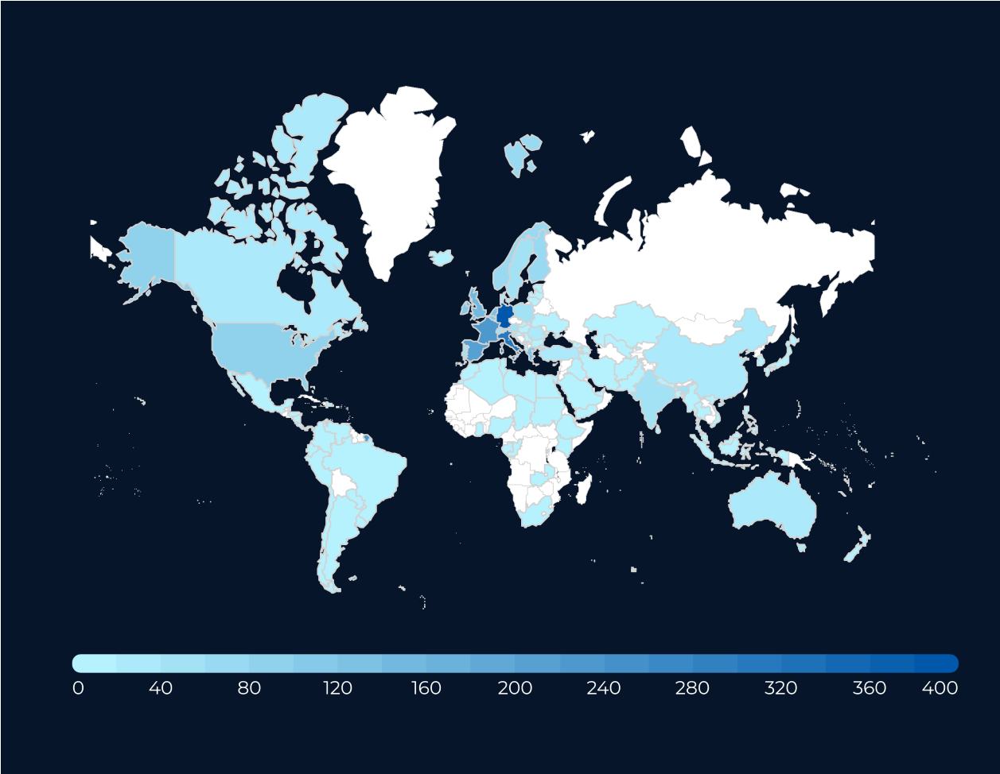

>  style="width:4.22932in;height:0.58611in" />

**D2.4 Communication Plan**

<table>
<colgroup>
<col style="width: 28%" />
<col style="width: 71%" />
</colgroup>
<thead>
<tr>
<th style="text-align: left;"><strong>Lead Partner:</strong></th>
<th style="text-align: left;">Trust-IT, AUTh</th>
</tr>
</thead>
<tbody>
<tr>
<td style="text-align: left;"><strong>Version:</strong></td>
<td style="text-align: left;">V3.0</td>
</tr>
<tr>
<td style="text-align: left;"><strong>Status:</strong></td>
<td style="text-align: left;">Final</td>
</tr>
<tr>
<td style="text-align: left;"><strong>Dissemination Level:</strong></td>
<td style="text-align: left;">PU</td>
</tr>
</tbody>
</table>

<table>
<colgroup>
<col style="width: 100%" />
</colgroup>
<thead>
<tr>
<th style="text-align: left;"><strong>Deliverable Abstract</strong></th>
</tr>
</thead>
<tbody>
<tr>
<td style="text-align: left;">This deliverable outlines the current
DestinE Communication Plan which covers the promotional activities for
DestinE, support for community building and activities foreseen as part
of the DestinE Use Cases project (DEUC) including the operation of the
Joint DestinE channels such as the website, newsletter and events.</td>
</tr>
</tbody>
</table>

**COPYRIGHT NOTICE**

**DELIVERY SLIP**

<table>
<colgroup>
<col style="width: 23%" />
<col style="width: 61%" />
<col style="width: 14%" />
</colgroup>
<thead>
<tr>
<th style="text-align: left;"><blockquote>

<em><strong>Date</strong></em>

</blockquote></th>
<th style="text-align: left;"><em><strong>Name &amp;
Partner</strong></em></th>
<th style="text-align: left;"><em><strong>Date</strong></em></th>
</tr>
</thead>
<tbody>
<tr>
<td style="text-align: left;"><blockquote>

<strong>Prepared by:</strong>

</blockquote></td>
<td>
Rob Carrillo (Trust-IT), Eleni Karachaliou (AUTh), Valeriya
Fetisova (Trust-IT), Claudia D’Onofrio (Trust-IT), Diego

Domenici (Trust-IT)
</td>
<td style="text-align: left;">11.06.2025</td>
</tr>
<tr>
<td style="text-align: left;"><blockquote>

<strong>Reviewed by:</strong>

</blockquote></td>
<td style="text-align: left;"></td>
<td style="text-align: left;"></td>
</tr>
<tr>
<td style="text-align: left;"><blockquote>

<strong>Approved by:</strong>

</blockquote></td>
<td style="text-align: left;"></td>
<td style="text-align: left;"></td>
</tr>
</tbody>
</table>

**DOCUMENT LOG**

<table>
<colgroup>
<col style="width: 7%" />
<col style="width: 14%" />
<col style="width: 38%" />
<col style="width: 38%" />
</colgroup>
<thead>
<tr>
<th style="text-align: left;"><blockquote>

<em><strong>Issue</strong></em>

</blockquote></th>
<th style="text-align: left;"><em><strong>Date</strong></em></th>
<th style="text-align: left;"><blockquote>

<em><strong>Comment</strong></em>

</blockquote></th>
<th style="text-align: left;"><blockquote>

<em><strong>Author</strong></em>

</blockquote></th>
</tr>
</thead>
<tbody>
<tr>
<td style="text-align: left;"><blockquote>

<strong>V1.0</strong>

</blockquote></td>
<td style="text-align: left;">11.06.2025</td>
<td style="text-align: left;"><blockquote>

First version developed

</blockquote></td>
<td style="text-align: left;"><blockquote>

Valeriya Fetisova (Trust-IT),

Rob Carrillo (Trust-IT),

Eleni Karachaliou (AUTh), Antonio

Romeo (Starion)

</blockquote></td>
</tr>
<tr>
<td style="text-align: left;"><blockquote>

<strong>V2.0</strong>

</blockquote></td>
<td style="text-align: left;">11.07.2025</td>
<td style="text-align: left;"><blockquote>

Revised version sent

</blockquote></td>
<td style="text-align: left;"><blockquote>

Valeriya Fetisova (Trust-IT), Rob Carrillo (Trust-IT)

</blockquote></td>
</tr>
<tr>
<td style="text-align: left;"><blockquote>

<strong>V3.0</strong>

</blockquote></td>
<td style="text-align: left;">24.07.2025</td>
<td style="text-align: left;"><blockquote>

Revised version sent

</blockquote></td>
<td style="text-align: left;"><blockquote>

Valeriya Fetisova (Trust-IT), Rob Carrillo (Trust-IT)

</blockquote></td>
</tr>
</tbody>
</table>

**TERMINOLOGY**

<table>
<colgroup>
<col style="width: 26%" />
<col style="width: 73%" />
</colgroup>
<thead>
<tr>
<th
style="text-align: left;"><em><strong>Terminology/Acronym</strong></em></th>
<th style="text-align: left;"><blockquote>

<em><strong>Definition</strong></em>

</blockquote></th>
</tr>
</thead>
<tbody>
<tr>
<td style="text-align: left;"><strong>AI</strong></td>
<td style="text-align: left;"><blockquote>

Artificial intelligence

</blockquote></td>
</tr>
<tr>
<td style="text-align: left;"><strong>CBMS</strong></td>
<td style="text-align: left;"><blockquote>

Community Building and Management Strategy

</blockquote></td>
</tr>
<tr>
<td style="text-align: left;"><strong>CoP</strong></td>
<td style="text-align: left;"><blockquote>

Community of Practice

</blockquote></td>
</tr>
<tr>
<td style="text-align: left;"><strong>DestinE</strong></td>
<td style="text-align: left;"><blockquote>

Destination Earth

</blockquote></td>
</tr>
<tr>
<td style="text-align: left;"><strong>DEUC</strong></td>
<td style="text-align: left;"><blockquote>

ESA DestinE Platform Use Cases project

</blockquote></td>
</tr>
<tr>
<td style="text-align: left;"><strong>EE</strong></td>
<td style="text-align: left;"><blockquote>

Entrusted Entities (ESA, ECMWF, EUMETSTAT)

</blockquote></td>
</tr>
<tr>
<td style="text-align: left;"><strong>GIS</strong></td>
<td style="text-align: left;"><blockquote>

Geographic Information Systems

</blockquote></td>
</tr>
<tr>
<td style="text-align: left;"><strong>ML</strong></td>
<td style="text-align: left;"><blockquote>

Machine Learning

</blockquote></td>
</tr>
<tr>
<td style="text-align: left;"><strong>UI</strong></td>
<td style="text-align: left;"><blockquote>

User interface

</blockquote></td>
</tr>
<tr>
<td style="text-align: left;"><strong>UX</strong></td>
<td style="text-align: left;"><blockquote>

User experience

</blockquote></td>
</tr>
<tr>
<td style="text-align: left;"><strong>3Es</strong></td>
<td style="text-align: left;"><blockquote>

Three Entrusted Entities

</blockquote></td>
</tr>
</tbody>
</table>

**Contents**

1.  Introduction
    ............................................................................................................................
    4

2.  DestinE Overview and Target Stakeholders
    ............................................................................
    5

    1.  Destination Earth
        ..............................................................................................................
        5

    2.  Stakeholders
        ......................................................................................................................
        6

        1.  Spatial Scale Stakeholders
            .............................................................................................
            6

        2.  Expertise-based stakeholders
            ........................................................................................
            6

        3.  Customised Categorisation Stakeholders
            ......................................................................
            6

3.  DestinE Communication and Engagement Plan
    ......................................................................
    7

    1.  Communication and Engagement Objectives
        ....................................................................
        7

    2.  Resources
        ..........................................................................................................................
        8

        1.  DestinE Joint Website Editorial Board
            ...........................................................................
            8

        2.  Content Production Team
            .............................................................................................
            9

        3.  Editorial process
            ............................................................................................................
            9

    3.  Communication campaigns
        .............................................................................................
        11

        1.  Campaign 1: Awareness-raising and DestinE promotion
            (ongoing) ............................. 12

        2.  Campaign 2: Support for DEUC Use Case Procurements
            (concluded) .......................... 15

        3.  Campaign 3: Demonstrating DestinE’s Potential Impact Via Use
            Cases (ongoing) ....... 16

        4.  Campaign 4: Support for Communities of Practice and
            Community Building (on-going)

16

1.  Horizontal Communication Activities and Channels
    .................................................... 17

<!-- -->

1.  Monitoring
    ............................................................................................................................
    31

    1.  KPIs dashboard
        ................................................................................................................
        31

    2.  Matomo analytics
        ............................................................................................................
        32

    3.  Community database
        ......................................................................................................
        32

2.  Conclusions and next steps
    ...................................................................................................
    36

# 1 Introduction 

The DestinE Joint Communication Plan covers the promotional activities
for DestinE, support for community building and activities foreseen as
part of the DestinE Use Cases project (DEUC) including the operation of
the Joint DestinE channels such as the website, newsletter and events.

It is a document that evolved out of the DestinE Community Management
Strategy and Workplan (CBMS) which outlined expectations and procedures
for implementing an open stakeholder dialogue within the ESA DestinE Use
Cases project (DEUC), in accordance with the DestinE Partnership Plan.

This document is an iteration of the previous D2.4 and provides a
comprehensive overview of the conducted communication activities
envisaged in DEUC.

In **Section 2**, targeted stakeholders have been mapped and
categorised.

In **Section 3**, the Communication Plan which covers the carried out
promotional activities for DestinE and community building actions that
were foreseen as part of the DestinE Use Cases project (DEUC), including
the operation of the Joint DestinE Website (formerly the DestinE
Community Portal).

The document also provides an overview of how the community and
engagement progress has been monitored.

# 2 DestinE Overview and Target Stakeholders 

## 2.1 Destination Earth 

DestinE is an initiative of the European Commission to **develop a
highly-accurate digital twin of Earth** to model, monitor, and simulate
natural and human activity, Earth System phenomena and natural hazards
to develop and test scenarios that will assist policy-makers in
designing accurate and actionable adaptation strategies and mitigation
measures for achieving both the [<u>Green
Deal</u>](https://ec.europa.eu/info/strategy/priorities-2019-2024/european-green-deal_en)
and the [<u>Digital
Strategy</u>](https://ec.europa.eu/info/strategy/priorities-2019-2024/europe-fit-digital-age/european-data-strategy_en)
priorities of the EU:

- **DestinE will anticipate both natural disasters and man-made
  environmental damage** with ever higher accuracy. It will identify and
  assess the negative impacts of natural disasters and environmental
  damage on various socio-economic sectors and geographical regions. In
  other words, DestinE will integrate ‘cause and effect’ – combining
  better forecasts of potential environmental disasters with their
  expected adverse impacts on human activity.

- **DestinE will enable the continuous and accurate monitoring of the
  health of the planet** by focusing on the countless effects of climate
  change on, e.g., the oceans, water resources, the Earth’s ice caps,
  biodiversity, land use, and other natural resources.

- **DestinE will allow to better understand the socio-economic effects
  of climate change and the occurrence of extreme natural disasters**.
  For example, between 1980 and 2017, floods, droughts, heat waves and
  other climate-related extremes caused economic losses in excess of
  €420 billion and have claimed the lives of more than 115,000 people
  across Europe.

- **DestinE will help adapting to climate change related challenges** by
  providing a common **infrastructure for the users at various levels**
  for supporting informed and actionable decision-making for policy
  measures, for example, to assess the real impact and efficiency of
  environmental policies and related legislative measures.

In the Commission’s Data Strategy of 2020, DestinE is highlighted as an
initiative that will cover concrete actions in the context of the Green
Deal Data Space and in support of the Green Deal objectives.

DestinE will be implemented gradually over the next 7-10 years. The
activities funded by th[e <u>DIGITAL</u> <u>Work Programme
2021-2022</u>](https://digital-strategy.ec.europa.eu/en/activities/work-programmes-digital)
will focus on the deployment of the DestinE Platform and the Data Lake,
the building of the Digital Twin Engine and the implementation of the
first two Digital Twins on Weather-induced & Geophysical Extremes and on
Climate Change Adaptation that will be integrated into the platform. In
later stages, these initial components will be complemented by
additional digital twins, tools and applications by research
institutions, private sector and civil society. Additional funding will
be available from other sources, e.g., the Horizon Europe Programme.

DestinE will also have a clear interface with the European Union’s
flagship Space programme Copernicus and its relevant resources.

## 2.2 Stakeholders 

Considering the size and goals of the DestinE initiative, the user
community shall be divided into three distinct categories: spatial
scale, expertise, and customised. The below captures only a snapshot of
these priority DestinE stakeholder groups. More in-depth information
about user community categories and subcategories are defined and found
in <u>D2.2 Community Building and</u> <u>Management Strategy and
Workplan</u> (accessible only with DEUC repository access). A summary is
outlined below.

### 2.2.1 Spatial Scale Stakeholders 

Spatial scale stakeholders are **policymakers** or **decision makers**
with interests and influence relevant to their geographical scale. This
group includes **community groups** and **NGOs** with more influence at
the local and regional scales, as well as **national governments** and
**international organisations** that possess more power at the national
and global levels. Decision makers are highlevel government officials
and business leaders with significant influence extending from the local
to the global levels.

### 2.2.2 Expertise-based stakeholders 

The expertise categorisation includes **research & academia**,
**technology providers** and **industry stakeholders**. Research and
academic stakeholders can have different subcategories on different
spatial levels, depending on the focus of their research and their
geographical scope. Technology providers include companies that offer
hardware and software solutions. Unlike other stakeholder categories,
technology providers do not have subcategories on different spatial
levels because their services are not necessarily limited to a specific
geographic location. Industry refers to companies such as energy,
agriculture, and transportation, amongst many others that may be
interested in exploiting the data and insights provided by the DestinE
Platform.

### 2.2.3 Customised Categorisation Stakeholders 

The customised categorisation audience consists of **DestinE use case
makers**, **Core DestinE Entities**, and the **general public**. The use
case maker subcategory is comprised of organisations or individuals
including data providers, model developers, application developers,
infrastructure providers, policy advocates, and end-users. The Core
DestinE Entities refers to EC DGCNCT, who is funding the project, the
entrusted entities ESA, EUMETSTAT and ECMWF, as well as the other
organisations or projects involved in the initial stages of DestinE.

# 3 DestinE Communication and Engagement Plan 

This **Communication and Engagement Plan** is drawn up and maintained as
part of the ESA DestinE Platform Use Cases project (DEUC) which includes
in its obligations not only to deliver DestinE Platform use cases but
also to contribute to the overall promotion of DestinE. As other
entities are expected to carry out their own promotional activities for
DestinE such as the European Commission, the three Entrusted Entities
and their respective contractors, this Communication Plan’s scope is
limited to the following:

- Promotional activities for DestinE (in consultation and conjunction
  with the other EEs and the EC).

- Operation of the Joint DestinE Website (formerly the DestinE Community
  Portal, expanded in scope).

- Support for the implementation of the DEUC D2.2 CBMS.

- Support for the activities foreseen as part of DEUC.

This communication plan does not cover the activities carried out by the
EEs and the EC independently from DEUC.

The plan contributed to the first phase of the Destination Earth
initiative (the initial implementation phase) as well as the first part
of the second phase (24 months from June 2024). Priority will be to
communicate widely to build general interest on the initiative, building
a solid basis that can be exploited later when the activities related to
DestinE will be further developed. The main emphasis of this
Communication Plan is on European and Associated Countries and will be
implemented from February 2023 until February 2025.

## 3.1 Communication and Engagement Objectives 

The high-level communication objectives are the following:

1.  **Promote Destination Earth**, specifically:

    1.  Raise awareness about environmental phenomena and the effects of
        climate change in general together with possible mitigation and
        adaptation options in an easily understandable format for all.

    2.  Increase the visibility of concrete actions undertaken by the EU
        to achieve the objectives of the twin transition (green and
        digital) in line with the major strategies of the EU (the Green
        Deal, the Digital Strategy).

    3.  Highlight the transversal role of digital technologies to
        achieve EU’s climate objectives and in helping Europe to become
        the world's first climate-neutral continent by 2050 (the 2030
        Climate Target Plan).

    4.  Highlight the crucial role of EU’s new HPC and AI capabilities
        in implementing

> DestinE and its objectives in environmental/climate modelling and
> predictions.

1.  Highlight the key role of the past, present, and future investments
    in European Earth observation and other related EU programmes for
    predictions and accountable knowledge, based on European
    technological and scientific excellence.

2.  Demonstrate European industry's strong competitiveness in the
    development of advanced technologies for delivering the technology
    needed for DestinE.

<!-- -->

1.  Provide **communication support fo DEUC** activities namely:

    1.  **Community Building**: Foster the active engagement and
        participation of DestinE user communities in the co-design,
        development, co-evolution and use of DestinE capabilities,
        applications and solutions.

    2.  **DestinE Platform Recommendations Gathering**: Gather the
        stakeholders’ needs and requirements and encourage their direct
        involvement and guidance in the continuous evolution of the
        DestinE infrastructure and capabilities towards the future
        Phases of the Initiative.

    3.  **Use Cases Procurement and Promotion**: Demonstrate the ability
        of the DestinE infrastructure in general through a first set of
        use cases.

## 3.2 Resources 

### 3.2.1 DestinE Joint Website Editorial Board 

The Editorial Board oversees and has the ultimate decision-making on
what will be published on the website. It consists of the following
roles.

**Table 1 Editorial Board**

<table>
<colgroup>
<col style="width: 15%" />
<col style="width: 44%" />
<col style="width: 40%" />
</colgroup>
<thead>
<tr>
<th style="text-align: left;"><blockquote>

<strong>Role</strong>

</blockquote></th>
<th style="text-align: left;"><strong>Description</strong></th>
<th style="text-align: left;"><strong>Key Figures</strong></th>
</tr>
</thead>
<tbody>
<tr>
<td style="text-align: left;"><blockquote>

<strong>Content Editors</strong>

</blockquote></td>
<td>The content editors will oversee the entire process, from content
planning to ensuring content is published on time and
up-to-standard.</td>
<td style="text-align: left;">
Lead Content Editor: Rob Carrillo

(Trust-IT)

Deputy Content Editor: Diego

Domenici (Trust-IT)
</td>
</tr>
<tr>
<td style="text-align: left;"><blockquote>

<strong>Content</strong>

<strong>Strategists</strong>

</blockquote></td>
<td>At least one from each entrusted entity, will assist the editor with
content planning, check content policies and ensure compliance.</td>
<td style="text-align: left;">
Claudia Vitolo (ESA)

Gaia Maggi (ESA)

Franka Kunz (ESA)

Neil Fletcher (EUMETSAT)

Danaële Puechmaille (EUMETSAT)

Sophia Sheridan (ECMWF) Rafael Cereceda (ECMWF)

Laila Granderath (ECMWF)

Antonio Romeo (Starion Group)
</td>
</tr>
<tr>
<td style="text-align: left;"><blockquote>

<strong>Advisor</strong>

</blockquote></td>
<td>The advisor will be from DG-CNECT and will ensure that content
complies with the EC policies and vision.</td>
<td style="text-align: left;">
Advisor: Mara-Ioana Bubberman (EC)

Backup: Stephan Siemen (EC)
</td>
</tr>
</tbody>
</table>

### 3.2.2 Content Production Team 

The content production team is tasked with implementing the strategy as
indicated in the communications plan and the directions of the DestinE
Editorial Board.

**Table 2 Content Production Team**

<table>
<colgroup>
<col style="width: 17%" />
<col style="width: 47%" />
<col style="width: 35%" />
</colgroup>
<thead>
<tr>
<th style="text-align: left;"><blockquote>

<strong>Copywriters, Video production, events
specialists</strong>

</blockquote></th>
<th>Content creators are asked to develop the content. These are mainly
selected amongst EEs’ contractors.</th>
<th style="text-align: left;">
Valeriya Fetisova (Trust-IT)

Matteo Zoppi (Trust-IT)

Ruben Tognetti (Trust-IT)

Sarina Magham (Trust-IT)

Claudia d’Onofrio (Trust-IT)

Diego Domenici (Trust-IT)

Barbara Pinho (EJR-Quartz)
</th>
</tr>
</thead>
<tbody>
<tr>
<td><blockquote>

<strong>Graphic and web designers</strong>

</blockquote></td>
<td>Carries out the technical development of the DestinE Joint
Website.</td>
<td style="text-align: left;">
Alessandro Petrocelli (Trust-IT)

Luca Di Fiore (Trust-IT)

Riccardo Giuntini (Trust-IT)

Christian Attanasio (Trust-IT)

Lorenzo Calamai (Trust-IT)
</td>
</tr>
<tr>
<td style="text-align: left;"><blockquote>

<strong>Subject</strong>

<strong>Matter</strong>

<strong>Experts</strong>

</blockquote></td>
<td>Subject matter experts are asked to support content creators and
validate content from a scientific and technological point of view.
These are mainly selected amongst the 3Es and/or amongst community
experts on an ad hoc basis.</td>
<td style="text-align: left;">To be sourced ad-hoc</td>
</tr>
</tbody>
</table>

### 3.2.3 Editorial process 

The editorial process is the process by which the editorial board
creates, develops, approves and publishes content. The editorial process
uses Jira to control the editorial and approval workflow, which is
complemented by a monthly conference call to discuss any issues or
needed adjustments to the process and strategy. The editorial process
follows the following steps:

**Step 1 - Content Request**: Any editorial board member can create a
request for content to be published or modified on the website. This is
done simply by creating an “issue” on Jira, and filling in the following
important information:

- Type of content - Blog/Event/News, New Webpage/Section, New Website
  Feature or Website Error/Bug)

- A summary - short title which briefly explains the request)

- Description - a detailed explanation of what is required, including
  attachments, images or links to make the task as clear and easy as
  possible

- Entrusted Entity/s - which EE/s is the content related to. This is
  important both to track published content for balance and to know who
  will need to approve the content before publishing

- Needs EC Approval - this must be checked if the content is of a
  political nature (including policy, budget etc.)

- Priority - how important this is

- Due Date - When this content should be published

- Start Date - When this content should be started (this can be useful
  when you still need to add more information before the work can start)

Once created, the issue will appear with the “To do” status on Jira. The
Content Editors will check every new issue and assign them to Content
Creators. If necessary, they will contact the creator of the issue
through the Jira commenting system for any clarifications or potential
problems.

**Step 2 - Content Creation**: The Content Creators will create the
content which is requested with the oversight of the Content Editors.
While working on the content they will play the issue into the “In
progress” status. If necessary, they will contact the creator of the
issue through the Jira commenting system if further clarifications are
needed. Once the content has been created it will be linked to the issue
either as an attachment or a link to where it can be found and commented
on. The Content Creator will then move the issue into the “Testing”
status on Jira.

**Step 3 - Content Editor Review**: All issues in “Testing” will be
reviewed by the content editors for quality. If minor edits are
required, they will be performed directly by the Content Editors. If any
major edits are required, the issue will be moved back to the “In
progress” status, and the Content Editor will explain through the Jira
commenting system the further work required sending the issue back to
Step 2 of the editorial process. Once the content has been approved by a
Content Editor, it will be moved to the “In review - EE” status.

**Step 4 - Content Strategist Review**: When an issue is moved into the
“In review - EE” status, the title of the issue will include the
deadline (5 working days). Each of the selected EEs Content Strategists
will be automatically contacted by Jira asking them to review the
content. If there are no problems the Content Strategist/s will leave a
comment saying “Approved.” If more than one EE is reviewing the content,
all relevant Content Strategists must comment before moving the issue
onwards ahead of the 5 working day schedule.

If there are any problems, the Content Strategist/s will use the Jira
commenting system to explain the required changes and will move the
issue back to the “In progress” status. In this case, once the Content
Creator has implemented the changes, they will move the issue directly
back into “In review - EE” status (i.e. without the need to repeat Step
3 - Content Editor Review).

Once the issue has been approved by all relevant Content Strategists,
the issue can be manually moved along by the Content Creator. If no
comments have been made over the course of 5 working days, the Content
Creator will send an email to the relevant Content Strategists informing
them that the piece will be published/moved to the next step. If an
out-of-office reply is received, the deadline will be extended by 2
working days, otherwise the piece will be published/moved to the next
step.

At the end of the additional 2 working days, if no response is received,
the issue will be published/moved along. If the issue has “Needs EC
Approval” ticked, it will move to Step 5 and the “In review - EC”
status. If not, it will move directly to Step 6 and the “Approved for
publishing” status.

If a piece has been produced based on an already published source and
retains at least 80% of the original content even with minor changes, it
goes directly to publication but needs to apply the DestinE website
standards dictated by the Style Guide.

> **Step 4a - Advisor Review**: Any issues that have been flagged as
> needing a review by the EC will eventually move into this step. The EC
> Advisor will receive a notification from Jira whenever an issue is
> moved into the status “In review - EC.”
>
> As in Step 4, if there are any problems, the Advisor will use the Jira
> commenting system to explain the required changes and will move the
> issue back to the “In progress” status. In this case, once the Content
> Creator has implemented the changes, they will move the issue directly
> back into “In review - EC” status (i.e. without the need to repeat
> Step 3 or 4 - Content Editor Review & Content Strategist Review).
>
> If there are no problems the Advisor will leave a comment saying
> “Approved.” Then the Content Creator will move the issue to the
> “Approved for publishing” status.

**Step 5 - Publishing**: Any issues in the “Approved for publishing”
status are now ready to be published or implemented on the website. The
Content Creator should however be aware whether there is a specific date
on which the content should be published, and eventually wait for that
date before doing so.

The Content Creator will either publish content directly if able or
contact whoever is able to perform the action. Once the publication or
implementation is complete, the issue is moved to the “Published”
status.

**Step 7 - Review**: Once a month the Editorial Board will meet in a
video conference to discuss the editorial content, any problems that
have emerged, proposed solutions as well as any potential ways to
improve the editorial process.

The meeting will also include a review of the published content to
ensure that all EEs are being equally represented by the Joint DestinE
Website.

To expedite reviews, the Lead Editor sends a bi-weekly summary of items
for each content strategist’s review via email.

## 3.3 Communication campaigns 

To ensure proper support for the implementation of the CBMS and the
growth of the DestinE Community, the DestinE Joint Website and DEUC
Communication and Community Building Methodology below has been drawn up
to ensure that every single communication activity is connected to the
goals of the initiative.

Every communication and dissemination activity will be mapped to the
Attract – Convert – Close – Delight – Promote process. This ensures a
logical transition from **Stranger**, someone who is not familiar with
the project, to **Visitor**, someone who interacts with the digital
content, to **Lead**, DestinE’s target stakeholder who has shown
interest in what DestinE communicates and expressly requested DestinE to
engage with them, to **Community Member**, and finally to **Promoter**,
a stakeholder who is so pleased with their interactions with DestinE
that they are happy to promote the initiative’s outputs, services and
results. This process ensures an interconnected and efficient
communications and community building ecosystem.

Measuring feedback meaningfully through KPIs can be achieved by
organising important phases of DEUC and DestinE activities as campaigns.
Under each campaign, specific communication actions are planned, and
metrics are measured, which contribute to the achievement of the
project’s overall goals.

All strategic and tactical actions, from concept and design, through
development and testing, to digital marketing activities (SEO,
newsletters, social media...) are coordinated for a consistent User
Experience (UX) and with a continuous optimization towards the project's
KPIs, through our Conversion-Rate Optimization (CRO) framework, where
the focus is on:

1.  increasing the relevance and clarity of the project's Unique Value
    Proposition (UVP);

2.  removing frictions-like distractions and possible anxiety triggers
    in the user journey towards the conversion. The various target
    stakeholder groups will be addressed with tailored actions.

Note: Adjustments to the campaigns had to be implemented due to the
following:

- Only one procurement call is being run under DEUC instead of two.

- No more than five use cases will be showcased under DEUC

### 3.3.1 Campaign 1: Awareness-raising and DestinE promotion (concluded) 

<table>
<colgroup>
<col style="width: 26%" />
<col style="width: 39%" />
<col style="width: 34%" />
</colgroup>
<thead>
<tr>
<th colspan="3" style="text-align: left;"><blockquote>

<strong>Duration</strong>: 1 Feb 2023 - 15 Feb 2025

</blockquote></th>
</tr>
</thead>
<tbody>
<tr>
<td colspan="3"><blockquote>

<strong>Main Objective</strong>: Build general interest on the
initiative, building a solid basis that can be exploited later when the
activities related to DestinE will be further developed.

</blockquote></td>
</tr>
<tr>
<td style="text-align: left;"><blockquote>

<strong>Activity</strong>

</blockquote></td>
<td style="text-align: left;"><blockquote>

<strong>Target</strong>

</blockquote></td>
<td style="text-align: left;"><strong>Results (to date)</strong></td>
</tr>
<tr>
<td rowspan="2" style="text-align: left;">
DestinE Journal Blog

<blockquote>

Series

</blockquote></td>
<td style="text-align: left;"><blockquote>

18 blogs published

</blockquote></td>
<td style="text-align: left;">27 blogs published (1.5x)</td>
</tr>
<tr>
<td style="text-align: left;"><blockquote>

1000 total reads/views

</blockquote></td>
<td style="text-align: left;">46,440 total reads/views</td>
</tr>
<tr>
<td style="text-align: left;"><blockquote>

Use cases

</blockquote></td>
<td style="text-align: left;"><blockquote>

1000 total reads/ views

</blockquote></td>
<td style="text-align: left;">
26 Use cases published with

25,248 total reads/views
</td>
</tr>
<tr>
<td rowspan="2" style="text-align: left;">
DestinE Roadshow

<blockquote>

Webinar

</blockquote></td>
<td style="text-align: left;"><blockquote>

Total webinars organised: 6

</blockquote></td>
<td style="text-align: left;">6 webinars held</td>
</tr>
<tr>
<td style="text-align: left;"><blockquote>

min. 40 attendees each

</blockquote></td>
<td style="text-align: left;">Average attendees: 169</td>
</tr>
<tr>
<td style="text-align: left;">
Community members

<blockquote>

(1st target)

</blockquote></td>
<td style="text-align: left;"><blockquote>

400 members

</blockquote></td>
<td rowspan="2" style="text-align: left;">2929 members</td>
</tr>
<tr>
<td style="text-align: left;">
Community members

<blockquote>

(2nd target)<a href="#fn1" class="footnote-ref"
id="fnref1" role="doc-noteref">1</a>

</blockquote></td>
<td style="text-align: left;"><blockquote>

2500 members

</blockquote></td>
</tr>
<tr>
<td style="text-align: left;"><blockquote>

Newsletters

</blockquote></td>
<td style="text-align: left;"><blockquote>

6 sent, monthly

</blockquote></td>
<td style="text-align: left;">29 newsletters sent</td>
</tr>
<tr>
<td><blockquote>

Third-party events with DestinE visibility

</blockquote></td>
<td style="text-align: left;"><blockquote>

6

</blockquote></td>
<td style="text-align: left;">21</td>
</tr>
<tr>
<td style="text-align: left;"><blockquote>

DestinE Promotional Kit

</blockquote></td>
<td style="text-align: left;"><blockquote>

Visual identity guidelines delivered:

</blockquote>
<ul>
<li>
1 rollup banner
</li>
<li>
5 stakeholder-focused flyers
</li>
<li>
1 detailed brochure
</li>
<li>
1 infographic
</li>
<li>
1 poster
</li>
<li>
1 slide deck
</li>
<li>
1 General video
</li>
</ul></td>
<td>V1 completed for 10 of 11 of the materials (91%)</td>
</tr>
</tbody>
</table>
<section id="footnotes" class="footnotes footnotes-end-of-document"
role="doc-endnotes">

<ol>
<li id="fn1">
This is a new metric based on a readjusted community
members target following surpassed targets &amp; new CBMS ambition of
3000 community members by end of 2024. This largely depends on being
able to synchronise data collection between the DestinE Platform and
DEUC projects as DestinE Platform users would be considered as DestinE
community members.<a href="#fnref1" class="footnote-back"
role="doc-backlink">↩︎</a>
</li>
</ol>
</section>

##### Messaging 

- *DestinE will develop a highly accurate digital twin of the Earth to
  monitor and predict environmental change and its impact on human life
  with unprecedented resolution. (all stakeholders)*

- *DestinE will enable interaction and knowledge generation that is
  tailored to the level of expertise of the users and their specific
  interests. (all stakeholders)*

- *DestinE will allow policy and decision makers to: (1) Support timely
  environmental policy decisions at European and Global scale to
  anticipate environmental disasters and their impact, and (2) Get more
  accurate understanding and assessment of the socio-economic effects of
  these changes and the identification of adaptation strategies
  fostering the green transition of the European Union towards carbon
  neutrality, in agreement with the goals set forth by the EC in their
  Green Deal and Digital Strategy (policy makers and actors)*

- *DestinE will leverage on EU’s investments and activities in
  high-performance computing, cloud computing, AI technologies, and
  high-speed connectivity networks enabling cuttingedge science
  developments. (Policy makers, Funders, and Research and academia)*

- *Build on data provided by the European Copernicus programme and many
  other major data sources and infrastructures. (Policy makers, Funders,
  and Research and academia)*

- *DestinE will significantly contribute to the implementation of the
  European Green Deal and European Data Strategy. (Policy makers,
  Funders, and Research and academia)* **DestinE Journal Topics**

The DestinE Journal is a monthly blog series focussing on specific
topics and featuring contributions or quotes from experts inside or
outside the DestinE initiative in various fields, including climate,
high-performance computing, renewable energy, urban planning, and more.

Topics were proposed and also considered key happenings and events
taking place in specific months. Planning and coordination for the
DestinE Journal was carried out via a dedicated shared working document
hosted on the project SharePoint workspace, while implementation is
monitored via the Jira system.

##### List of published blogs for the DestinE Journal 

<table>
<colgroup>
<col style="width: 60%" />
<col style="width: 19%" />
<col style="width: 20%" />
</colgroup>
<thead>
<tr>
<th style="text-align: left;"><blockquote>

<strong>Title</strong>

</blockquote></th>
<th style="text-align: left;"><blockquote>

<strong>Date</strong>

</blockquote></th>
<th style="text-align: left;"><blockquote>

<strong>Cumulative views</strong>

</blockquote></th>
</tr>
</thead>
<tbody>
<tr>
<td><blockquote>

<a
href="https://destination-earth.eu/news/destination-earth-to-date-developments-events-and-views/">Destination
Earth to date: developments, events, and views</a>

</blockquote></td>
<td rowspan="2" style="text-align: left;">28 April 2023</td>
<td rowspan="2" style="text-align: left;"><blockquote>

2180 views

</blockquote></td>
</tr>
<tr>
<td style="text-align: left;"></td>
</tr>
<tr>
<td><blockquote>

<a
href="https://destination-earth.eu/news/engaging-community-interview-hoffmann/">Engaging
Destination Earth’s Community – Interview with</a>

</blockquote></td>
<td rowspan="3" style="text-align: left;"><a
href="https://destination-earth.eu/news/engaging-community-interview-hoffmann/">1</a>6
May 2023</td>
<td rowspan="3" style="text-align: left;"><blockquote>

1511 views

</blockquote></td>
</tr>
<tr>
<td rowspan="2" style="text-align: left;"><blockquote>

<a
href="https://destination-earth.eu/news/engaging-community-interview-hoffmann/">Jörn
Hoffmann</a>

</blockquote></td>
</tr>
<tr>
</tr>
<tr>
<td><blockquote>

<a
href="https://destination-earth.eu/news/empowering-community-collaboration-in-earth-system-modelling-highlights-from-the-1st-destine-user-exchange-workshop/">Empowering
community collaboration in Earth system</a>

</blockquote></td>
<td rowspan="4" style="text-align: left;"><a
href="https://destination-earth.eu/news/empowering-community-collaboration-in-earth-system-modelling-highlights-from-the-1st-destine-user-exchange-workshop/">2</a>5
May 2023</td>
<td rowspan="4" style="text-align: left;"><blockquote>

1081 views

</blockquote></td>
</tr>
<tr>
<td><blockquote>

<a
href="https://destination-earth.eu/news/empowering-community-collaboration-in-earth-system-modelling-highlights-from-the-1st-destine-user-exchange-workshop/">modelling:
highlights from the 1st DestinE User eXchange</a>

</blockquote></td>
</tr>
<tr>
<td rowspan="2" style="text-align: left;"><blockquote>

<a
href="https://destination-earth.eu/news/empowering-community-collaboration-in-earth-system-modelling-highlights-from-the-1st-destine-user-exchange-workshop/">Workshop</a>

</blockquote></td>
</tr>
<tr>
</tr>
<tr>
<td style="text-align: left;"><blockquote>

<a
href="https://destination-earth.eu/news/data-lake-wolf-interview/">Dive
into the DestinE Data Lake and glimpse the future</a>

</blockquote></td>
<td rowspan="2" style="text-align: left;"><blockquote>

09 October 2023

</blockquote></td>
<td rowspan="2" style="text-align: left;"><blockquote>

3699 views

</blockquote></td>
</tr>
<tr>
<td style="text-align: left;"></td>
</tr>
<tr>
<td><blockquote>

<a
href="https://destination-earth.eu/news/from-earth-observation-to-earth-intelligence-egw-2023-spotlights-digital-twins/">From
“Earth observation” to “Earth intelligence”: EGW 2023</a>

</blockquote></td>
<td rowspan="3" style="text-align: left;"><a
href="https://destination-earth.eu/news/from-earth-observation-to-earth-intelligence-egw-2023-spotlights-digital-twins/">1</a>3
October 2023</td>
<td rowspan="3" style="text-align: left;"><blockquote>

1124 views

</blockquote></td>
</tr>
<tr>
<td rowspan="2" style="text-align: left;"><blockquote>

<a
href="https://destination-earth.eu/news/from-earth-observation-to-earth-intelligence-egw-2023-spotlights-digital-twins/">spotlights
digital twins</a>

</blockquote></td>
</tr>
<tr>
</tr>
<tr>
<td style="text-align: left;"><blockquote>

<a
href="https://destination-earth.eu/news/understanding-destines-digital-twins/">Understanding
DestinE’s Digital Twins</a>

</blockquote></td>
<td rowspan="2" style="text-align: left;"><blockquote>

25 October 2023

</blockquote></td>
<td rowspan="2" style="text-align: left;"><blockquote>

3307 views

</blockquote></td>
</tr>
<tr>
<td style="text-align: left;"></td>
</tr>
<tr>
<td><blockquote>

<a
href="https://destination-earth.eu/news/revolutionizing-climate-policy-with-digital-twins-destine-at-european-young-leaders-seminar/">Revolutionising
climate policy with Digital Twins – DestinE at</a>

</blockquote></td>
<td rowspan="3" style="text-align: left;"><a
href="https://destination-earth.eu/news/revolutionizing-climate-policy-with-digital-twins-destine-at-european-young-leaders-seminar/">3</a>
November 2023</td>
<td rowspan="3" style="text-align: left;"><blockquote>

886 views

</blockquote></td>
</tr>
<tr>
<td style="text-align: left;"><blockquote>

<a
href="https://destination-earth.eu/news/revolutionizing-climate-policy-with-digital-twins-destine-at-european-young-leaders-seminar/">European
Young Leaders seminar</a>

</blockquote></td>
</tr>
<tr>
<td style="text-align: left;"></td>
</tr>
<tr>
<td><blockquote>

<a
href="https://destination-earth.eu/news/easier-data-access-for-service-providers-an-interview-with-alessandro-amici-b-open/">Overcoming
the issue of accessing large amounts of data</a>

</blockquote></td>
<td rowspan="3" style="text-align: left;"><a
href="https://destination-earth.eu/news/easier-data-access-for-service-providers-an-interview-with-alessandro-amici-b-open/">1</a>9
February 2024</td>
<td rowspan="3" style="text-align: left;"><blockquote>

977 views

</blockquote></td>
</tr>
<tr>
<td rowspan="2" style="text-align: left;"><blockquote>

<a
href="https://destination-earth.eu/news/easier-data-access-for-service-providers-an-interview-with-alessandro-amici-b-open/">through
DestinE Platform</a>

</blockquote></td>
</tr>
<tr>
</tr>
<tr>
<td><blockquote>

<a
href="https://destination-earth.eu/news/video-series-ecmwf-team-for-destine-introduces-the-digital-twins-and-the-digital-twinengine/">Video
Series: ECMWF team for DestinE introduces the digital</a>

</blockquote></td>
<td rowspan="3" style="text-align: left;"><a
href="https://destination-earth.eu/news/video-series-ecmwf-team-for-destine-introduces-the-digital-twins-and-the-digital-twinengine/">0</a>5
March 2024</td>
<td rowspan="3" style="text-align: left;"><blockquote>

1752 views

</blockquote></td>
</tr>
<tr>
<td style="text-align: left;"><blockquote>

<a
href="https://destination-earth.eu/news/video-series-ecmwf-team-for-destine-introduces-the-digital-twins-and-the-digital-twinengine/">twins
and the Digital Twin Engine</a>

</blockquote></td>
</tr>
<tr>
<td style="text-align: left;"></td>
</tr>
<tr>
<td style="text-align: left;"><blockquote>

<a
href="https://destination-earth.eu/news/all-you-need-to-know-about-the-digital-twin-engine/">All
you need to know about the Digital Twin Engine</a>

</blockquote></td>
<td rowspan="2" style="text-align: left;"><blockquote>

13 March 2024

</blockquote></td>
<td rowspan="2" style="text-align: left;"><blockquote>

1692 views

</blockquote></td>
</tr>
<tr>
<td style="text-align: left;"></td>
</tr>
<tr>
<td style="text-align: left;">Creating interactive DestinE stories
through data</td>
<td rowspan="3" style="text-align: left;"><a
href="https://destination-earth.eu/news/destine-visualisation-blog/">1</a>0
April 2024</td>
<td rowspan="3" style="text-align: left;"><blockquote>

1231 views

</blockquote></td>
</tr>
<tr>
<td rowspan="2" style="text-align: left;"><blockquote>

<a
href="https://destination-earth.eu/news/destine-visualisation-blog/">visualisation</a>

</blockquote></td>
</tr>
<tr>
</tr>
<tr>
<td><blockquote>

<a
href="https://destination-earth.eu/news/use-cases-empower-community/">How
Use Cases empower the DestinE Community to shape</a>

</blockquote></td>
<td rowspan="3" style="text-align: left;"><a
href="https://destination-earth.eu/news/use-cases-empower-community/">1</a>5
April 2024</td>
<td rowspan="3" style="text-align: left;"><blockquote>

1584 views

</blockquote></td>
</tr>
<tr>
<td rowspan="2" style="text-align: left;"><blockquote>

<a
href="https://destination-earth.eu/news/use-cases-empower-community/">the
future</a>

</blockquote></td>
</tr>
<tr>
</tr>
<tr>
<td style="text-align: left;"><blockquote>

<a
href="https://destination-earth.eu/news/ecmwf-destine-eurohpc-summit-2024/">ECMWF
brings DestinE DTs to EuropHPC Summit 2024</a>

</blockquote></td>
<td rowspan="2" style="text-align: left;"><blockquote>

18 April 2024

</blockquote></td>
<td rowspan="2" style="text-align: left;"><blockquote>

1255 views

</blockquote></td>
</tr>
<tr>
<td style="text-align: left;"></td>
</tr>
<tr>
<td><blockquote>

<a
href="https://destination-earth.eu/news/destination-earths-climate-change-adaption-digital-twin-operationalising-multi-decadal-climate-projections/">Destination
Earth’s Climate Change Adaptation Digital</a>

</blockquote></td>
<td rowspan="3" style="text-align: left;"><a
href="https://destination-earth.eu/news/destination-earths-climate-change-adaption-digital-twin-operationalising-multi-decadal-climate-projections/">1</a>4
May 2024</td>
<td rowspan="3" style="text-align: left;"><blockquote>

1882 views

</blockquote></td>
</tr>
<tr>
<td style="text-align: left;"><blockquote>

<a
href="https://destination-earth.eu/news/destination-earths-climate-change-adaption-digital-twin-operationalising-multi-decadal-climate-projections/">Twin:
operationalising multi-decadal climate projections</a>

</blockquote></td>
</tr>
<tr>
<td style="text-align: left;"></td>
</tr>
<tr>
<td><blockquote>

<a
href="https://destination-earth.eu/news/relationship-between-the-destine-platform-and-the-destination-earth-data-lake-dedl/">Exploring
the relationship between the DestinE platform</a>

</blockquote></td>
<td rowspan="3" style="text-align: left;"><a
href="https://destination-earth.eu/news/relationship-between-the-destine-platform-and-the-destination-earth-data-lake-dedl/">2</a>9
May 2024</td>
<td rowspan="3" style="text-align: left;"><blockquote>

1050 views

</blockquote></td>
</tr>
<tr>
<td style="text-align: left;"><blockquote>

<a
href="https://destination-earth.eu/news/relationship-between-the-destine-platform-and-the-destination-earth-data-lake-dedl/">and
the Destination Earth Data lake (DEDL)</a>

</blockquote></td>
</tr>
<tr>
<td style="text-align: left;"></td>
</tr>
<tr>
<td><blockquote>

<a
href="https://destination-earth.eu/news/unveiling-the-destine-community-insights-from-the-first-online-community-meeting/">Unveiling
the DestinE Platform Use Cases Project (DEUC)</a>

</blockquote></td>
<td rowspan="4" style="text-align: left;"><a
href="https://destination-earth.eu/news/unveiling-the-destine-community-insights-from-the-first-online-community-meeting/">5</a>
July 2024</td>
<td rowspan="4" style="text-align: left;"><blockquote>

1516 views

</blockquote></td>
</tr>
<tr>
<td><blockquote>

<a
href="https://destination-earth.eu/news/unveiling-the-destine-community-insights-from-the-first-online-community-meeting/">Community:
insights from the first DEUC community</a>

</blockquote></td>
</tr>
<tr>
<td rowspan="2" style="text-align: left;"><blockquote>

<a
href="https://destination-earth.eu/news/unveiling-the-destine-community-insights-from-the-first-online-community-meeting/">meeting</a>

</blockquote></td>
</tr>
<tr>
</tr>
<tr>
<td style="text-align: left;">UrbanSquare: transforming urban planning
through</td>
<td rowspan="3" style="text-align: left;"><a
href="https://destination-earth.eu/news/urbansquare-transforming-urban-planning/">2</a>4
September 2024</td>
<td rowspan="3" style="text-align: left;">1708 views</td>
</tr>
<tr>
<td rowspan="2" style="text-align: left;"><blockquote>

<a
href="https://destination-earth.eu/news/urbansquare-transforming-urban-planning/">climate
resilience</a>

</blockquote></td>
</tr>
<tr>
</tr>
<tr>
<td style="text-align: left;">Latest Challenge unveils future ideas for
rising</td>
<td rowspan="4" style="text-align: left;"><a
href="https://destination-earth.eu/news/latest-challenge-unveils-future-ideas/">1</a>
October 2024</td>
<td rowspan="4" style="text-align: left;"><blockquote>

1622 views

</blockquote></td>
</tr>
<tr>
<td><blockquote>

<a
href="https://destination-earth.eu/news/latest-challenge-unveils-future-ideas/">temperatures,
climate forecasting and co-designed city</a>

</blockquote></td>
</tr>
<tr>
<td rowspan="2" style="text-align: left;"><blockquote>

<a
href="https://destination-earth.eu/news/latest-challenge-unveils-future-ideas/">planning</a>

</blockquote></td>
</tr>
<tr>
</tr>
<tr>
<td><blockquote>

<a
href="https://destination-earth.eu/news/citynexus-redefining-urban-planning/">CITYNEXUS:
Redefining urban planning through advanced</a>

</blockquote></td>
<td rowspan="3" style="text-align: left;"><a
href="https://destination-earth.eu/news/citynexus-redefining-urban-planning/">9</a>
October 2024</td>
<td rowspan="3" style="text-align: left;"><blockquote>

2046 views

</blockquote></td>
</tr>
<tr>
<td rowspan="2" style="text-align: left;"><blockquote>

<a
href="https://destination-earth.eu/news/citynexus-redefining-urban-planning/">data-driven
solutions</a>

</blockquote></td>
</tr>
<tr>
</tr>
<tr>
<td><blockquote>

<a
href="https://destination-earth.eu/news/dre-pioneering-the-future/">Destination
Renewable Energy (DRE): pioneering the future</a>

</blockquote></td>
<td rowspan="3" style="text-align: left;"><a
href="https://destination-earth.eu/news/dre-pioneering-the-future/">6</a>
November 2024</td>
<td rowspan="3" style="text-align: left;"><blockquote>

2282 views

</blockquote></td>
</tr>
<tr>
<td rowspan="2" style="text-align: left;"><blockquote>

<a
href="https://destination-earth.eu/news/dre-pioneering-the-future/">of
clean energy with HYREF</a>

</blockquote></td>
</tr>
<tr>
</tr>
<tr>
<td><blockquote>

<a
href="https://destination-earth.eu/news/exploring-the-future-of-education-insights-from-the-1st-online-meeting-of-the-community-of-practice-cop-in-education/">Exploring
the Future of Education: Insights from the 1st</a>

</blockquote></td>
<td rowspan="4" style="text-align: left;"><a
href="https://destination-earth.eu/news/exploring-the-future-of-education-insights-from-the-1st-online-meeting-of-the-community-of-practice-cop-in-education/">1</a>9
November 2024</td>
<td rowspan="4" style="text-align: left;"><blockquote>

1769 views

</blockquote></td>
</tr>
<tr>
<td><blockquote>

<a
href="https://destination-earth.eu/news/exploring-the-future-of-education-insights-from-the-1st-online-meeting-of-the-community-of-practice-cop-in-education/">Online
Meeting of the Community of Practice (CoP) in</a>

</blockquote></td>
</tr>
<tr>
<td rowspan="2" style="text-align: left;"><blockquote>

<a
href="https://destination-earth.eu/news/exploring-the-future-of-education-insights-from-the-1st-online-meeting-of-the-community-of-practice-cop-in-education/">Education</a>

</blockquote></td>
</tr>
<tr>
</tr>
<tr>
<td><blockquote>

<a
href="https://destination-earth.eu/news/destine-qgis-community-user-feedback/">DestinE
and the QGIS community: understanding user</a>

</blockquote></td>
<td rowspan="3" style="text-align: left;"><a
href="https://destination-earth.eu/news/destine-qgis-community-user-feedback/">2</a>8
November 2024</td>
<td rowspan="3" style="text-align: left;"><blockquote>

2081 views

</blockquote></td>
</tr>
<tr>
<td rowspan="2" style="text-align: left;"><blockquote>

<a
href="https://destination-earth.eu/news/destine-qgis-community-user-feedback/">needs
and experiences</a>

</blockquote></td>
</tr>
<tr>
</tr>
<tr>
<td><blockquote>

<a
href="https://destination-earth.eu/news/navigating-polar-frontier-deside-use-case/">Navigating
the Polar Frontier: How DESIDE enhances</a>

</blockquote></td>
<td rowspan="3" style="text-align: left;"><a
href="https://destination-earth.eu/news/navigating-polar-frontier-deside-use-case/">2</a>8
November 2024</td>
<td rowspan="3" style="text-align: left;"><blockquote>

2040 views

</blockquote></td>
</tr>
<tr>
<td style="text-align: left;"><blockquote>

<a
href="https://destination-earth.eu/news/navigating-polar-frontier-deside-use-case/">marine
safety and decision-making</a>

</blockquote></td>
</tr>
<tr>
<td style="text-align: left;"></td>
</tr>
<tr>
<td style="text-align: left;"><blockquote>

<a
href="https://destination-earth.eu/news/users-at-the-heart-of-the-3rd-destine-user-exchange/">Users
at the heart of the 3rd DestinE User eXchange</a>

</blockquote></td>
<td rowspan="2" style="text-align: left;"><blockquote>

16 December 2024

</blockquote></td>
<td rowspan="2" style="text-align: left;"><blockquote>

1931 views

</blockquote></td>
</tr>
<tr>
<td style="text-align: left;"></td>
</tr>
<tr>
<td><blockquote>

<a
href="https://destination-earth.eu/news/mapping-future-marine-conservation-with-gfts/">Mapping
the future of Marine Conservation with DestinE’s</a>

</blockquote></td>
<td rowspan="3" style="text-align: left;"><a
href="https://destination-earth.eu/news/mapping-future-marine-conservation-with-gfts/">1</a>7
December 2024</td>
<td rowspan="3" style="text-align: left;"><blockquote>

2029 views

</blockquote></td>
</tr>
<tr>
<td rowspan="2" style="text-align: left;"><blockquote>

<a
href="https://destination-earth.eu/news/mapping-future-marine-conservation-with-gfts/">Global
Fish Tracking System</a>

</blockquote></td>
</tr>
<tr>
</tr>
<tr>
<td style="text-align: left;"><blockquote>

<a
href="https://destination-earth.eu/news/watch-destination-earths-key-features-explained/">Watch:
Destination Earth’s key features explained</a>

</blockquote></td>
<td rowspan="2" style="text-align: left;"><blockquote>

13 February 2025

</blockquote></td>
<td rowspan="2" style="text-align: left;"><blockquote>

1048 views

</blockquote></td>
</tr>
<tr>
<td style="text-align: left;"></td>
</tr>
<tr>
<td style="text-align: left;"><blockquote>

<a
href="https://destination-earth.eu/news/artificial-intelligence-in-destine-an-explainer/">Artificial
Intelligence in DestinE: an explainer</a>

</blockquote></td>
<td rowspan="2" style="text-align: left;"><blockquote>

13 February 2025

</blockquote></td>
<td rowspan="2" style="text-align: left;"><blockquote>

1157 views

</blockquote></td>
</tr>
<tr>
<td style="text-align: left;"></td>
</tr>
</tbody>
</table>

### 3.3.2 Campaign 2: Support for DEUC Use Case Procurements (concluded) 

<table>
<colgroup>
<col style="width: 24%" />
<col style="width: 33%" />
<col style="width: 41%" />
</colgroup>
<thead>
<tr>
<th colspan="3" style="text-align: left;"><blockquote>

<strong>Duration</strong>:

Campaign 2a: 1 May 2023 - 30 Nov. 2023

</blockquote></th>
</tr>
</thead>
<tbody>
<tr>
<td colspan="3" style="text-align: left;"><blockquote>

<strong>Main Objective</strong>: Generate wide visibility for the
Best Practice Procurement calls #1 and #2.

</blockquote></td>
</tr>
<tr>
<td style="text-align: left;"><blockquote>

<strong>Activity</strong>

</blockquote></td>
<td style="text-align: left;"><strong>Target</strong></td>
<td style="text-align: left;"><strong>Results (to date)</strong></td>
</tr>
<tr>
<td rowspan="2" style="text-align: left;"><blockquote>

Announcement news

post

</blockquote></td>
<td style="text-align: left;">
1 published (contributing to
overarching target: 18 blogs

published)
</td>
<td style="text-align: left;">1 published</td>
</tr>
<tr>
<td style="text-align: left;">1000 total reads/views</td>
<td style="text-align: left;">1474 reads/views</td>
</tr>
<tr>
<td style="text-align: left;"><blockquote>

Webinar

</blockquote></td>
<td style="text-align: left;">
1 webinar held (related to the
procurement of the use cases)

Min. 40 attendees each webinar
</td>
<td style="text-align: left;">1590 cumulative views</td>
</tr>
<tr>
<td rowspan="2" style="text-align: left;"><blockquote>

Results news post

</blockquote></td>
<td style="text-align: left;">1 published</td>
<td style="text-align: left;">1 published: <u>LINK</u></td>
</tr>
<tr>
<td style="text-align: left;">500 total reads/views</td>
<td style="text-align: left;">1431 views</td>
</tr>
<tr>
<td style="text-align: left;"><blockquote>

Procurement Section

</blockquote></td>
<td style="text-align: left;">1000 total reads/views</td>
<td style="text-align: left;">5566 reads/views</td>
</tr>
</tbody>
</table>

Note that campaign 2b has been cancelled as there will no longer be a
second procurement of DestinE Platform use cases.

### 3.3.3 Campaign 3: Demonstrating DestinE’s Potential Impact Via Use Cases (concluded) 

<table>
<colgroup>
<col style="width: 20%" />
<col style="width: 33%" />
<col style="width: 46%" />
</colgroup>
<thead>
<tr>
<th colspan="3" style="text-align: left;"><blockquote>

<strong>Duration</strong>: 1 Dec. 2023 - 15 Feb 2025

</blockquote></th>
</tr>
</thead>
<tbody>
<tr>
<td colspan="3"><blockquote>

<strong>Main Objective</strong>: Promote the Best Practices that have
been procured with the aim of demonstrating DestinE’s potential
impact.

</blockquote></td>
</tr>
<tr>
<td style="text-align: left;"><blockquote>

<strong>Activity</strong>

</blockquote></td>
<td style="text-align: left;"><strong>Target</strong></td>
<td style="text-align: left;"><strong>Results (to date)</strong></td>
</tr>
<tr>
<td><blockquote>

Best Practice/ use case pages

</blockquote></td>
<td style="text-align: left;">300 page views each.</td>
<td style="text-align: left;">25,248 cumulative views to use cases
pages</td>
</tr>
<tr>
<td rowspan="2" style="text-align: left;"><blockquote>

DestinE

Roadshow

Webinar

</blockquote></td>
<td>5 webinars specifically presenting the use cases.</td>
<td style="text-align: left;">5 use case-specific webinars held.</td>
</tr>
<tr>
<td style="text-align: left;">Min. 40 attendees each webinar.</td>
<td style="text-align: left;">118 average attendees</td>
</tr>
<tr>
<td style="text-align: left;"><blockquote>

Videos showcasing use

cases

</blockquote></td>
<td>5, one for each use case, with a total of 500 views.</td>
<td style="text-align: left;">5 videos available</td>
</tr>
</tbody>
</table>

#### 3.3.4 Campaign 4: Support for Communities of Practice and Community Building (concluded) 

<table>
<colgroup>
<col style="width: 22%" />
<col style="width: 20%" />
<col style="width: 56%" />
</colgroup>
<thead>
<tr>
<th colspan="3" style="text-align: left;"><blockquote>

<strong>Duration</strong>: Cycle 1: 1 May 2023 - 30 Nov 2023 | Cycle
2: 1 Dec. 2023 - 30 Mar 2024

</blockquote></th>
</tr>
</thead>
<tbody>
<tr>
<td colspan="3" style="text-align: left;"><blockquote>

<strong>Main Objective</strong>: Support the development of the CoPs
and enable their growth and engagement.

</blockquote></td>
</tr>
<tr>
<td style="text-align: left;"><blockquote>

<strong>Activity</strong>

</blockquote></td>
<td style="text-align: left;"><blockquote>

<strong>Target</strong>

</blockquote></td>
<td style="text-align: left;"><strong>Results (to date)</strong></td>
</tr>
<tr>
<td style="text-align: left;"><blockquote>

Events Support

</blockquote></td>
<td style="text-align: left;"><blockquote>

Development of posters (ad hoc)

</blockquote></td>
<td style="text-align: left;">
Total of 7 posters developed
ad-hoc:

<ul>
<li>
1 DestinE community poster for the 2nd User
eXchange
</li>
<li>
5 Posters, one for each DEUC use case developed by each UC
representative
</li>
<li>
1 DEUC use cases showcase poster for the EGU 2024
</li>
</ul>

Use of the generic DEUC and DestinE posters at the
</td>
</tr>
<tr>
<td style="text-align: left;"></td>
<td style="text-align: left;"></td>
<td style="text-align: left;">EuroGEO 2023, and EuroGEO 2024.</td>
</tr>
<tr>
<td style="text-align: left;"><blockquote>

Promotional news post for online

questionnaires

</blockquote></td>
<td style="text-align: left;"><blockquote>

At least 300 views

</blockquote></td>
<td style="text-align: left;">Dedicated newsletter distributed to the
2nd User eXchange Participants (479 contacts at the
time)</td>
</tr>
<tr>
<td rowspan="5" style="text-align: left;">
DestinE User

<blockquote>

eXchanges

</blockquote></td>
<td rowspan="2" style="text-align: left;"><blockquote>

At least 300 views

</blockquote></td>
<td style="text-align: left;">529 views for 1st User eXchange</td>
</tr>
<tr>
<td style="text-align: left;">
10458 views for 2nd User eXchange

173 views for the 3rd user EXchange
</td>
</tr>
<tr>
<td rowspan="3" style="text-align: left;"><blockquote>

Post event reports/ slides/ recordings

published for each

</blockquote></td>
<td style="text-align: left;">Done for 1st User eXchange</td>
</tr>
<tr>
<td style="text-align: left;">Done for 2nd User eXchange</td>
</tr>
<tr>
<td style="text-align: left;">Done for 3rd User Exchange</td>
</tr>
<tr>
<td style="text-align: left;"><blockquote>

Hackathon/DestinE Innovation Prize

</blockquote></td>
<td style="text-align: left;"><blockquote>

Moving benchmark<a href="#fn1" class="footnote-ref" id="fnref1"
role="doc-noteref">1</a> on hackathon page views.

</blockquote></td>
<td style="text-align: left;">
292 views of 1st DestinE Innovation
Challenge

1,311 views of 2nd DestinE Innovation Challenge (target 321 views
based on moving benchmark from 1st challenge page views of
292 + 10%

3rd Challenge target views: 1442 page views.
</td>
</tr>
</tbody>
</table>
<section id="footnotes" class="footnotes footnotes-end-of-document"
role="doc-endnotes">

<ol>
<li id="fn1">
A moving benchmark is carried out by first measuring the
results for the first period. This will be the benchmark set and the
goal for the next period is to surpass this benchmark by 10%. The last
benchmark remains until it is reached. This ensures that goals are
realistic as they are based on past results while also aiming for
continuous growth.<a href="#fnref1" class="footnote-back"
role="doc-backlink">↩︎</a>
</li>
</ol>
</section>

### 3.3.5 Horizontal Communication Activities and Channels 

Horizontal activities ensure the continuous relevance of the DestinE
communication activities by ensuring continuous growth and activity.
These were not topic specific and were implemented throughout the
duration of this communication plan.

##### Targets 

Moving benchmarks are set to ensure continuous growth and improvement of
the horizontal activities and are applied to the following metrics:

- Total website visits: 286,468 (cumulative unique pageviews to-date)

- Quarterly visits: 52,704 (Q2 2025)

- Average bounce rate: 65% (Q2 2025)

###### *3.3.5.1 DestinE Joint Website* 

The DestinE Joint website aimed to be the central reference point online
for the DestinE initiative providing general information, up-to-date
developments and engagement and co-creation opportunities. It will also
be the main web presence of the DEUC project and its activities.

**Figure 1 Website homepage elements**

The development of the Destination Earth Joint website follows a gradual
process of releases. Each website release introduces new sections and
pages that complement the core of the website and provide more detailed
information about the project and further opportunities for engagement.
Up to today, two releases have been finalized and a third one is
ongoing. The priorities for each release are discussed with the
Entrusted Entities and are based on the content availability.

The timeline and updates for the website releases and the modules that
comprise each release are recorded and updated at least monthly in the
<u>Destination Earth Joint Website Roadmap.docx</u> (link accessible
only to those that have access to the DEUC consortium repository).

##### 1st Release 

The first website release was centred on the development of the core
sections that provide a clear overview of Destination Earth’s objective,
timeline and updates. Thus, it included such sections:

- **Homepage:** The Homepage is the main entry point for the external
  users. For this reason, its objective is to provide a concise yet
  comprehensive overview of the project’s mission and activities. The
  Homepage features key information about how DestinE will be used, the
  three main components, the development timeline, the organisations
  entrusted with its development, a shortcut to the latest news and
  events and, most importantly, a call to action that redirects to the
  Community section.

- **About:** The About section has been designed to provide more
  detailed information about the project and the Entrusted Entities, the
  technologies that will be leveraged within the core platform, the
  envisaged activities and the value proposition for the stakeholders.

- **News & Events:** The News & Events section serves to announce and
  continuously inform the website visitors about the progress on the
  project implementation and new opportunities for engagement.

>  style="width:3.97222in;height:3.90602in" />

- **Contact us:** The Contact us page ensures that there is an
  easy-to-use channel for communication and feedback from external
  users.

- **Privacy Policy** and **Terms of Use** pages: The second website
  release built upon the developed core sections and has further
  expanded the engagement channels for the users.

##### 2nd Release 

The second release complemented the website with such sections and
pages:

- **Community** **section:** The Community section describes the
  advantages of joining the community and the opportunities offered to
  the members. A secondary page under the Community section includes a
  dedicated webform to join the Community.

- **Components pages:** A set of secondary pages under the About section
  provide an overview of the three main components to be delivered by
  the three Entrusted Entities and the expected impact.

- **Procurements** **section:** The Procurements section displays the
  list of DestinE open and closed procurements. To ensure an easy
  navigation, the procurements can be filtered by the funding
  organization, budget and status. The section is complemented with a
  secondary page covering external procurements.

##### 3rd Release 

The third release, which is currently under development, envisages the
launch of:

- The **Use Cases** section provides an overview of the use cases
  contracted by the three entities. Each Use Case will have a dedicated
  page that covers the technical details, challenges addressed,
  developed solution and the expected impact.

- The **National Initiatives** page, which will provide an interactive
  map that includes key information about the initiatives that are
  related to the DestinE project at the national level

- The **Communications Kit** page which will provide an easy access to
  all DestinE’s communications materials, infographics and publications

- A **FAQ** page including the most asked questions related to the
  project.

The next releases will further expand the website with additional
sections including opportunities for engagement and more detailed
information about DestinE, such as a MOOCs advertisement page and a
section dedicated to Partnerships.

##### 4th Release 

In the fourth release, the following sections have been developed and
added to the website:

The [<u>Press & Media
section</u>](https://destination-earth.eu/press-media/) located under
the Contact us tab in the menu and providing contact details for general
media inquiries and a list of press releases

A Multimedia section has been implemented, which provides access to
videos and podcasts, and the communications kit.

The initially envisaged Forum has been developed, but put on hold upon
request.

The MOOC framework has also been developed based on the provided
requirements. The MOOC can include files ranging from presentations,
videos, pictures to surveys and other interactive materials. As the MOOC
modules content is still being developed and finalised by partners, the
MOOC has not been launched on the website in the agreed timeframe. The
next step is to explore the possibility of the work being continued
under the resources for the Serco-led DestinE Platform consortium.

Furthermore, the joint DestinE website provides access to the DestinE
Platform, following its launch on 10 June 2024. For this, a button
redirecting to the Platform has been added to the main navigation bar.
Also, a banner promoting the Platform has been developed on the
Homepage.

###### *3.3.5.2 Events* 

Events are organised to engage stakeholders on-site or online. Events
will take the form of DestinEorganised events and third-party events
with DestinE visibility.

3.3.5.2.1 DestinE-organised events

These events, directly organised by the EC, EEs and their contractors
are to be listed below.

As a standard operating procedure, events organised by the DestinE
initiative through the EC, EEs or their contractors will always be
announced in the events section of the website and promoted across
DestinE Joint channels.

Specifically for DEUC, these events will usually be linked to the
implementation of one or more of the campaigns detailed in 3.3.
Post-event reports, slides and recordings will then be published on the
same event page within 1 week of the event conclusion.

###### User eXchanges 

The DestinE User eXchange events series, occurring twice annually and
hosted by the EEs gather the main actors that are contributing to the
DestinE initiative and act as the flagship event of the initiative that
showcases achievements to date. The events are targeted for research
centres, universities, industry, public institutions from the science
and development community and policy domain, as well as partners,
potential partners, contractors, stakeholders, Commission members, and
DestinE governance bodies, allowing opportunities for interaction both
within the DestinE initiative as well as with stakeholders.

**Table 3 User eXchanges carried out to date**

<table>
<colgroup>
<col style="width: 28%" />
<col style="width: 26%" />
<col style="width: 22%" />
<col style="width: 21%" />
</colgroup>
<thead>
<tr>
<th style="text-align: left;"><blockquote>

<strong>Event</strong>

</blockquote></th>
<th style="text-align: left;"><strong>Date</strong></th>
<th style="text-align: left;"><blockquote>

<strong>Event Link</strong>

</blockquote></th>
<th style="text-align: left;"><blockquote>

<strong>Main Organiser</strong>

</blockquote></th>
</tr>
</thead>
<tbody>
<tr>
<td style="text-align: left;"><blockquote>

1st User eXchange

</blockquote></td>
<td style="text-align: left;">15 February 2023</td>
<td style="text-align: left;"><blockquote>

<a
href="https://destination-earth.eu/event/welcome-to-the-first-destination-earth-user-exchange/"><u>LINK</u></a>

</blockquote></td>
<td style="text-align: left;"><blockquote>

ESA

</blockquote></td>
</tr>
<tr>
<td style="text-align: left;"><blockquote>

2nd User eXchange

</blockquote></td>
<td style="text-align: left;">13-14 November 2023</td>
<td style="text-align: left;"><blockquote>

<a
href="https://destination-earth.eu/event/2nd-destination-earth-user-exchange/"><u>LINK</u></a>

</blockquote></td>
<td style="text-align: left;"><blockquote>

ECMWF

</blockquote></td>
</tr>
<tr>
<td style="text-align: left;"><blockquote>

3rd User eXchange

</blockquote></td>
<td style="text-align: left;">15-16 October 2024</td>
<td style="text-align: left;"><blockquote>

<a
href="https://destination-earth.eu/event/3rd-destination-earth-user-exchange/"><u>LINK</u></a>

</blockquote></td>
<td style="text-align: left;"><blockquote>

EUMETSAT

</blockquote></td>
</tr>
<tr>
<td style="text-align: left;"><blockquote>

4th User eXchange

</blockquote></td>
<td style="text-align: left;">25-26 June 2025</td>
<td style="text-align: left;"><blockquote>

<a
href="https://destination-earth.eu/event/4th-destine-user-exchange/"><u>LINK</u></a>

</blockquote></td>
<td style="text-align: left;"><blockquote>

ESA

</blockquote></td>
</tr>
</tbody>
</table>

###### Workshops 

Workshops are organised to highlight key outcomes and encourage
stakeholder participation in the DestinE initiative. Below is the list
of workshops conducted so far.

**Table 4 Workshops carried out to date**

<table>
<colgroup>
<col style="width: 38%" />
<col style="width: 18%" />
<col style="width: 9%" />
<col style="width: 34%" />
</colgroup>
<thead>
<tr>
<th style="text-align: left;"><blockquote>

<strong>Event</strong>

</blockquote></th>
<th style="text-align: left;"><blockquote>

<strong>Date</strong>

</blockquote></th>
<th style="text-align: left;"><blockquote>

<strong>Event Link</strong>

</blockquote></th>
<th style="text-align: left;"><strong>Main Organiser</strong></th>
</tr>
</thead>
<tbody>
<tr>
<td><blockquote>

ESA-ECMWF Workshop on Machine Learning for Earth System

Observation and Prediction 2024

</blockquote></td>
<td style="text-align: left;"><blockquote>

7 May 2024

</blockquote></td>
<td style="text-align: left;"><blockquote>

<a href="https://www.ml4esop.esa.int/"><u>LINK</u></a>

</blockquote></td>
<td style="text-align: left;">ESA, ECMWF</td>
</tr>
<tr>
<td><blockquote>

DestinE Use Case Energy Systems - User Perspectives Workshop (by

invitation only)

</blockquote></td>
<td style="text-align: left;">
6 February

<blockquote>

2024

</blockquote></td>
<td style="text-align: left;"><blockquote>

<a
href="https://destination-earth.eu/event/destine-use-case-energy-systems-user-perspectives-workshop-by-invitation-only/"><u>LINK</u></a>

</blockquote></td>
<td style="text-align: left;">
Renewables Grid Initiative, German
Aerospace Center, and

Aarhus University
</td>
</tr>
</tbody>
</table>

###### Webinars 

Webinars are organised to showcase results or engage stakeholders into
contributing to the DestinE initiative. They are typically planned to
last 60 minutes and involve two to four speakers, giving visibility to
the organisations involved in the initiative. Below are the webinars
organised to-date as well as the webinars planned with their indicative
month.

<table>
<colgroup>
<col style="width: 100%" />
</colgroup>
<thead>
<tr>
<th style="text-align: left;">
<strong>Plans</strong>

DEUC is planning two more webinars between September 2024 - February
2025:

<ul>
<li>
DESIDE (tentative October 2024)
</li>
<li>
GFTS (tentative January 2025)
</li>
</ul>

The Events Organisation Task of the DEUC project will commence
planning with the two use cases from September as the past months have
been focused on the delivery of the last 3 webinars, supporting two
community events, and closing the 2nd innovation
challenge.
</th>
</tr>
</thead>
<tbody>
</tbody>
</table>

**Table 5 Webinars carried out to date**

<table>
<colgroup>
<col style="width: 12%" />
<col style="width: 33%" />
<col style="width: 6%" />
<col style="width: 9%" />
<col style="width: 13%" />
<col style="width: 9%" />
<col style="width: 14%" />
</colgroup>
<thead>
<tr>
<th style="text-align: left;"><blockquote>

<strong>Date</strong>

</blockquote></th>
<th style="text-align: left;"><blockquote>

<strong>Title</strong>

</blockquote></th>
<th style="text-align: left;"></th>
<th style="text-align: left;"></th>
<th style="text-align: left;"><blockquote>

<strong>Attendees</strong>

</blockquote></th>
<th style="text-align: left;"><blockquote>

<strong>Event Page</strong>

</blockquote></th>
<th style="text-align: left;"><blockquote>

<strong>Organiser</strong>

</blockquote></th>
</tr>
</thead>
<tbody>
<tr>
<td style="text-align: left;"><blockquote>

Septembe

r TBC

</blockquote></td>
<td style="text-align: left;"><blockquote>

Global Fish Tracking System

</blockquote></td>
<td style="text-align: left;"></td>
<td style="text-align: left;"></td>
<td style="text-align: left;"><blockquote>

-

</blockquote></td>
<td style="text-align: left;"><blockquote>

-

</blockquote></td>
<td style="text-align: left;"><blockquote>

DEUC

</blockquote></td>
</tr>
<tr>
<td style="text-align: left;"><blockquote>

19 february 2025

</blockquote></td>
<td style="text-align: left;"><blockquote>

Destination Earth Sea Enhancement

</blockquote></td>
<td style="text-align: left;">Ice</td>
<td style="text-align: left;">Decision</td>
<td style="text-align: left;"><blockquote>

45

</blockquote></td>
<td style="text-align: left;"><blockquote>

<a
href="https://destination-earth.eu/event/roadshow-webinar-deside/"><u>LINK</u></a>

</blockquote></td>
<td style="text-align: left;"><blockquote>

DEUC

</blockquote></td>
</tr>
<tr>
<td style="text-align: left;">
9 July

<blockquote>

2024

</blockquote></td>
<td colspan="3" style="text-align: left;">
UrbanSquare: DestinE
Empowering Urban

Resilience Against Climate Challenges
</td>
<td style="text-align: left;"><blockquote>

90

</blockquote></td>
<td style="text-align: left;"><a
href="https://destination-earth.eu/event/urbansquare-destine-empowering-urban-resilience-against-climate-challenges/"><u>LINK</u></a></td>
<td style="text-align: left;"><blockquote>

DEUC

</blockquote></td>
</tr>
<tr>
<td style="text-align: left;">
2 July

<blockquote>

2024

</blockquote></td>
<td colspan="3" style="text-align: left;">Renewable Energy Forecasting
through the DestinE Platform</td>
<td style="text-align: left;"><blockquote>

133

</blockquote></td>
<td style="text-align: left;"><a
href="https://destination-earth.eu/event/roadshow-webinar-renewable-energy-forecasting-through-the-destine-platform/"><u>LINK</u></a></td>
<td style="text-align: left;"><blockquote>

DEUC

</blockquote></td>
</tr>
<tr>
<td style="text-align: left;">
25 June

<blockquote>

2024

</blockquote></td>
<td colspan="3" style="text-align: left;">How DestinE can empower
sustainable cities</td>
<td style="text-align: left;"><blockquote>

132

</blockquote></td>
<td style="text-align: left;"><a
href="https://destination-earth.eu/event/how-destine-can-empower-sustainable-cities/"><u>LINK</u></a></td>
<td style="text-align: left;"><blockquote>

DEUC

</blockquote></td>
</tr>
<tr>
<td style="text-align: left;"><blockquote>

11-12

April 2024

</blockquote></td>
<td colspan="3" style="text-align: left;">2nd DestinE Capability
Providers Event</td>
<td style="text-align: left;"></td>
<td style="text-align: left;"><a
href="https://destination-earth.eu/event/destine-use-case-energy-systems-user-perspectives-workshop-by-invitation-only/"><u>LINK</u></a></td>
<td style="text-align: left;"><blockquote>

ECMWF

</blockquote></td>
</tr>
<tr>
<td style="text-align: left;">
6 Feb

<blockquote>

2024

</blockquote></td>
<td colspan="3" style="text-align: left;">DestinE Forestry Webinar:
Harvester Seasons</td>
<td style="text-align: left;"></td>
<td style="text-align: left;"><a
href="https://destination-earth.eu/event/destine-forestry-webinar-harvester-seasons/"><u>LINK</u></a></td>
<td style="text-align: left;"></td>
</tr>
<tr>
<td style="text-align: left;"><blockquote>

13

December 2023

</blockquote></td>
<td colspan="3" style="text-align: left;">DEUC Roadshow Webinar: DestinE
in action - meet the first DESP use cases</td>
<td style="text-align: left;"><blockquote>

364

</blockquote></td>
<td style="text-align: left;"><a
href="https://destination-earth.eu/event/destine-in-action-meet-the-first-desp-use-cases/"><u>LINK</u></a></td>
<td style="text-align: left;"><blockquote>

DEUC

</blockquote></td>
</tr>
<tr>
<td style="text-align: left;"><blockquote>

11

Septembe

r 2023

</blockquote></td>
<td colspan="3" style="text-align: left;">Information Day: ESA DTE High
Performance Earth Observation Digital Twin Components Ready Data Gateway
(HIGHWAY)</td>
<td style="text-align: left;"></td>
<td style="text-align: left;"><a
href="https://destination-earth.eu/event/information-day-esa-dte-hpc/"><u>LINK</u></a></td>
<td style="text-align: left;"><blockquote>

ESA

</blockquote></td>
</tr>
<tr>
<td style="text-align: left;">
19 July

<blockquote>

2023

</blockquote></td>
<td colspan="3" style="text-align: left;">DEUC Roadshow Webinar:
Participation and Upcoming Collaboration Opportunities Today</td>
<td style="text-align: left;"><blockquote>

271

</blockquote></td>
<td style="text-align: left;"><u><a
href="https://destination-earth.eu/event/destination-earth-webinar-collaboration-opportunities/">LI</a>NK</u></td>
<td style="text-align: left;"><blockquote>

DEUC

</blockquote></td>
</tr>
<tr>
<td style="text-align: left;">
12 June

<blockquote>

2023

</blockquote></td>
<td colspan="3" style="text-align: left;">
1st ECMWF Destination Earth
Capability

Providers Meeting
</td>
<td style="text-align: left;"></td>
<td style="text-align: left;"><a
href="https://destination-earth.eu/event/ecmwf-1st-destine-contractors-meeting/"><u>LINK</u></a></td>
<td style="text-align: left;"><blockquote>

ECMWF

</blockquote></td>
</tr>
<tr>
<td style="text-align: left;">
21 April

<blockquote>

2023

</blockquote></td>
<td colspan="3" style="text-align: left;">
Information Day: DestinE
Core Service Platform Framework – Advanced Applications and

Services
</td>
<td style="text-align: left;"></td>
<td style="text-align: left;"><a
href="https://destination-earth.eu/event/information-day-desp-applications-services/"><u>LINK</u></a></td>
<td style="text-align: left;"><blockquote>

ESA

</blockquote></td>
</tr>
</tbody>
</table>

###### Community Meetings 

To support the development of Communities of Practice, up to six
community meetings will be organised. These community meetings will be
defined based on the development and current needs of the COPs and by
Trust-IT in conjunction with AUTh.

Below is presented the community meetings implemented so far:

<table>
<colgroup>
<col style="width: 14%" />
<col style="width: 26%" />
<col style="width: 16%" />
<col style="width: 15%" />
<col style="width: 27%" />
</colgroup>
<thead>
<tr>
<th style="text-align: left;"><blockquote>

<strong>Date</strong>

</blockquote></th>
<th style="text-align: left;"><strong>Title</strong></th>
<th style="text-align: left;"><strong>Registrations</strong></th>
<th style="text-align: left;"><strong>Participants</strong></th>
<th style="text-align: left;"><strong>Link</strong></th>
</tr>
</thead>
<tbody>
<tr>
<td style="text-align: left;"><blockquote>

26/3/2024

</blockquote></td>
<td>
Leveraging Community Insights for Enhanced DEUC Contributions
to

DestinE
</td>
<td style="text-align: left;">130</td>
<td style="text-align: left;">117</td>
<td style="text-align: left;">
<a
href="https://destination-earth.eu/event/desp-community-unveiling-vision-strategy-and-engagement/"><u>Event</u>
<u>Page</u></a>

<a
href="https://destination-earth.eu/news/unveiling-the-destine-community-insights-from-the-first-online-community-meeting/"><u>Post-Event
Summary</u></a>
</td>
</tr>
<tr>
<td style="text-align: left;"><blockquote>

27/6/2024

</blockquote></td>
<td>
1st Οnline Meeting of the Community of Practice (CoP) in

Education
</td>
<td style="text-align: left;">131</td>
<td style="text-align: left;">66</td>
<td style="text-align: left;">
<a
href="https://destination-earth.eu/event/1st-%ce%bfnline-meeting-of-the-community-of-practice-cop-in-education/"><u>Event</u>
<u>Page</u></a>

<a
href="https://destination-earth.eu/news/exploring-the-future-of-education-insights-from-the-1st-online-meeting-of-the-community-of-practice-cop-in-education/"><u>Post-Event
Summary</u></a>
</td>
</tr>
</tbody>
</table>

###### Hackathons: the DestinE Innovation Prize 

The DestinE Innovation Prize is envisioned to be a contest where the
project will launch a call for submissions of applications of DestinE.
Support will be provided by the project through live online workshops
for the contestants as well as through the Training Platform. At the
end, a winner will be selected based on the creative use of DestinE and
the impact of their proposal.

<table>
<colgroup>
<col style="width: 14%" />
<col style="width: 26%" />
<col style="width: 16%" />
<col style="width: 15%" />
<col style="width: 26%" />
</colgroup>
<thead>
<tr>
<th style="text-align: left;"><blockquote>

<strong>Date</strong>

</blockquote></th>
<th style="text-align: left;"><strong>Title</strong></th>
<th style="text-align: left;"><strong>Registrations</strong></th>
<th style="text-align: left;"><blockquote>

<strong>Participants</strong>

</blockquote></th>
<th style="text-align: left;"><blockquote>

<strong>Link</strong>

</blockquote></th>
</tr>
</thead>
<tbody>
<tr>
<td style="text-align: left;"><blockquote>

20/3/2024

</blockquote></td>
<td>
The DestinE Platform Innovation Prize – Ideating the Impact of
the DestinE Platform

(Launch)
</td>
<td style="text-align: left;">36</td>
<td style="text-align: left;"><blockquote>

10

</blockquote></td>
<td style="text-align: left;"><blockquote>

<a
href="https://destination-earth.eu/event/the-destine-service-platform-innovation-prize-ideation-challenge/"><u>Event
Page</u></a>

<a href="https://www.youtube.com/watch?v=PUL9CW-pEwY"><u>Post-Event
Summary</u></a>

</blockquote></td>
</tr>
<tr>
<td style="text-align: left;"><blockquote>

19/6/2024

</blockquote></td>
<td>
2nd DestinE Platform Innovation Challenge – Ideating the Impact
of the DestinE Platform

(the results)
</td>
<td style="text-align: left;">127</td>
<td style="text-align: left;"><blockquote>

73

</blockquote></td>
<td style="text-align: left;"><blockquote>

<u>Event Page</u>

<a
href="https://destination-earth.eu/news/latest-challenge-unveils-future-ideas/"><u>Post-Event
Summary</u></a>

</blockquote></td>
</tr>
</tbody>
</table>

3.3.5.2.2 Third Party Events

DestinE representatives take part in external events relevant to our
stakeholder communities. These are precious opportunities to raise
awareness and potentially generate new contacts or community members. We
aim to generate visibility for DestinE in at least 6 third party events.
To count as having generated visibility, one or more should be
fulfilled, highlighting Destination Earth:

- A presentation as part of the programme

- Participation in a panel session

- An exhibition booth

- A poster

Below is a list of events where DestinE contributors participated and
promoted the initiative.

**Table 6 Events where DestinE was presented or given visibility**

<table>
<colgroup>
<col style="width: 32%" />
<col style="width: 20%" />
<col style="width: 11%" />
<col style="width: 16%" />
<col style="width: 18%" />
</colgroup>
<thead>
<tr>
<th style="text-align: left;"><blockquote>

<strong>Event</strong>

</blockquote></th>
<th style="text-align: left;"><strong>Date</strong></th>
<th style="text-align: left;"><blockquote>

<strong>Event Link</strong>

</blockquote></th>
<th style="text-align: left;">
<strong>Type of</strong>

<strong>Participation</strong>
</th>
<th style="text-align: left;">
<strong>DestinE</strong>

<strong>Contributors</strong>

<strong>Participating</strong>
</th>
</tr>
</thead>
<tbody>
<tr>
<td style="text-align: left;"><blockquote>

Science Business Annual Network Conference

</blockquote></td>
<td style="text-align: left;">7 February 2023</td>
<td style="text-align: left;"><blockquote>

<a
href="https://destination-earth.eu/event/ecmwf-sciencebusiness-2023/"><u>LINK</u></a>

</blockquote></td>
<td style="text-align: left;">Panel</td>
<td style="text-align: left;">ECMWF</td>
</tr>
<tr>
<td style="text-align: left;"><blockquote>

ETP4HPC Conference

</blockquote></td>
<td style="text-align: left;">
6-9 November

2023
</td>
<td style="text-align: left;"><blockquote>

<a
href="https://destination-earth.eu/event/digital-twins-etp4hpc-conference/"><u>LINK</u></a>

</blockquote></td>
<td style="text-align: left;">Presentation</td>
<td style="text-align: left;">
ESA, DEUC,

EUMETSAT,

EODC
</td>
</tr>
<tr>
<td style="text-align: left;"><blockquote>

EGU General Assembly

</blockquote></td>
<td style="text-align: left;">23-28 April 2023</td>
<td style="text-align: left;"><blockquote>

<a href="https://www.egu23.eu/"><u>LINK</u></a>

</blockquote></td>
<td style="text-align: left;">Presentation</td>
<td style="text-align: left;">EEs, DEUC</td>
</tr>
<tr>
<td style="text-align: left;"><blockquote>

IGARSS 2023 Town Hall Meeting: Digital Twins for

Earth Science

</blockquote></td>
<td style="text-align: left;">16-21 July 2023</td>
<td style="text-align: left;"><blockquote>

<a
href="https://destination-earth.eu/event/igarss-2023-town-hall-digital-twins/"><u>LINK</u></a>

</blockquote></td>
<td style="text-align: left;">Presentation</td>
<td style="text-align: left;">ESA</td>
</tr>
</tbody>
</table>

<table>
<colgroup>
<col style="width: 32%" />
<col style="width: 20%" />
<col style="width: 11%" />
<col style="width: 16%" />
<col style="width: 18%" />
</colgroup>
<thead>
<tr>
<th style="text-align: left;">
13th International

<blockquote>

Symposium on Digital Earth

</blockquote></th>
<th style="text-align: left;">11-14 July 2023</th>
<th style="text-align: left;"><blockquote>

<a
href="https://pcoconvin.eventsair.com/isde23/the-host"><u>LINK</u></a>

</blockquote></th>
<th style="text-align: left;">Presentation</th>
<th style="text-align: left;">ESA</th>
</tr>
</thead>
<tbody>
<tr>
<td><blockquote>

VII Convective Permitting Climate Modelling 2023 workshop

</blockquote></td>
<td style="text-align: left;">29-31 August</td>
<td style="text-align: left;"><blockquote>

<a href="https://cpm2023.w.uib.no/"><u>LINK</u></a>

</blockquote></td>
<td style="text-align: left;">Presentation</td>
<td style="text-align: left;">DEUC</td>
</tr>
<tr>
<td style="text-align: left;"><blockquote>

EuroGEO Workshop 2023

</blockquote></td>
<td style="text-align: left;">2-4 October 2023</td>
<td style="text-align: left;"><blockquote>

<a
href="https://egw2023.eurac.edu/program-outline"><u>LINK</u></a>

</blockquote></td>
<td style="text-align: left;">E-Poster</td>
<td style="text-align: left;">ESA, ECMWF, DEUC</td>
</tr>
<tr>
<td style="text-align: left;"><blockquote>

Ireland's Destination Earth Workshop

</blockquote></td>
<td style="text-align: left;">4 October 2023</td>
<td style="text-align: left;"><blockquote>

<a
href="https://destination-earth.eu/event/irelands-destination-earth-workshop/"><u>LINK</u></a>

</blockquote></td>
<td style="text-align: left;">Presentation</td>
<td style="text-align: left;">
EEs, CSC,

Deltares
</td>
</tr>
<tr>
<td style="text-align: left;">
The Open-Earth Monitor

<blockquote>

Global Workshop 2023

</blockquote></td>
<td style="text-align: left;">4 October 2023</td>
<td style="text-align: left;"><blockquote>

<a
href="https://destination-earth.eu/event/the-open-earth-monitor-global-workshop-2023/"><u>LINK</u></a>

</blockquote></td>
<td style="text-align: left;">Presentation</td>
<td style="text-align: left;">ESA, DEUC</td>
</tr>
<tr>
<td><blockquote>

20th ECMWF workshop on high performance computing in meteorology

</blockquote></td>
<td style="text-align: left;">
9-13 October

2023
</td>
<td style="text-align: left;"><blockquote>

<a
href="https://destination-earth.eu/event/20th-ecmwf-hpc-workshop/"><u>LINK</u></a>

</blockquote></td>
<td style="text-align: left;">Presentation</td>
<td style="text-align: left;">ECMWF</td>
</tr>
<tr>
<td style="text-align: left;">
2nd National DestinE

<blockquote>

Workshop - Poland

</blockquote></td>
<td style="text-align: left;">
12-13 October

2023
</td>
<td style="text-align: left;"><blockquote>

<a
href="https://destination-earth.eu/event/2nd-national-destine-workshop-poland/"><u>LINK</u></a>

</blockquote></td>
<td style="text-align: left;">Presentation</td>
<td style="text-align: left;">ESA, ECMWF</td>
</tr>
<tr>
<td><blockquote>

UN-WHO International Conference on Space and

Global Health

</blockquote></td>
<td style="text-align: left;">
1-3 November

2023
</td>
<td style="text-align: left;"><blockquote>

<a
href="https://destination-earth.eu/event/un-who-geneva-conference-space-health/"><u>LINK</u></a>

</blockquote></td>
<td style="text-align: left;">Presentation</td>
<td style="text-align: left;">ESA</td>
</tr>
<tr>
<td style="text-align: left;"><blockquote>

Big Data from Space 2023

</blockquote></td>
<td style="text-align: left;">
6-9 November

2023
</td>
<td style="text-align: left;"><blockquote>

<a href="https://www.bigdatafromspace2023.org/"><u>LINK</u></a>

</blockquote></td>
<td style="text-align: left;">
Satellite

Event &amp;

visibility at ESA booth.
</td>
<td style="text-align: left;">
ESA,

EUMETSAT,

DEUC
</td>
</tr>
<tr>
<td style="text-align: left;"><blockquote>

AGU2023

</blockquote></td>
<td style="text-align: left;">
15-16 December

2023
</td>
<td style="text-align: left;"><blockquote>

<a
href="https://destination-earth.eu/event/agu2023-digital-twin-technologies-for-climate-and-weather-simulation/"><u>LINK</u></a>

</blockquote></td>
<td style="text-align: left;">Session</td>
<td style="text-align: left;">ESA</td>
</tr>
<tr>
<td style="text-align: left;"><blockquote>

DestinE Use Case Energy

Systems – User Perspectives

Workshop

</blockquote></td>
<td style="text-align: left;">6 February 2024</td>
<td style="text-align: left;"><blockquote>

<a
href="https://destination-earth.eu/event/destine-use-case-energy-systems-user-perspectives-workshop-by-invitation-only/"><u>LINK</u></a>

</blockquote></td>
<td style="text-align: left;">Workshop</td>
<td style="text-align: left;">ECMWF</td>
</tr>
<tr>
<td style="text-align: left;"><blockquote>

EuroHPC Summit 2024

</blockquote></td>
<td style="text-align: left;">18-21 March 2024</td>
<td style="text-align: left;"><blockquote>

<a href="https://www.eurohpcsummit.eu/"><u>LINK</u></a>

</blockquote></td>
<td style="text-align: left;">Presentations</td>
<td style="text-align: left;">ECMWF</td>
</tr>
<tr>
<td style="text-align: left;"><blockquote>

NWP at the crossroads: How the Quiet, Digital and DataDriven
Revolutions are shaping the future of NWP

</blockquote></td>
<td style="text-align: left;">20 March 2024</td>
<td style="text-align: left;"><blockquote>

<a
href="https://www.emetsoc.org/events/event/ems-webinar-series-how-the-quiet-digital-and-data-driven-revolutions-are-shaping-the-future-of-nwp/"><u>LINK</u></a>

</blockquote></td>
<td style="text-align: left;">Presentation</td>
<td style="text-align: left;">ECMWF</td>
</tr>
<tr>
<td style="text-align: left;"><blockquote>

EGU General Assembly 2024

</blockquote></td>
<td style="text-align: left;">14-19 April 2024</td>
<td style="text-align: left;"><blockquote>

<a
href="https://destination-earth.eu/event/egu-general-assembly-2024/"><u>LINK</u></a>

</blockquote></td>
<td style="text-align: left;">Session, Posters</td>
<td style="text-align: left;">
ECMWF, ESA,

EUMETSAT,

DEUC
</td>
</tr>
<tr>
<td style="text-align: left;"><blockquote>

Belgian Earth Observation Day 2024

</blockquote></td>
<td style="text-align: left;">14 May 2024</td>
<td style="text-align: left;"><blockquote>

<a
href="https://eo.belspo.be/en/agenda/belgian-earth-observation-day-2024"><u>LINK</u></a>

</blockquote></td>
<td style="text-align: left;">Presentation</td>
<td style="text-align: left;">ECMWF, ESA</td>
</tr>
<tr>
<td style="text-align: left;"><blockquote>

IGARSS 2024

</blockquote></td>
<td style="text-align: left;">1 July 2024</td>
<td style="text-align: left;"><blockquote>

<a href="https://www.2024.ieeeigarss.org/"><u>LINK</u></a>

</blockquote></td>
<td style="text-align: left;">Presentation</td>
<td style="text-align: left;">ESA, DEUC</td>
</tr>
<tr>
<td style="text-align: left;"><blockquote>

FOSS4G EUROPE 2024

</blockquote></td>
<td style="text-align: left;">1-7 July 2024</td>
<td style="text-align: left;"><blockquote>

<a
href="https://destination-earth.eu/event/foss4g-europe-2024/"><u>LINK</u></a>

</blockquote></td>
<td style="text-align: left;">Presentation, Booth</td>
<td style="text-align: left;">
DEUC,

EUMETSAT
</td>
</tr>
<tr>
<td style="text-align: left;"><blockquote>

QGIS User Forum

</blockquote></td>
<td style="text-align: left;">
9-10 September

2024
</td>
<td style="text-align: left;"><blockquote>

<a href="https://uc2024.qgis.sk/"><u>LINK</u></a>

</blockquote></td>
<td style="text-align: left;">Workshop, Booth</td>
<td style="text-align: left;">ESA, DEUC</td>
</tr>
<tr>
<td style="text-align: left;"><blockquote>

EGI Conference

</blockquote></td>
<td style="text-align: left;">1-3 October 2024</td>
<td style="text-align: left;"><blockquote>

<a href="https://www.egi.eu/event/egi2024/"><u>LINK</u></a>

</blockquote></td>
<td style="text-align: left;">Booth</td>
<td style="text-align: left;">DEUC</td>
</tr>
<tr>
<td style="text-align: left;"><blockquote>

EuroGEO Week 2024

</blockquote></td>
<td style="text-align: left;">
8-10 October

2024
</td>
<td style="text-align: left;"><blockquote>

<a href="https://eurogeosec.eu/egw2024/"><u>LINK</u></a>

</blockquote></td>
<td style="text-align: left;">Poster</td>
<td style="text-align: left;">DEUC</td>
</tr>
<tr>
<td style="text-align: left;">
17th European Space

<blockquote>

Conference

</blockquote></td>
<td style="text-align: left;">
28-29 January

2025
</td>
<td style="text-align: left;"><blockquote>

<a href="https://spaceconference.eu/"><u>LINK</u></a>

</blockquote></td>
<td style="text-align: left;">Booth</td>
<td style="text-align: left;">DEUC</td>
</tr>
</tbody>
</table>

Additionally, external events that featured DestinE are showcased in the
[<u>joint DestinE website</u> <u>events
section</u>.](https://destination-earth.eu/event/)

####### 3.3.5.3 Videos 

Videos are a fundamental element of online and offline outreach. We are
going to produce **up to 6 videos** exploring the DestinE vision and the
use cases coming out of the DEUC project. These videos will be between
2-5 minutes each and will be geared towards non-technical audiences. At
least one of these videos will be a general introductory video for the
DestinE initiative and the other 5 will be dedicated to showcasing the
use cases and their impact.

Videos will also play a crucial role in community engagement during
events. In the digital age where attention spans are shorter, videos
have the power to captivate and convey information more effectively than
static images. By maximising the use of videos, we can create an
immersive experience for participants and amplify the impact of event
insights dissemination. Short video pills, in particular, offer an
engaging and dynamic format that can quickly grab the audience attention
during and even after the event. Whether it is introducing event
sessions or sharing brief interviews with speakers, these video pills
create event experiences that foster connection, inspire learning, and
drive community engagement.

Based on the 1st round of use cases procured by ESA and
Starion, and to ensure that we can also produce videos for the later use
cases, we plan to produce videos based on domains that DestinE can
potentially impact. The 1st batch of use cases can yield the
first 3 videos. These can be expanded if use cases in the same domain
are procured during the 2nd round. Otherwise, we have
allotted two videos for other potential domains not already covered by
the first round.

<table>
<colgroup>
<col style="width: 32%" />
<col style="width: 22%" />
<col style="width: 44%" />
</colgroup>
<thead>
<tr>
<th style="text-align: left;"><blockquote>

Topic

</blockquote></th>
<th style="text-align: left;">Cumulative views</th>
<th style="text-align: left;">Date</th>
</tr>
</thead>
<tbody>
<tr>
<td style="text-align: left;"><blockquote>

General promotional video

</blockquote></td>
<td style="text-align: left;"></td>
<td>September 2023 (draft delivered, but undergoing revision)</td>
</tr>
<tr>
<td style="text-align: left;"><blockquote>

<a href="https://www.youtube.com/watch?v=MVvKX6J30sg"><u>CityNexus
Use Case video</u></a>

</blockquote></td>
<td style="text-align: left;">262 views</td>
<td rowspan="5" style="text-align: left;">Published in June 2024</td>
</tr>
<tr>
<td style="text-align: left;"><blockquote>

<a href="https://www.youtube.com/watch?v=aVtes_u7WwQ"><u>DESIDE Use
Case video</u></a>

</blockquote></td>
<td style="text-align: left;">87 views</td>
</tr>
<tr>
<td style="text-align: left;"><blockquote>

<a href="https://www.youtube.com/watch?v=jk5KOcjK0IU"><u>DRE Use Case
video</u></a>

</blockquote></td>
<td style="text-align: left;">114 views</td>
</tr>
<tr>
<td style="text-align: left;"><blockquote>

<a href="https://www.youtube.com/watch?v=eNCeo0IKJVw"><u>GFTS Use
Case video</u></a>

</blockquote></td>
<td style="text-align: left;">206 views</td>
</tr>
<tr>
<td style="text-align: left;"><blockquote>

<a href="https://www.youtube.com/watch?v=lgS-lVYpI0E"><u>UrbanSquare
Use Case video</u></a>

</blockquote></td>
<td style="text-align: left;">115 views</td>
</tr>
<tr>
<td style="text-align: left;">
<u>DestinE Use Cases:</u>

<u>Demonstrating the early</u> <u>impact of the DestinE</u>

<blockquote>

<a
href="https://www.youtube.com/watch?v=oqnyK6MQPgM&amp;list=PLFTVAvhnTGULVQx695gvuiFppM-UcOvMR&amp;index=7&amp;pp=iAQB"><u>Platform
through use cases</u></a>

</blockquote></td>
<td style="text-align: left;">92 views</td>
<td rowspan="2" style="text-align: left;">Published in 2025</td>
</tr>
<tr>
<td style="text-align: left;"><blockquote>

<a
href="https://www.youtube.com/watch?v=eNCeo0IKJVw&amp;list=PLFTVAvhnTGULVQx695gvuiFppM-UcOvMR&amp;index=5&amp;pp=iAQB"><u>DestinE
Community Building:</u></a>

</blockquote>

<u>Achievement and</u>

<blockquote>

<a
href="https://www.youtube.com/watch?v=eNCeo0IKJVw&amp;list=PLFTVAvhnTGULVQx695gvuiFppM-UcOvMR&amp;index=5&amp;pp=iAQB"><u>Opportunities</u></a>

</blockquote></td>
<td style="text-align: left;">281 views</td>
</tr>
</tbody>
</table>

Apart from the above-mentioned events which have been planned to be
produced, videos can also be produced from important events. The
following videos are ad-hoc videos that have been agreed to be developed
even if they are not part of the original plan but merited the
production of a video.

<table>
<colgroup>
<col style="width: 29%" />
<col style="width: 70%" />
</colgroup>
<thead>
<tr>
<th style="text-align: left;"><strong>Topic, Link and date</strong></th>
<th style="text-align: left;"><strong>Reason for
production</strong></th>
</tr>
</thead>
<tbody>
<tr>
<td style="text-align: left;">
<a
href="https://www.youtube.com/watch?v=PUL9CW-pEwY"><u>BIDS’23</u></a>

Published: 16 Jan 2024
</td>
<td>BIDS’23 hosted our first ideation challenge and allowed DEUC to
showcase first-hand the growing community and their participation.</td>
</tr>
<tr>
<td style="text-align: left;">
<a
href="https://www.youtube.com/watch?v=dCOZEr_RZyE">2nd
DestinE User <u>eXchange</u></a>

Published: 28 Nov 2023
</td>
<td>The 2nd User eXchange provided the opportunity to have a
video that included representatives from the three entities implementing
DestinE as well as provide a video that could be used to promote future
User eXchanges.</td>
</tr>
<tr>
<td style="text-align: left;">3rd User eXchange</td>
<td style="text-align: left;"><a
href="https://www.youtube.com/watch?v=WdZzROzV7cA"><u>LINK</u></a></td>
</tr>
</tbody>
</table>

####### 3.3.5.4 DestinE Promotional Kit and other Collaterals 

To support the different organisations promoting the DestinE initiative,
a general DestinE Promotional Kit was developed. This contains the
project’s general roll-up banner, stakeholderfocused flyers, a more
detailed brochure, infographics, poster, slide deck, general video, logo
and was provided to partners and made publicly available on the DestinE
website.

To enable this, a visual identity guidelines document has been prepared
in collaboration with the DestinE Editorial Board.

Updates are periodically applied to the promotional kit and are recorded
quarterly in the deliverable D4.2 Promotion Package.

####### 3.3.5.5 Email and Newsletters 

Email is seen as one of the most valuable channels of communication
based on how it is used within this communication plan. Emails are only
sent to individuals that have expressly requested to be informed of
DestinE or the DEUC project’s developments and are gathered with full
application of the GDPR requirements and hence it provides us with a
direct one-on-one channel with each stakeholder individually.

Newsletters have been sent using a branded template developed especially
for the purpose, in line with DestinE branding. Aside from the regular
quarterly newsletters, there have been special issues in case of
particularly important deadlines or events.

The platform chosen for this is Mailjet, as it is a reliable EU-based
provider. A signup form is embedded on the website, to make it very easy
for people to subscribe.

####### 3.3.5.6 Press and media 

A Press Office has been set-up to monitor the media coverage of the
DestinE initiative. The press office has also connected any press
inquiries to key spokespersons of the DestinE initiative. Spokespersons
have been identified based on each EE’s main scope of activities. The
main goal of the press office has been to encourage as much coverage of
the DestinE initiative in various thirdparty media outlets or channels.

####### 3.3.5.7 Social media 

Promotion of the DestinE initiative has been carried out through the EEs
own social media channels. For messaging specifically related to the
DEUC project, ESA’s social media channels have been the prime social
media channel to be used.

The Editorial Board may decide to establish social media channels
specifically tied to the Joint DestinE Website.

A DestinE LinkedIn channel has been established as of June 2025. In June
2025, the DestinE LinkedIn channel counts 225 followers. LinkedIn plays
a key role in the DestinE communication and dissemination activities,
especially when it comes to increasing the visibility of results and
events. It offers a direct way to reach professionals, researchers and
policymakers across Europe in a space that’s already focused on sharing
knowledge and building networks on topics related to Destination Earth.
LinkedIn helps ensure that the project’s work is seen, shared, and
talked about by the right audiences.

The charts below show the trend in impressions and engagement rate over
time. As clearly illustrated, there was a notable spike starting from 23
June, which coincides with the 4th DestinE User Exchange
event in Vienna, Austria. This suggests audience interest and effective
promotion around that period.

**Graph 1 Impressions registered 3 June 2025-7 July 2025**

**Graph 2 Engagement rate 3 June 2025- 7 July 2025**

An example of a LinkedIn post is included below.

**Image 1 Example of LinkedIn post**

The publication process for social media content follows a coordinated
approval workflow involving the three entities. Posts are drafted by
Trust-IT and then circulated for review and approval by ESA, ECMWF, and
EUMETSAT before they are published.

# 4 Monitoring 

Monitoring the implementation of the Communication and Engagement
strategy is crucial to assess whether it is achieving its intended
goals.

Through various tools, DestinE is implementing a feedback loop that
collects data from its website and social media channels to identify
valuable insights, patterns, trends and challenges related to how the
community interacts with these channels that will ultimately allow
DestinE to investigate and implement the adjustments needed to improve
the effectiveness of its strategy.

With specific reference to the DestinE LinkedIn channel, performance is
monitored using the platform’s built-in analytics tools, which provide
detailed insights into key metrics such as follower growth, number of
posts, reach (impressions), and engagement rates, including reactions,
comments, and link clicks. These figures are regularly recorded in the
DestinE’s internal KPI tracker to support ongoing evaluation. This
allows for an informed approach to refining content strategy and
ensuring continued visibility and engagement throughout the project
period.

To effectively monitor the implementation of the current strategy the
following tools are being implemented.

## 4.1 KPIs dashboard 

To measure the website and social media activities, a Google Looker
studio dashboard will be created.

Google Looker Studio is a business intelligence and analytics platform
that allows users to easily access, analyse, and visualise their data
through a user-friendly interface by creating and sharing dashboards and
reports.

With Google Looker Studio, DestinE will be able to:

- **Easy data exploration**: Explore its data quickly and easily,
  without the need for complex queries or coding.

- **Collaborative analytics**: Collaborate on data analysis and share
  insights internally with the consortium to improve decision-making.

- **Customisable dashboards**: Build and share dashboards tailored to
  track the specific KPIs of each campaign.

## 4.2 Matomo analytics 

Matomo is a web analytics platform that offers businesses complete
control over their data. It is open-source software that provides a
range of features to help companies understand their website traffic,
user behaviour, and conversion rates (the percentage of users that have
carried out a targeted actions such as a link click, or form submission,
e.g. event registration on the website or newsletter subscriptions).
Matomo analytics is designed to give businesses the data they need to
make informed decisions about their online strategy.

With Matomo analytics, DestinE will be able to:

- **Complete data ownership**: DestinE will have complete ownership and
  control over its data ensuring complete privacy and security.

- **Customisable dashboards**: Matomo Analytics offers customisable
  dashboards that will allow DestinE to create its own reports and
  visualisations to better understand website traffic and user
  behaviour.

- **Real-time tracking**: Matomo analytics tracks website traffic in
  real time, providing DestinE with up-to-date information about its
  website visitors and their behaviour.

- **GDPR compliance**: Matomo Analytics is GDPR compliant, ensuring that
  DestinE can collect and use data in a way that is compliant with the
  EU's General Data Protection Regulation (GDPR).

- **Customisable tracking**: DestinE will be able to customise its
  tracking settings to ensure that it is collecting the data needed to
  make informed decisions.

Below, we provide a summary of the main statistics extracted by Matomo
for Q2-2025:

- Average monthly visitors (cumulative to date): 5,899.

- Visits (cumulative to date): 70,787.

- Visits (during the quarter): 33,888.

- Bounce rate: 68%.

## 4.3 Community database 

A database of DestinE community members, or individuals that are
actively contributing to the Destination Earth initiative or who have
requested to be informed of the initiative’s developments, or users of
the components, is stored safely within the repository of the DEUC
project. This community is accessible only to the data controllers as
indicated in the Destination Earth Joint Website Privacy Policy. This
community database is being used to track the growth of the DestinE
Community.

The database has been regularly analyzed and demonstrates a steady
increase in community membership. As of May 2025, the cumulative monthly
growth reached **2.973 members**, which is nearly double the figure
recorded in May 2024. As per geographical distribution, the DestinE
community is represented by over **110 countries** with the highest
concentration on the European continent. The countries with the highest
number of members include **Germany** (407), **Italy** (317), **France**
(220), **Spain** (219), and the **United Kingdom** (147).

>  style="width:4.14861in;height:3.33093in" />

**Figure 2 DestinE Community database cumulative monthly growth**

**Figure 3 DestinE Community geographical distribution**

> **Figure 4 Number and percentage of members from EU member states in
> relation to the overall DestinE Community**

**Figure 5 Number and percentage of members from non-EU countries in
relation to the overall DestinE Community**

**Figure 6 DestinE Community distribution based on stakeholder type**

With new DestinE user interfaces expected to be brought forward through
the launch of the different components for public access, this means new
DestinE community members as defined above may be gathered in the
respective DestinE component databases not under the control of the DEUC
project.

4.4 Community database expansion

To expand the DestinE Community database and encourage greater
participation from key stakeholder groups, a targeted outreach activity
was conducted. This initiative included dedicated desktop research and
direct engagement efforts.

As a result, a curated list of 793 relevant leads was compiled,
representing a range of stakeholder groups, including: decision-makers,
policy-makers, researchers and academia, technology providers,
governmental agencies, and industry (such as agriculture and food,
energy and utilities, insurance/finance, urban planning, and renewable
energy).

The table below provides a breakdown of the number of contacts
identified for each stakeholder group.

**Table 7 Targeted outreach for DestinE community expansion**

<table>
<colgroup>
<col style="width: 14%" />
<col style="width: 39%" />
<col style="width: 46%" />
</colgroup>
<thead>
<tr>
<th colspan="2" style="text-align: left;"><blockquote>

<strong>Stakeholder type</strong>

</blockquote></th>
<th style="text-align: left;"><blockquote>

<strong>Number of contacts identified &amp; contacted</strong>

</blockquote></th>
</tr>
</thead>
<tbody>
<tr>
<td colspan="2" style="text-align: left;"><blockquote>

<strong>Decision-makers</strong>

</blockquote></td>
<td style="text-align: left;"><blockquote>

30

</blockquote></td>
</tr>
<tr>
<td colspan="2" style="text-align: left;"><blockquote>

<strong>Policy-makers</strong>

</blockquote></td>
<td style="text-align: left;"><blockquote>

126

</blockquote></td>
</tr>
<tr>
<td colspan="2" style="text-align: left;"><blockquote>

<strong>Research &amp; Academia</strong>

</blockquote></td>
<td style="text-align: left;"><blockquote>

228

</blockquote></td>
</tr>
<tr>
<td colspan="2" style="text-align: left;"><blockquote>

<strong>Technology providers</strong>

</blockquote></td>
<td style="text-align: left;"><blockquote>

64

</blockquote></td>
</tr>
<tr>
<td colspan="2" style="text-align: left;"><blockquote>

<strong>Governmental agencies</strong>

</blockquote></td>
<td style="text-align: left;"><blockquote>

106

</blockquote></td>
</tr>
<tr>
<td rowspan="5" style="text-align: left;"><blockquote>

<strong>Industry</strong>

</blockquote></td>
<td style="text-align: left;">Agriculture &amp; Food</td>
<td style="text-align: left;"><blockquote>

43

</blockquote></td>
</tr>
<tr>
<td style="text-align: left;">Energy &amp; Utility</td>
<td style="text-align: left;"><blockquote>

24

</blockquote></td>
</tr>
<tr>
<td style="text-align: left;">Insurance / Finance</td>
<td style="text-align: left;"><blockquote>

6

</blockquote></td>
</tr>
<tr>
<td style="text-align: left;">Urban Planning</td>
<td style="text-align: left;"><blockquote>

86

</blockquote></td>
</tr>
<tr>
<td style="text-align: left;">Renewable Energy</td>
<td style="text-align: left;"><blockquote>

70

</blockquote></td>
</tr>
</tbody>
</table>

Although the contact list was successfully populated and target numbers
were reached, there appears to be limited interest in engaging with
DestinE at this stage. Therefore, it is recommended to focus desktop
research and outreach efforts around specific engagement opportunities,
such as prior to webinars, workshops, or other events, where targeted
invitations can be more effective.

This approach would optimize resources and increase the likelihood of
meaningful participation.

# 5 Conclusions, recommendation and next steps 

The Joint Communication Plan for the DestinE initiative marks a
significant stride towards achieving cohesive and impactful engagement
across all stakeholder groups. This plan has laid the foundation for a
unified approach, leveraging the strengths and resources of the
entrusted entities and their partners to communicate effectively about
DestinE's goals and achievements.

For the organisations involved in the dissemination and communication
activities related to Destination Earth, the following recommendations
are made:

- Attempt to further coordinate communication activities across the
  various entities and contractors.

- Highlight further the work being produced at a technical level. This
  could be done by inviting all EEs and communication leads or
  coordinators of the various contractors to a communications
  coordination group that would identify newsworthy updates from across
  the ecosystem and work them into the editorial plan.

- With social media being added as a new joint channel, it should be
  leveraged to increase visibility of the website content and focus at
  this current stage should be to grow its following and establish it as
  one of the recognised reference points for the DestinE initiative.
  Attempt to further simplify or speed up the review process for content
  in the Editorial Board level.

- Leverage joint communications or outreach activities prior to
  strategic events and with complementary or relevant initiatives i.e.
  other data spaces, the Copernicus community, the European Open Science
  Cloud community etc. An example could be a jointly promoted and
  co-organised webinar.

This plan is envisioned to continue being a live or working document
with periodic progress updates as the coordination work is continued
under the DestinE Platform consortium.
