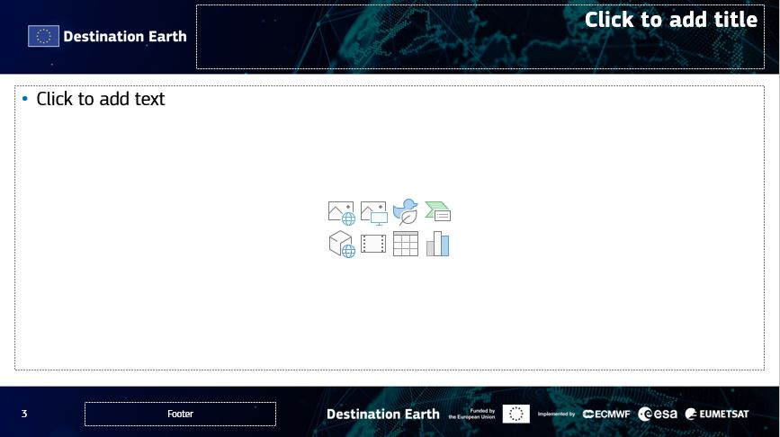
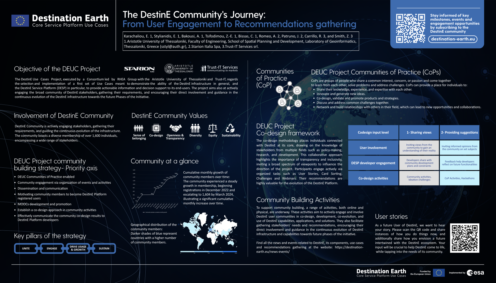

D4.2: Promotion Package

<table>
<colgroup>
<col style="width: 28%" />
<col style="width: 71%" />
</colgroup>
<tbody>
<tr>
<td><strong>Lead Partner:</strong></td>
<td style="text-align: left;">Trust-IT</td>
</tr>
<tr>
<td><strong>Reference:</strong></td>
<td style="text-align: left;">DEUC-TN-23-04</td>
</tr>
<tr>
<td><strong>Version:</strong></td>
<td style="text-align: left;">V6.1</td>
</tr>
<tr>
<td><strong>Status:</strong></td>
<td style="text-align: left;">Final</td>
</tr>
<tr>
<td><strong>Dissemination Level:</strong></td>
<td style="text-align: left;">Public</td>
</tr>
</tbody>
</table>

<table>
<colgroup>
<col style="width: 100%" />
</colgroup>
<tbody>
<tr>
<td style="text-align: left;"><strong>Deliverable Abstract</strong></td>
</tr>
<tr>
<td style="text-align: left;">This deliverable is the sixth iteration of
the promotional package to support promoters of Destination Earth
(DestinE) and the ESA DestinE Platform Use Cases Project (DEUC) in
generating visibility for both initiatives. This deliverable provides
materials with jointly agreed messaging by the DestinE Entrusted
Entities and the EC. The promotional package consists of separate visual
identity guidelines, rollups, flyers, posters, slide decks and others
for DestinE and DEUC. Development of the material is based on input from
D2.2 Community Building and Management Strategy and Workplan. The
deliverable also includes information on the current status of the
training programme to be implemented as a DestinE outreach mechanism
implemented as part of the project and the promotional activities for
the use cases procured under DEUC.</td>
</tr>
</tbody>
</table>

**  **

**COPYRIGHT NOTICE**

**DELIVERY SLIP**

<table>
<colgroup>
<col style="width: 23%" />
<col style="width: 40%" />
<col style="width: 19%" />
<col style="width: 16%" />
</colgroup>
<thead>
<tr>
<th><em>Date</em></th>
<th><em>Name</em></th>
<th><em>Partner/Activity</em></th>
<th><em>Date</em></th>
</tr>
</thead>
<tbody>
<tr>
<td>Prepared by:</td>
<td>Sarina Magham, Diego Domenici</td>
<td>Trust-IT Services</td>
<td>04/07/25</td>
</tr>
<tr>
<td>Reviewed by:</td>
<td></td>
<td></td>
<td></td>
</tr>
<tr>
<td>Approved by:</td>
<td></td>
<td></td>
<td></td>
</tr>
</tbody>
</table>

**DOCUMENT LOG**

<table>
<colgroup>
<col style="width: 9%" />
<col style="width: 14%" />
<col style="width: 24%" />
<col style="width: 52%" />
</colgroup>
<thead>
<tr>
<th><strong><em>Issue</em> </strong></th>
<th><strong><em>Date</em> </strong></th>
<th><strong><em>Comment</em> </strong></th>
<th><strong><em>Author</em> </strong></th>
</tr>
</thead>
<tbody>
<tr>
<td><strong>V1.0</strong></td>
<td>2023.01.31 </td>
<td>First Iteration </td>
<td>Rob Carrillo (Trust-IT), Luigi Colucci (Trust-IT), Lorenzo Calamai
(Trust-IT), Andrea Greco (Trust-IT), Diego Domenici (Trust-IT), Joanne
Ahern (Trust-IT), Zachary Smith (Trust-IT), Eleni Karachaliou
(AUTh) </td>
</tr>
<tr>
<td><strong>V2.0 </strong></td>
<td>2023.03.11</td>
<td>2nd iteration </td>
<td> Rob Carrillo (Trust-IT), Luigi Colucci (Trust-IT)</td>
</tr>
<tr>
<td><strong>V3.0</strong></td>
<td>2024.04.16</td>
<td>3rd iteration</td>
<td>Rob Carrillo (Trust-IT), Valeriya Fetisova (Trust-IT)</td>
</tr>
<tr>
<td><strong>V4.0</strong></td>
<td>2024.04.16</td>
<td>4th iteration</td>
<td>Rob Carrillo (Trust-IT), Valeriya Fetisova (Trust-IT)</td>
</tr>
<tr>
<td><strong>V5.0</strong></td>
<td>2024.07.22</td>
<td>5th iteration</td>
<td>Rob Carrillo (Trust-IT), Diego Dylan Domenici (Trust-IT), Eleni
Karachaliou (AUTh)</td>
</tr>
<tr>
<td><strong>V6.0</strong></td>
<td>2025.04.07</td>
<td>6th iteration</td>
<td>Rob Carrillo (Trust-IT), Diego Dylan Domenici (Trust-IT), Sarina
Magham (Trust-IT)</td>
</tr>
<tr>
<td><strong>V6.1</strong></td>
<td>2025.09.19</td>
<td>Update after final review comments</td>
<td>Antonio Romeo (Starion)</td>
</tr>
</tbody>
</table>

**Contents**

[1 Introduction [5](#introduction)](#introduction)

[2 DestinE Promotional Package
[6](#destine-promotional-package)](#destine-promotional-package)

[2.1 Visual identity guidelines and branded templates
[6](#visual-identity-guidelines-and-branded-templates)](#visual-identity-guidelines-and-branded-templates)

[2.2 Brochure [9](#brochure)](#brochure)

[2.3 Stakeholder-focused flyers
[10](#stakeholder-focused-flyers)](#stakeholder-focused-flyers)

[2.4 General Poster [15](#general-poster)](#general-poster)

[2.5 Community Poster [16](#community-poster)](#community-poster)

[2.6 Infographic [18](#infographic)](#infographic)

[2.7 Presentation slides
[20](#presentation-slides)](#presentation-slides)

[2.8 Rollup banner [21](#rollup-banner)](#rollup-banner)

[2.9 Videos [21](#videos)](#videos)

[3 DEUC Promotional Package
[24](#deuc-promotional-package)](#deuc-promotional-package)

[3.1 Visual identity guidelines
[24](#visual-identity-guidelines)](#visual-identity-guidelines)

[3.2 General Poster [26](#general-poster-1)](#general-poster-1)

[3.3 EGU2024 Poster [27](#egu2024-poster)](#egu2024-poster)

[3.4 Rollups [28](#rollups)](#rollups)

[3.5 General flyer [29](#general-flyer)](#general-flyer)

[3.6 Presentation slides
[30](#presentation-slides-1)](#presentation-slides-1)

[3.7 User Story Forms [30](#user-story-forms)](#user-story-forms)

[3.8 Zoom backgrounds for Webinars
[31](#zoom-backgrounds-for-webinars-plus-the-other-material)](#zoom-backgrounds-for-webinars-plus-the-other-material)

[3.9 2nd User eXchange posters
[32](#nd-user-exchange-posters)](#nd-user-exchange-posters)

[4 Training [36](#training)](#training)

[5 ESA DestinE Use Cases Promotion
[41](#esa-destine-use-cases-promotion)](#esa-destine-use-cases-promotion)

**  **

**Figures**

[Figure 1 DestinE Visual Identity Guidelines
[7](#_Toc201310004)](#_Toc201310004)

[Figure 2 DestinE Document, Letterhead and Presentation Templates
[8](#_Toc144447053)](#_Toc144447053)

[Figure 3 DestinE Brochure - excerpts
[9](#_Toc144447054)](#_Toc144447054)

[Figure 4 DestinE Flyer for Policymakers
[10](#_Toc144447055)](#_Toc144447055)

[Figure 5 DestinE Flyer for Decision Makers
[11](#_Toc201310008)](#_Toc201310008)

[Figure 6 DestinE Flyer for Research and Academia
[12](#_Toc144447057)](#_Toc144447057)

[Figure 7 DestinE Flyer for Industry and Private Sector
[13](#_Toc144447058)](#_Toc144447058)

[Figure 8 DestinE Flyer for Technology Providers
[14](#_Toc144447059)](#_Toc144447059)

[Figure 9 DestinE Poster [15](#_Toc144447060)](#_Toc144447060)

[Figure 10 DestinE Infographic [18](#_Toc144447061)](#_Toc144447061)

[Figure 11 DestinE Presentation Slides
[20](#_Toc144447062)](#_Toc144447062)

[Figure 12 DestinE Rollup Banner [21](#_Toc144447063)](#_Toc144447063)

[Figure 13 DestinE Video Pill Screenshots
[22](#_Toc201310016)](#_Toc201310016)

[Figure 14 DestinE Main Video Screenshots
[23](#_Toc201310017)](#_Toc201310017)

[Figure 15 DEUC Visual Identity Guidelines
[24](#_Toc144447065)](#_Toc144447065)

[Figure 16 DEUC Poster [26](#_Toc144447066)](#_Toc144447066)

[Figure 17 DEUC Rollups [28](#_Toc144447067)](#_Toc144447067)

[Figure 18 DEUC Flyer [29](#_Toc144447068)](#_Toc144447068)

[Figure 19 DEUC Presentation Slides
[30](#_Toc201310022)](#_Toc201310022)

[Figure 20 DEUC User Story Forms [31](#_Toc172242654)](#_Toc172242654)

[Figure 21 Webinar backgrounds [31](#_Toc201310024)](#_Toc201310024)

[Figure 22 2nd UX posters
[33](#_Toc201310025)](#_Toc201310025)

# Introduction 

The ESA DestinE Platform Use Cases project (DEUC) includes the
production and maintenance of channels and promotional materials that
create visibility and support engagement for the wider Destination Earth
(DestinE) initiative within its workplan. This means that aside from a
promotional kit dedicated to DEUC, a promotional kit is also produced
for DestinE.

To support the production of these promotional kits, DEUC D2.2 Community
Building and Management Strategy and Workplan (CBMS) was used as input
specifically the sections on stakeholder analysis to ensure that the
messaging in these materials is relevant.

In addition, especially for the DestinE promotional kit, the materials
are undergoing continuous updating and submission under a review process
under the DestinE Entrusted Entities (3E) ECMWF, ESA and EUMETSAT as
well as the European Commission. This means that the produced materials
contain agreed joint messaging about DestinE.

This document covers the following:

- DestinE promotional kit

- DEUC promotional kit

- Training

# DestinE Promotional Package

This section contains the promotional package developed to generate
visibility and support engagement for the Destination Earth initiative.
This promotional package includes visual identity guidelines, brochure,
five stakeholder-focused flyers, poster, general slides, rollup banner,
and general videos.

In Q2 2024, the DestinE promotional package is expected to be updated to
consider three changes:

- The rebranding of RHEA to Starion Italia

- The renaming of the Destination Earth Core Service Platform (DESP) to
  the DestinE Platform

- A convergence on the term “Digital Twin” rather than “Digital Replica”
  or “Digital Model”

## Visual identity guidelines and branded templates

Based on the visual guidelines provided by the European Commission (EC)
which included mostly ways to use the logo, and how to show the funding
acknowledgement, the DEUC project developed an expanded visual identity
guidelines document with more suggestions for the logotype applications,
colour palette and fonts. An expanded guidelines document was needed due
to the development of other materials outside the EC that will need
guidance for logotype applications, colours and font.

The original files can be accessed in the following link:

<https://github.com/destination-earth/DestinE/tree/main/Promotion%20Packages/Visual%20Identity%20Guidelines>

In addition, and based on the visual identity guidelines, templates for
documents, letterhead and presentations have been delivered.

Following the 2nd iteration, the templates have been revised
and adjusted based on the received feedback. The changes included
improvements on the design and content distribution on the templates.
The presentation templates are currently under revision. The 5th
iteration of the templates is available at the following link:

<https://github.com/destination-earth/DestinE/tree/main/Promotion%20Packages/Document%20and%20Presentation%20Templates>

<table>
<caption>
Figure 1
DestinE Visual Identity Guidelines
</caption>
<colgroup>
<col style="width: 49%" />
<col style="width: 50%" />
</colgroup>
<thead>
<tr>
<th></th>
<th></th>
</tr>
</thead>
<tbody>
<tr>
<td></td>
<td></td>
</tr>
<tr>
<td></td>
<td></td>
</tr>
</tbody>
</table>

Figure 2 DestinE
Document, Letterhead and Presentation Templates

## Brochure

The DestinE brochure will supply more detailed information about the
initiative than what the other promotional materials can provide. For
the latest iteration of the brochure, it will have general information
about Destination Earth and its development, a page on each of the
components, who benefits from it, the known use cases to-date, and
engagement opportunities. This can be used at onsite events or can be
distributed digitally.

The current version of the brochure is to be considered complete for the
purposes of the first DestinE contract. The Serco contract will use the
version developed under the Starion contract as a basis to develop one
or more brochures which will be more lightweight in comparison to the
original, to ease the editorial and publication processes.

This can be accessed in the following link:

<https://github.com/destination-earth/DestinE/tree/main/Promotion%20Packages/Brochure>

Figure 3 DestinE
Brochure - excerpts

## Stakeholder-focused flyers

To supply stakeholder-tailored information, DEUC has produced a flyer
for each priority stakeholder group as identified in the DEUC D2.2
Community Building and Management Strategy and Workplan. Flyers tailored
to policymakers, decision makers, research and academia, industry and
private sector and technology providers have been drafted. These can be
distributed at digitally as well as onsite events where the presence of
specific stakeholders are expected, allowing promoters of DestinE to
supply stakeholder-specific information to audiences.

These flyers are now in their 3rd revision. The improvements include
changes in the flyers background to ensure readability, reflecting the
change in terminology from Core Service Platform to DestinE Platform,
harmonising the tagline of DestinE for the use of “digital twin” instead
of digital replica or model, and edits in the content to better
highlight the advantages for the stakeholders.

### For policymakers

The “DestinE for Policymakers” flyer aims to introduce DestinE to
policymakers and it highlights the various policy levels where DestinE
can be used. High-level information is supplied and seeks to pique
interest for the initiative from the target audience.

This can also be accessed in the following link:

<https://github.com/destination-earth/DestinE/tree/main/Promotion%20Packages/Flyers/For%20Policymakers>

Figure 4 DestinE Flyer
for Policymakers

### For decision makers

The “DestinE for Decision Makers” flyer aims to specifically introduce
DestinE to decision makers. Unlike the other flyers, this specific flyer
is targeted to a specific role given DestinE’s significant benefits to
decision makers across various stakeholder groups. High-level
information is supplied and seeks to pique interest for the initiative
from the target audience.

This can also be accessed in the following link:

<https://github.com/destination-earth/DestinE/tree/main/Promotion%20Packages/Flyers/For%20Decision%20Makers>

Figure 5 DestinE Flyer
for Decision Makers

### For research and academia

The “DestinE for Research and Academia” flyer aims to introduce DestinE
to the research community, emphasising the diverse domains DestinE may
be used in and a general description of what it can offer to the
community. High-level information is supplied and seeks to pique
interest for the initiative from the target audience.

This can also be accessed in the following link :

<https://github.com/destination-earth/DestinE/tree/main/Promotion%20Packages/Flyers/For%20Research%20and%20Academia>

Figure 6 DestinE Flyer
for Research and Academia

### For industry and private sector

The “DestinE for Industry and Private Sector” flyer aims to generate
visibility on DestinE to the private sector. It highlights the benefits
to the private sector as a user, but it also informs them of procurement
opportunities where they can already take part in co-developing DestinE.
High-level information is supplied and seeks to pique interest for the
initiative from the target audience.

This can also be accessed in the following link:

<https://github.com/destination-earth/DestinE/tree/main/Promotion%20Packages/Flyers/For%20Industry%20and%20Private%20Sector>

Figure 7 DestinE Flyer
for Industry and Private Sector

### For technology providers

The “DestinE for Technology Providers” flyer aims to introduce DestinE
to technology providers across public and private sectors. The flyer
highlights the potential role of DestinE in supporting innovation in
various technological domains. High-level information is supplied and
seeks to pique interest for the initiative from the target audience.

This can also be accessed in the following link :

<https://github.com/destination-earth/DestinE/tree/main/Promotion%20Packages/Flyers/For%20Technology%20Providers>

Figure 8 DestinE Flyer
for Technology Providers

## General Poster

To generate visibility in relevant conferences or events with poster
sessions, DEUC has developed a draft standard poster which can form the
basis of future iterations with more specific messaging, as needed.

The general poster has gone under revision and can be accessed in the
following link :

<https://github.com/destination-earth/DestinE/tree/main/Promotion%20Packages/Poster>

<figure>

<figcaption>
Figure 9
DestinE Poster
</figcaption>
</figure>

## Community Poster

For the 2nd User Exchange and following editions, an
additional poster has been developed and presented to the community.
This poster is aimed at communicating the growth of the DestinE
community and highlighting the various engagement opportunities
available.

The Community Poster has been published and is accessible at the
following link:

<https://zenodo.org/records/10439395>

## Community Poster

For the 2024 EuroGEO Workshop and following external editions, an
additional poster has been developed and presented to the community.
This poster is aimed at communicating the key elements of DestinE, as
well as upcoming opportunities.

The Community Poster is accessible at the following link:

\[STARION LINK MISSING\]

## Infographic

To support digital communication and engagement across websites or
social media, three infographics were developed to supply a one-page
overview or primer for DestinE. They are designed in a landscape format
that would be apt for consumption in desktop screens or laptops or for
easy incorporation into presentations. The infographics convey the
comprehensive construction of DestinE in an appealing and easily
digestible arrangement, assisting users with an enjoyable frame of
reference as they seek to educate themselves on the DestinE process.

These infographics can also be accessed in the following link :

<https://github.com/destination-earth/DestinE/tree/main/Promotion%20Packages/Infographic>

<figure>

<figcaption>
Figure 10
DestinE Infographic
</figcaption>
</figure>

## Presentation slides

To support promoters of DestinE in presenting the initiative at various
events, a standard presentation deck has been produced which includes
general information about DestinE and a default call to action to join
the DestinE community via the website. The slides are delivered in an
editable format to allow presenters to change the presentation according
to their needs. The slides have been further developed and are currently
undergoing editorial board review and a new iteration is expected.

This can also be accessed in the following link:

<https://github.com/destination-earth/DestinE/tree/main/Promotion%20Packages/Presentation%20Slides>

<figure>

<figcaption>
Figure 11
DestinE Presentation Slides
</figcaption>
</figure>

## Rollup banner

DestinE-related events, particularly those organised by the Entrusted
Entities and their contractors that would like to further associate
their event to the DestinE initiative can use the rollup banner which
has been designed to not only reinforce DestinE’s visual identity but
also provide some high-level information and support the overall event
experience. This rollup has been approved and was used at events,
namely, BIDS’23, the 2nd DestinE User eXchange, and FOSS4G
2024, the QGIS User Conference 2024, the 3rd DestinE User
eXchange, EGI2024, and will be used at the upcoming 4th
DestinE User eXchange.

This can be accessed in the following link:

<https://github.com/destination-earth/DestinE/tree/main/Promotion%20Packages/Rollups>

<figure>

<figcaption>
Figure 12
DestinE Rollup Banner
</figcaption>
</figure>

## Videos 

**DestinE Video Pill**

The DestinE Video Pill’s purpose is to introduce the Destination Earth
initiative to a general audience with a rapid overview of its objectives
and scope. The video uses stock footage of natural landscapes, digital
visualisations and laboratory environments to convey the themes of the
initiative to the audience while providing them with essential
information through a voiceover in tune with minimal text on screen.

The Video Pill was created using Powtoon editing software and has been
designed and edited following multiple exchanges with the EEs, starting
in July 2023. It has currently been archived and marked as complete for
the purposes of the Starion contract.

<figure>

<figcaption>
Figure 13
DestinE Video Pill Screenshots
</figcaption>
</figure>

**DestinE Main Video**

The DestinE Main Video’s purpose is to provide a comprehensive overview
of the initiative to the public. It is expected to be valid for the
entire duration and be the flagship video for the initiative. As such,
the video does not limit itself to providing information but also uses
footage from the interviews with the EE representatives that were taken
during the 2nd UX event in Bonn, Germany to present an engaging and
personal message that can resonate not only with prospective DestinE
stakeholders but also the general public.

The Main Video was created using DaVinci editing software and has been
designed and edited following multiple exchanges with the EEs, starting
in October 2023. It has currently been archived and marked as complete
for the purposes of the Starion contract.

Both videos are accessible at the following link:

<https://github.com/destination-earth/DestinE/tree/main/Promotion%20Packages/Video>

<figure>

<figcaption>
Figure 14
DestinE Main Video Screenshots
</figcaption>
</figure>

# DEUC Promotional Package

This promotional package is being used in DEUC-specific activities or
DEUC-organised events.

In Q2 2024, the DEUC promotional package is expected to be updated to
consider two changes:

- The rebranding of RHEA to Starion Italia

- The renaming of the Destination Earth Core Service Platform
  () to the DestinE Platform

## Visual identity guidelines

As it was necessary to distinguish wider DestinE-related promotional
materials and communication and engagement activities to those organised
specifically by projects run by contractors, a promotional package has
been produced that apply the visual identity of the DEUC project. The
visual identity guidelines were developed in a way that allowed DEUC to
associate itself to the wider DestinE initiative while visually
communicating that a specific DEUC activity was carried out through the
DEUC project and not the DestinE initiative nor the Entrusted Entities
collectively.

We have also updated the logo for DEUC to reflect the change from Core
Service Platform to DestinE Platform.

This can also be accessed in the following link:

<https://github.com/destination-earth/DestinE_ESA_Use_Cases_Management/tree/main/Promotional%20material/VIsual%20Identity%20Guidelines>

Figure 15 DEUC Visual
Identity Guidelines

## General Poster

To generate visibility in relevant conferences or events with poster
sessions, DEUC has developed a draft standard poster which can form the
basis of future iterations with more specific messaging, as needed. This
poster has been displayed at the EuroGEO Week 2023 in Bolzano, Italy and
will be used at the upcoming EuroGEO Week 2024.

This can also be accessed in the following link:

<https://github.com/destination-earth/DestinE_ESA_Use_Cases_Management/tree/main/Promotional%20material/Poster>

<figure>

<figcaption>
Figure 16
DEUC Poster
</figcaption>
</figure>

## EGU2024 Poster

Below is the poster for EGU 2024 aimed at highlighting the core
functions and purposes of DestinE, including the objective of the DEUC
project and its function as community engagement facilitator to gather
insights and recommendations from users and demonstrate the capacity of
DestinE infrastructure.

<figure>

<figcaption>
Figure 10 DEUC Project Use Cases Poster
</figcaption>
</figure>

The poster was developed for EGU 2024 can be accessed through the
following link:

<https://github.com/destination-earth/DestinE_ESA_Use_Cases_Management/tree/main/Promotional%20material/Poster/Poster%20-%20EGU%202024>

## Rollups

DEUC-organised events can use the rollup banner which has been designed
to not only reinforce DEUC’s relation to DestinE but also supply some
high-level information and support the overall event experience. Two
versions have been produced – one branding focused which only shows the
main value proposition of the project while a content-rich version
supplies more information about the project. A first version of this
rollup has been approved and was used at events, namely, BIDS’23 and the
2nd DestinE User Exchange. This roll-up will be updated at
the next opportunity where it will be used since, at present, the
current design still retains the outdated terminologies and logos.

This can also be accessed in the following link:

<https://github.com/destination-earth/DestinE_ESA_Use_Cases_Management/tree/main/Promotional%20material/Rollup>

Figure 17 DEUC Rollups

## General flyer

A general flyer has been produced to support DEUC in disseminating about
the engagement opportunities made available through the project. It can
be used at third party events where DEUC is authorised to distribute
promotional material.

This can also be accessed in the following link:

<https://github.com/destination-earth/DestinE_ESA_Use_Cases_Management/tree/main/Promotional%20material/Flyer>

Figure 18 DEUC Flyer

## Presentation slides

To support the DEUC consortium in presenting its work at various events,
a standard presentation deck has been produced which includes general
information about DEUC and a default call to action to join the DestinE
community via the website. The slides are delivered in an editable
format to allow presenters to change the presentation according to their
needs.

The slides have been updated to reflect the consortium of the Serco
contract.

This can also be accessed in the following link:

<https://github.com/destination-earth/DestinE_ESA_Use_Cases_Management/tree/main/Promotional%20material/Standard%20Presentation>

<figure>

<figcaption>
Figure 19
DEUC Presentation Slides
</figcaption>
</figure>

## User Story Forms

To properly collect user feedback during the 2nd User
Exchange, the consortium created a printable form with a series of
fields to categorise and understand user needs. The fields were aimed at
understanding Users’ professions and needs and their opinions on
DestinE. These have been used during the 2nd User eXchange.

They can be accessed through the following link:

<https://github.com/destination-earth/DestinE_ESA_Use_Cases_Management/tree/main/Promotional%20material/2nd%20User%20Exchange%20(DEUC%20Use%20Cases)/User%20Stories%20form>

Figure 20 DEUC User Story
Forms

## Zoom backgrounds for Webinars (PLUS THE OTHER MATERIAL)

To assist with the roadshow webinars of the Use Cases, the consortium is
creating a series of background images, consisting of a general
background for the speakers as well as an introductory background for
each webinar. So far, the general background plus the specific
background for the webinars have been created (CITYNEXUS, DRE,
UrbanSquare).

They can be accessed through the following link:

<https://github.com/destination-earth/DestinE_ESA_Use_Cases_Management/tree/main/Promotional%20material/Zoom%20backgrounds>

Figure 21 Webinar
backgrounds

## 2nd User eXchange posters

To promote DEUC at the 2nd UX in Bonn, a series of posters
was realised. These were created by the Use Cases themselves rather than
by Trust-IT, but they are reported here nonetheless for posterity.

The posters can be accessed in the following link:

<https://github.com/destination-earth/DestinE_ESA_Use_Cases_Management/tree/main/Promotional%20material/2nd%20User%20Exchange%20(DEUC%20Use%20Cases)>

Figure 22 2nd
UX posters

##  3rd User eXchange posters

<figure>

<figcaption>
Figure 23 3rd UX posters
</figcaption>
</figure>

##  4th User eXchange Stickers

Figure 24 4th UX Stickers

# Training

The DEUC project MOOC, at its beginning, will consist of two
modules/sections. The first module will stand as an introduction to the
DestinE initiative and its mission, while the second module will focus
on the introduction and explanation of the DestinE Use Cases of ESA,
implemented by esteemed providers. The target group of this MOOC is
mainly people unaware of DestinE’s services and use cases, but also
DestinE users who would like to understand and learn more about
DestinE’s capabilities and actions. This MOOC will be hosted at the
DestinE Platform Learning Hub, implemented by Serco. Trust-IT services
also created a presentation template for the DestinE MOOC to keep the
content uniform and well-structured throughout the various modules,
sections, and collaborating partners.

The first module of the MOOC, named “DestinE explained: An introduction
to the DestinE initiative and its mission” is going to help promote the
DestinE initiative, share and explain its components and advantages,
values and objectives, introduce the three Entrusted Entities
implementing the components of DestinE, help to grow the DestinE
Community, explain key actions on the DestinE Platform and its services,
and provide some practical examples of using DestinE Digital Twins.

 In parallel, the second module of the MOOC hosts the description of
five Use Cases implemented for ESA by several providers. These Use Cases
cover subjects over different sectors, including energy, fishery
management, flooding, polar voyage planning, risk management, urban
heat, and urban planning. Each Use Case represents a service that will
or is already integrated into the DestinE Platform. These Use Cases
showcase their impact and importance by making good use of the
capabilities that DestinE Platform offers. All providers prepared
content for the MOOC to introduce, explain, and showcase the implemented
Use Cases to DestinE Platform’s users or potential ones. The general
structure that is mostly followed throughout the content of the Use
Cases module is:

- Use Case’s overview, purpose, and key outcomes

- Description of data sources, methodologies, tools used, Use Case
  DestinE service, and analytical way of using it

During the recommendations gathering activities from the Community, the
following recommendations refer to training. Some of the recommendations
are under implementation and others will be addressed in the near
future.

<table>
<colgroup>
<col style="width: 13%" />
<col style="width: 18%" />
<col style="width: 25%" />
<col style="width: 15%" />
<col style="width: 13%" />
<col style="width: 15%" />
</colgroup>
<thead>
<tr>
<th style="text-align: center;"></th>
<th style="text-align: center;"></th>
<th style="text-align: center;"></th>
<th style="text-align: center;">✅ Already addressed</th>
<th style="text-align: center;">🔄In progress</th>
<th style="text-align: center;">📌 Not Addressed – Candidate for
Roadmap</th>
</tr>
</thead>
<tbody>
<tr>
<td style="text-align: center;">Category</td>
<td style="text-align: center;">Sub-category</td>
<td style="text-align: center;">Recommendations</td>
<td style="text-align: center;"></td>
<td></td>
<td></td>
</tr>
<tr>
<td rowspan="18" style="text-align: center;">Training</td>
<td rowspan="5" style="text-align: center;"><em>What to Train</em></td>
<td style="text-align: center;">Training content should include explicit
guidance on how to access and navigate the DestinE platform.</td>
<td style="text-align: center;">X</td>
<td style="text-align: center;"></td>
<td style="text-align: center;"></td>
</tr>
<tr>
<td style="text-align: center;">Each service available on the platform
should be clearly explained, including its core functionalities and
intended use.</td>
<td style="text-align: center;">X</td>
<td style="text-align: center;"></td>
<td style="text-align: center;"></td>
</tr>
<tr>
<td style="text-align: center;">Users should be shown how a Use Case is
structured, with practical examples illustrating real-world applications
and implementation processes.</td>
<td style="text-align: center;">X</td>
<td style="text-align: center;"></td>
<td style="text-align: center;"></td>
</tr>
<tr>
<td style="text-align: center;">Training should provide comprehensive
information on the overall capabilities of the DestinE platform.</td>
<td style="text-align: center;">X</td>
<td style="text-align: center;"></td>
<td style="text-align: center;"></td>
</tr>
<tr>
<td style="text-align: center;">The marketable aspects of the platform
should be demonstrated, including why and how users can benefit from
active participation.</td>
<td style="text-align: center;"></td>
<td style="text-align: center;">X</td>
<td style="text-align: center;"></td>
</tr>
<tr>
<td rowspan="3" style="text-align: center;"><em>Who to Train</em></td>
<td style="text-align: center;">Prioritize training sessions based on
user needs and frequency of platform usage.</td>
<td style="text-align: center;"></td>
<td style="text-align: center;"></td>
<td style="text-align: center;">X</td>
</tr>
<tr>
<td style="text-align: center;">Explore the potential benefit of
engaging individuals who are not current users but might become relevant
stakeholders in the future.</td>
<td style="text-align: center;">X</td>
<td style="text-align: center;"></td>
<td style="text-align: center;"></td>
</tr>
<tr>
<td style="text-align: center;">Establish "Train-the-Trainers" programs,
empowering educators and community leaders to disseminate knowledge
within their own networks, thereby achieving a multiplier effect.</td>
<td style="text-align: center;"></td>
<td style="text-align: center;">X</td>
<td style="text-align: center;"></td>
</tr>
<tr>
<td rowspan="5" style="text-align: center;"><em>How to Train</em></td>
<td style="text-align: center;">Training materials should be clear,
concise, and engaging, using accessible formats such as “10 things you
can do now,” one-stop platform guides, walkthrough videos, and short
elevator-pitch summaries.</td>
<td style="text-align: center;">X</td>
<td style="text-align: center;"></td>
<td style="text-align: center;"></td>
</tr>
<tr>
<td style="text-align: center;">DestinE Platform should offer customized
training sessions tailored to the specific needs of different user
types.</td>
<td style="text-align: center;">X</td>
<td style="text-align: center;"></td>
<td style="text-align: center;"></td>
</tr>
<tr>
<td style="text-align: center;">The training process should include
co-designed and community-generated content, making the material more
relatable and effective.</td>
<td style="text-align: center;"></td>
<td style="text-align: center;">X</td>
<td style="text-align: center;"></td>
</tr>
<tr>
<td style="text-align: center;">DestinE Platform should adopt
interactive e-learning formats, including gamification elements and
quizzes, to improve learning outcomes and user engagement.</td>
<td style="text-align: center;">X</td>
<td style="text-align: center;"></td>
<td style="text-align: center;"></td>
</tr>
<tr>
<td style="text-align: center;">Formal training should be supported by
static training materials that include self-assessments or quizzes and
should be designed to lead users toward certification pathways.</td>
<td style="text-align: center;">X</td>
<td style="text-align: center;"></td>
<td style="text-align: center;"></td>
</tr>
<tr>
<td rowspan="3" style="text-align: center;"><em>Recognition of Knowledge
on the Platform (Training Certification)</em></td>
<td style="text-align: center;">DestinE Platform should create a formal
certification program, ideally in partnership with recognized
institutions or external credentialing bodies.</td>
<td style="text-align: center;"></td>
<td style="text-align: center;"></td>
<td style="text-align: center;">X</td>
</tr>
<tr>
<td style="text-align: center;">Certifications should be issued with
recognized credentials, such as those from the 3Es, to increase their
professional value.</td>
<td style="text-align: center;"></td>
<td style="text-align: center;"></td>
<td style="text-align: center;">X</td>
</tr>
<tr>
<td style="text-align: center;">Lightweight forms of recognition—such as
badges or certificates of completion—should also be made available for
those participating in webinars and training events.</td>
<td style="text-align: center;"></td>
<td style="text-align: center;">X</td>
<td style="text-align: center;"></td>
</tr>
<tr>
<td rowspan="2" style="text-align: center;"><em>Who is the
Trainer</em></td>
<td style="text-align: center;">DestinE Platform should appoint
service-specific trainers who have expertise in particular services or
Use Cases.</td>
<td style="text-align: center;"></td>
<td style="text-align: center;">X</td>
<td style="text-align: center;"></td>
</tr>
<tr>
<td style="text-align: center;">A dedicated DestinE Platform training
department should be established to (a) develop standardised,
high-quality training materials for each available service; (b) produce
detailed, instructional content for each Use Case; (c) ensure training
consistency across formats and delivery modes.</td>
<td style="text-align: center;"></td>
<td style="text-align: center;"></td>
<td style="text-align: center;">X</td>
</tr>
</tbody>
</table>

# ESA DestinE Use Cases Promotion

Following the kick-off of the ESA DestinE Use Cases in November 2023, a
new website section has been released to provide a comprehensive
overview of the Use Cases. Prior to the launch of the section, all the
selected Use Cases have been contacted and asked to provide a
description of their work and expected impact following a template
confirmed with the three EEs.

All the Use Cases are showcased in the general section, where the user
can filter them by organisation, topic and scale. Additionally, each Use
Case has a dedicated page which gives information on the challenge
addressed, technical details, solution provided by each Use Case,
expected impact and the parties involved in the Use Case implementation.

To facilitate promotion and users’ engagement, the Use Cases pages have
been designed to incorporate multiple graphic materials provided by the
Use Cases and images referring to each Use Case topic.

The website section acts as the main point of reference for retrieving
information on the Use Cases.

All the Use Cases are accessible through the dedicated section at the
following link:

<https://destination-earth.eu/use-cases/>

<table>
<colgroup>
<col style="width: 37%" />
<col style="width: 62%" />
</colgroup>
<thead>
<tr>
<th><strong>Planned Promotional Activity</strong></th>
<th style="text-align: left;"><strong>Status as of July
2024</strong></th>
</tr>
</thead>
<tbody>
<tr>
<td><strong>Website use case section</strong>: A section on the website
will be dedicated to use cases. After the kick-off of the ESA DestinE
Use Cases in the week of 6-10 November 2023, information from each use
case will be gathered and information will be published. This entire
section is planned to be released before the end of November 2023.</td>
<td style="text-align: left;">DEUC use case pages have been finalised
and can be access through this link: <a
href="https://destination-earth.eu/use-cases/?_organidsation=esa">https://destination-earth.eu/use-cases/?_organidsation=esa</a></td>
</tr>
<tr>
<td><strong>DestinE brochure</strong>: The first draft of the DestinE
brochure includes a section on use cases. In the next iteration of the
brochure and once information from the ESA DestinE Use Cases have been
collected, they will be included in the DestinE brochure.</td>
<td style="text-align: left;">The DEUC Use Cases have been incorporated
in the last draft. Currently, the brochure is undergoing the review by
the EB.</td>
</tr>
<tr>
<td><strong>Videos</strong>: As part of the Community Building and
Management Strategy (CBMS), a communication campaign will be dedicated
to the ESA DestinE Use Cases - Campaign 3: Demonstrating DestinE’s
Potential Impact Via Use Cases. In this campaign, at least 6 videos are
envisioned to be produced aiming to show the potential use and impact of
DestinE.</td>
<td style="text-align: left;">
The DEUC Use Cases videos have been
produced and shared.

<ul>
<li>
CityNexus for Urban Planning: <a
href="https://www.youtube.com/watch?v=MVvKX6J30sg">https://www.youtube.com/watch?v=MVvKX6J30sg</a>
</li>
<li>
DESIDE for Polar Voyage Planning: <a
href="https://www.youtube.com/watch?v=aVtes_u7WwQ">https://www.youtube.com/watch?v=aVtes_u7WwQ</a>
</li>
<li>
Destination Renewable Energy (DRE) for Energy: <a
href="https://www.youtube.com/watch?v=jk5KOcjK0IU">https://www.youtube.com/watch?v=jk5KOcjK0IU</a>
</li>
<li>
Global Fish Tracking System (GFTS) for Fishery Management: <a
href="https://www.youtube.com/watch?v=eNCeo0IKJVw">https://www.youtube.com/watch?v=eNCeo0IKJVw</a>
</li>
<li>
UrbanSquare for Flooding, Risk Management, and Urban Heat: <a
href="https://www.youtube.com/watch?v=lgS-lVYpI0E">https://www.youtube.com/watch?v=lgS-lVYpI0E</a>
</li>
</ul></td>
</tr>
<tr>
<td><strong>News</strong>: Several news posts communicating key
milestones of the ESA DestinE use cases will be published. This includes
the announcement of the use cases procured and any major
developments.</td>
<td style="text-align: left;">To be delivered upon receipt of
updates.</td>
</tr>
<tr>
<td><strong>DestinE Journal entries (blogs)</strong>: Each ESA DestinE
use case will be featured through an interview with the use case
implementer and published as a DestinE Journal blog.</td>
<td style="text-align: left;">The first draft of each blog has been
produced and is currently undergoing review at different steps of the
pipeline (internal, STARION, ESA)</td>
</tr>
<tr>
<td><strong>Webinar</strong>: Webinars will be organised by the ESA
DestinE Core Service Platform Use Cases project to introduce and
highlight the use cases and their progress.</td>
<td style="text-align: left;">
The webinars for CITYNEXUS, DRE,
UrbanSquare and DESIDE have taken place:

<ul>
<li>
CITYNEXUS: <a
href="https://destination-earth.eu/event/how-destine-can-empower-sustainable-cities/">https://destination-earth.eu/event/how-destine-can-empower-sustainable-cities/</a>
</li>
<li>
DRE: <a
href="https://destination-earth.eu/event/roadshow-webinar-renewable-energy-forecasting-through-the-destine-platform/">https://destination-earth.eu/event/roadshow-webinar-renewable-energy-forecasting-through-the-destine-platform/</a>
</li>
<li>
UrbanSquare: <a
href="https://destination-earth.eu/event/urbansquare-destine-empowering-urban-resilience-against-climate-challenges/">https://destination-earth.eu/event/urbansquare-destine-empowering-urban-resilience-against-climate-challenges/</a>
</li>
<li>
DESIDE: <a
href="https://destination-earth.eu/event/roadshow-webinar-deside/">https://destination-earth.eu/event/roadshow-webinar-deside/</a>
</li>
</ul>

Results are reported in D2.2 V3 (July 2024)

GFTS will be organised in September.
</td>
</tr>
<tr>
<td><strong>Other materials to be developed upon request</strong>: Where
needed, dedicated promotional material or communication activities can
be organised to promote the use cases including the production of
posters and flyers or the organisation of events such as dedicated
webinars or workshops.</td>
<td style="text-align: left;">To be delivered upon request.</td>
</tr>
</tbody>
</table>
