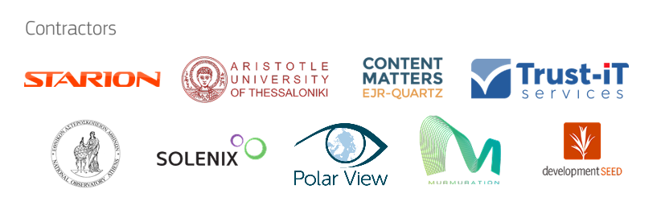
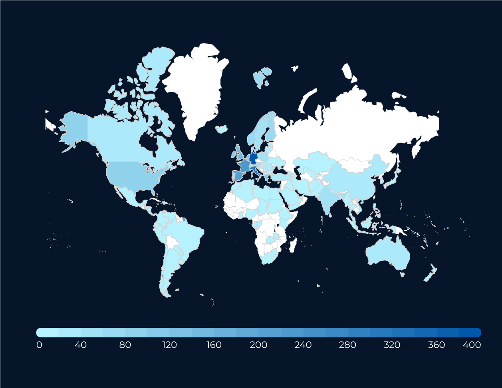
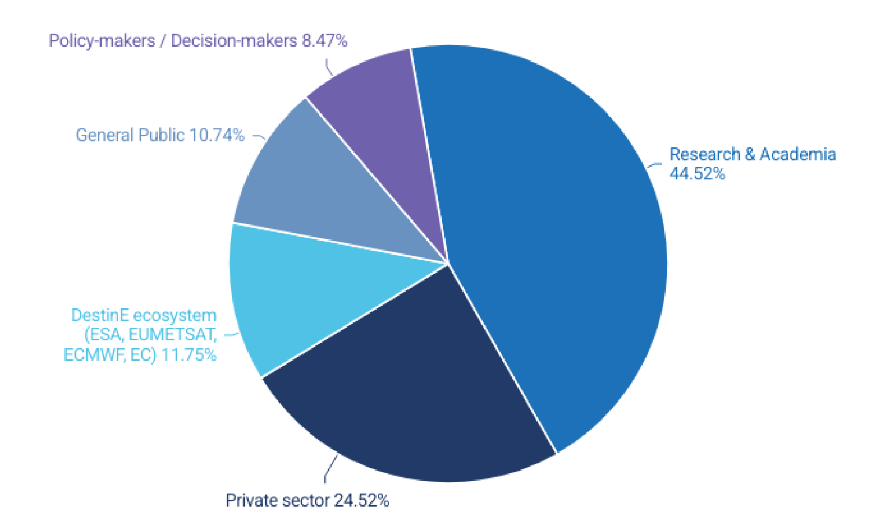
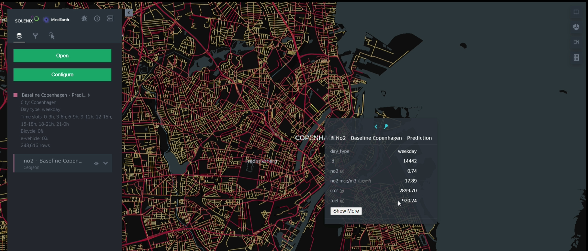
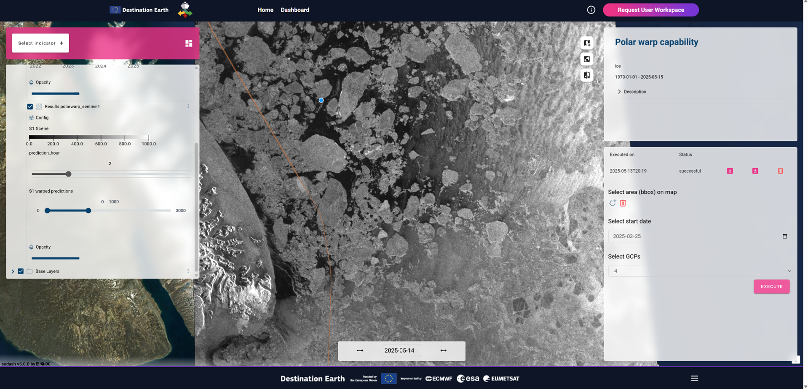
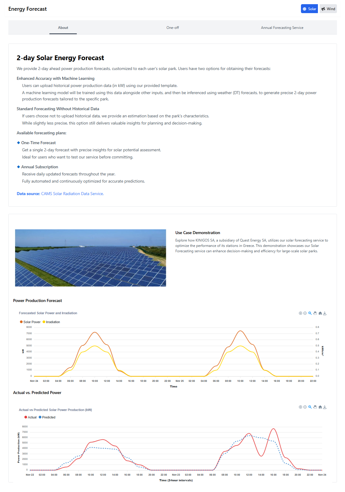
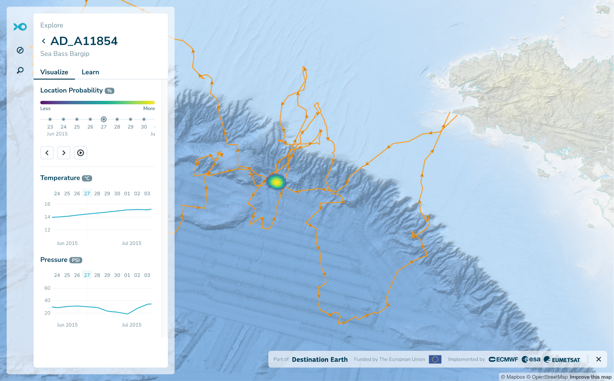
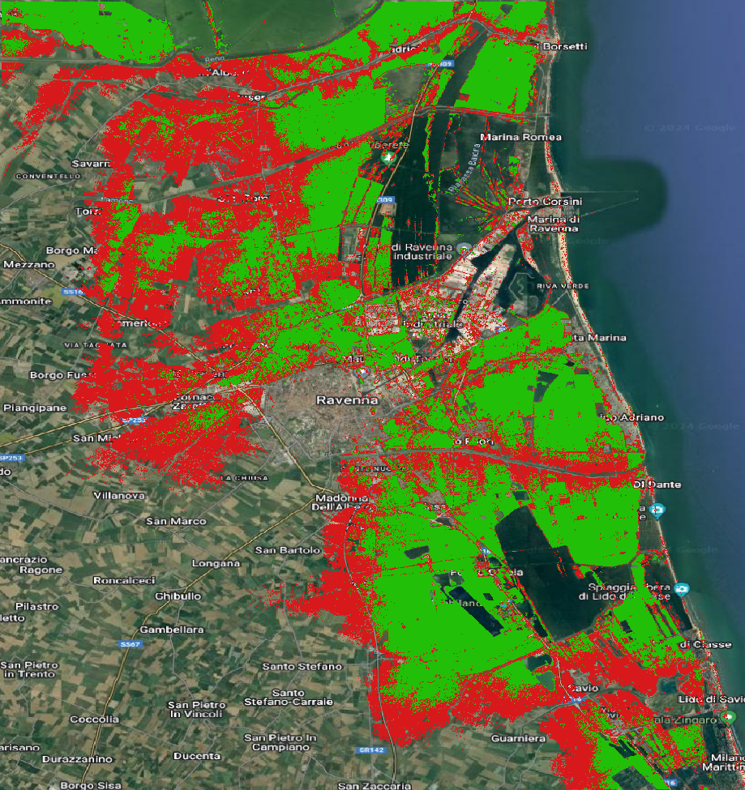
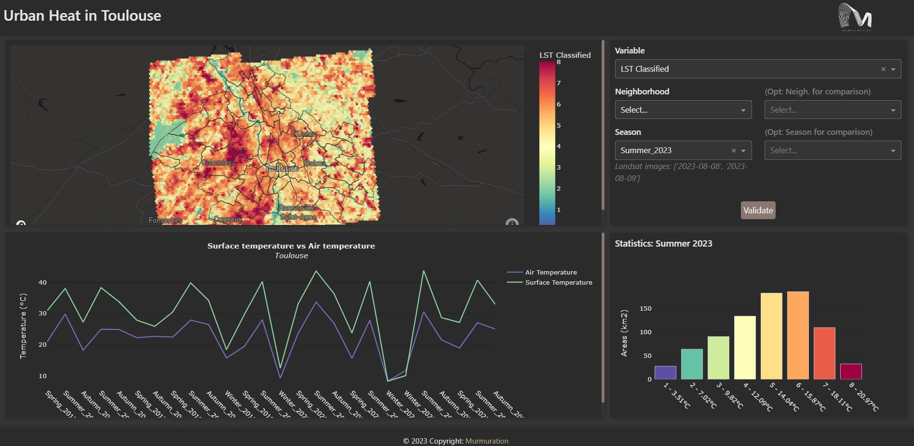
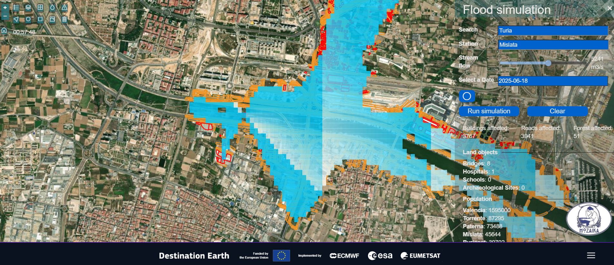

*  *

DestinE Platform Use Cases Final Report

<table>
<colgroup>
<col style="width: 28%" />
<col style="width: 71%" />
</colgroup>
<tbody>
<tr>
<td><strong>Lead Partner:</strong></td>
<td style="text-align: left;">Starion Italia S.p.A.</td>
</tr>
<tr>
<td><strong>Reference:</strong></td>
<td style="text-align: left;">DEUC-RP-25-01</td>
</tr>
<tr>
<td><strong>Version:</strong></td>
<td style="text-align: left;">1.0</td>
</tr>
<tr>
<td><strong>Status:</strong></td>
<td style="text-align: left;">Draft</td>
</tr>
<tr>
<td><strong>Dissemination Level:</strong></td>
<td style="text-align: left;">Public</td>
</tr>
</tbody>
</table>

<table>
<colgroup>
<col style="width: 100%" />
</colgroup>
<tbody>
<tr>
<td style="text-align: left;"><strong>Deliverable Abstract</strong></td>
</tr>
<tr>
<td style="text-align: left;">
This is the final report of the DestinE
Platform Use Cases project, providing an overview of the context of the
DestinE initiative and the achievements of the various activities
performed. It reports

<ul>
<li>
the outcome of the procurement and development of the 5 use cases
for the validation of the DestinE platform which were then integrated as
operational services on the platform itself,
</li>
<li>
the establishment and growth of the User Community
</li>
<li>
the creation of the DestinE Portal and the outreach activites
related to the whole initiative and the project specific
promotion
</li>
</ul></td>
</tr>
</tbody>
</table>

**  **

**COPYRIGHT NOTICE**

**DELIVERY SLIP**

<table>
<colgroup>
<col style="width: 23%" />
<col style="width: 40%" />
<col style="width: 19%" />
<col style="width: 16%" />
</colgroup>
<thead>
<tr>
<th><em>Date</em></th>
<th><em>Name</em></th>
<th><em>Partner/Activity</em></th>
<th><em>Date</em></th>
</tr>
</thead>
<tbody>
<tr>
<td>Prepared by:</td>
<td>Antonio Romeo</td>
<td>Starion</td>
<td>8/9/2025</td>
</tr>
<tr>
<td>Approved by:</td>
<td>Claudia Vitolo</td>
<td>ESA</td>
<td></td>
</tr>
</tbody>
</table>

**DOCUMENT LOG**

<table style="width:100%;">
<colgroup>
<col style="width: 9%" />
<col style="width: 14%" />
<col style="width: 60%" />
<col style="width: 16%" />
</colgroup>
<thead>
<tr>
<th><em>Issue</em></th>
<th><em>Date</em></th>
<th><em>Comment</em></th>
<th><em>Author</em></th>
</tr>
</thead>
<tbody>
<tr>
<td>v.1.0</td>
<td>8/9/2025</td>
<td>First version</td>
<td>Antonio Romeo</td>
</tr>
</tbody>
</table>

**TERMINOLOGY**

<table>
<colgroup>
<col style="width: 26%" />
<col style="width: 73%" />
</colgroup>
<thead>
<tr>
<th><em>Terminology/Acronym</em></th>
<th><em>Definition</em></th>
</tr>
</thead>
<tbody>
<tr>
<td>BP</td>
<td>Best Practice</td>
</tr>
<tr>
<td>CoP</td>
<td>Communities of Practice</td>
</tr>
<tr>
<td>CRO</td>
<td>Conversion-Rate Optimization</td>
</tr>
<tr>
<td>DEDL</td>
<td>Destination Earth Data Lake</td>
</tr>
<tr>
<td>DESP</td>
<td>Destination Earth Service Platform</td>
</tr>
<tr>
<td>DestinE</td>
<td>Destination Earth</td>
</tr>
<tr>
<td>DG CNECT</td>
<td>EC’s Directorate-General for Communications Networks, Content and
Technology</td>
</tr>
<tr>
<td>DL</td>
<td>Deep Learning</td>
</tr>
<tr>
<td>DT</td>
<td>Digital Twin</td>
</tr>
<tr>
<td>DTaaS</td>
<td>Digital Twin-as-a-Service</td>
</tr>
<tr>
<td>DTE</td>
<td>Digital Twin Engine</td>
</tr>
<tr>
<td>DTEP</td>
<td>Digital Twin Earth Precursor</td>
</tr>
<tr>
<td>E2E</td>
<td>End-to-End</td>
</tr>
<tr>
<td>EC</td>
<td>European Commission</td>
</tr>
<tr>
<td>ECMWF</td>
<td>European Centre for Medium-Range Weather Forecasts</td>
</tr>
<tr>
<td>Entrusted Entities</td>
<td>ESA, ECMWF and EUMETSAT</td>
</tr>
<tr>
<td>EO</td>
<td>Earth Observation</td>
</tr>
<tr>
<td>ESA</td>
<td>European Space Agency</td>
</tr>
<tr>
<td>ETP4HPC</td>
<td>European Technology Platform for High Performance Computing</td>
</tr>
<tr>
<td>EU</td>
<td>European Union</td>
</tr>
<tr>
<td>EUMETSAT</td>
<td>European Organization for the Exploitation of Meteorological
Satellites</td>
</tr>
<tr>
<td>HPC</td>
<td>High Performance Computing</td>
</tr>
<tr>
<td>IoT</td>
<td>Internet of Things</td>
</tr>
<tr>
<td>IP</td>
<td>Intellectual Property</td>
</tr>
<tr>
<td>IaaS</td>
<td>Infrastructure-as-a-Service</td>
</tr>
<tr>
<td>ITT</td>
<td>Invitation to Tender</td>
</tr>
<tr>
<td>JRC</td>
<td>EC’s Joint Research Centre</td>
</tr>
<tr>
<td>KO</td>
<td>Kick-Off</td>
</tr>
<tr>
<td>ML</td>
<td>Machine Learning</td>
</tr>
<tr>
<td>PaaS</td>
<td>Platform-as-a-Service</td>
</tr>
<tr>
<td>RA</td>
<td>Risk Assessment</td>
</tr>
<tr>
<td>RG</td>
<td>STARION Group</td>
</tr>
<tr>
<td>SaaS</td>
<td>Software-as-a-Service</td>
</tr>
<tr>
<td>SoW</td>
<td>Statement of Work</td>
</tr>
<tr>
<td>SPACES</td>
<td>Support, Product feedback, Advocacy, Content contribution,
Engagement</td>
</tr>
<tr>
<td>STC</td>
<td>Special Tender Conditions</td>
</tr>
<tr>
<td>SW</td>
<td>Software</td>
</tr>
<tr>
<td>TEB</td>
<td>Tender Evaluation Board</td>
</tr>
<tr>
<td>TOB</td>
<td>Tender Opening Board</td>
</tr>
<tr>
<td>UVP</td>
<td>Unique Value Proposition</td>
</tr>
<tr>
<td>UX</td>
<td>User Experience</td>
</tr>
<tr>
<td>WP</td>
<td>Work Package</td>
</tr>
</tbody>
</table>

**Contents**

[1 Introduction [5](#introduction)](#introduction)

[2 DestinE User Community Management and recommendation collection
[6](#destine-user-community-management-and-recommendation-collection)](#destine-user-community-management-and-recommendation-collection)

[3 Outreach activities [9](#outreach-activities)](#outreach-activities)

[4 Use Cases Procurement
[12](#use-cases-procurement)](#use-cases-procurement)

[5 Use Cases Development and coordination
[13](#use-cases-development-and-coordination)](#use-cases-development-and-coordination)

[5.1 CityNexus [13](#citynexus)](#citynexus)

[5.2 DESIDE [14](#deside)](#deside)

[5.3 DRE [15](#dre)](#dre)

[5.4 GFTS [17](#gfts)](#gfts)

[5.5 UrbanSquare [18](#urbansquare)](#urbansquare)

[6 Coordination with DestinE related activities
[21](#coordination-with-destine-related-activities)](#coordination-with-destine-related-activities)

[7 Lesson Learned [22](#lesson-learned)](#lesson-learned)

# Introduction 

The DestinE Platform Use Cases project, started in January 2023, is the
first of a set of contracts established by the European Space Agency in
the frame of the Destination Earh (DestinE) initiative, funded by the
EC, which aims at creating a highly accurate digital model of the Earth
in support to the European Green Deal and Digital Transformation
programmes. DestinE is implemented by 3 Entrusted Entities, ESA, ECMWF
and EUMETSAT, each of them overseeing one of the main components of the
DestinE system; ESA is responsible for the DestinE Platform, ECMWF for
the 2 initial Digital Twins (Climate Change Adaptation and
Weather-Induced Extremes) and the Digital Twin Engine, and EUMETSAT for
the Data Lake.

The project was implemented by a consortium led by Starion Italia, which
included Trust-IT, the Aristotle University of Thessaloniki, EJR-Quartz
and the providers of the Use Cases, as specified below.

The main objectives of the DestinE Platform Use Cases project were:

- Establish and expand the DestinE user community, collecting users’
  recommendation to drive the DestinE Platform development

- Procure a set of use cases to validate the DestinE platform and its
  concept

- Advertise DestinE initiative through a web portal, newsletters and
  events

- Develop and integrate the Use Cases in the DestinE Platform and
  eventually make them operational services

Within the project, 5 Use Cases have been operationalised on the DestinE
Platform:

- CityNexus, provided by a consortium led by Solenix, which focuses on
  urban planning

- DESIDE, provided by a consortium led by Polar View, which focuses on
  navigation in the Arctic

- DRE, provided by a consortium led by the National Observatory of
  Athens, which focuses on Solar and Wind electricity generation
  facilities

- GFTS, provided by a consortium led by DevelopmentSeed, which focuses
  on sustainable fishery

- UrbanSquare, provided by a consortium led by Murmuration, which
  focuses on urban resilience

The project, which originally foresaw a duration of 18 months and 2
rounds of use cases procurement, was extended to align with the DestinE
Platform development and to give time to the use cases to develop
additional functionalities to become operational services on the DestinE
Platform, reducing to only one the procurement rounds. The project ended
in September 2025.

In the following sections it is reported how the above-mentioned
objectives were met, the coordination performed with other DestinE
related activities and the lessons learned.

# DestinE User Community Management and recommendation collection

Create a user community around the DestinE initiative was a fundamental
task to ensure that the co-creation principle followed by DestinE
development was implemented. The community in fact has been the main
provider of the recommendations, together with the procured use cases,
which were collected within this project and passed to the DestinE
Platform operator.

The first step for the creation of the community was to classify
stakeholders using a multi-dimensional approach:

- **Spatial Scale**: Local, regional, national, continental and global.

- **Expertise**: Policymakers, decision-makers, researchers, technology
  providers, industry representatives.

- **Customized Roles**: Use case makers, core DestinE entities, and the
  general public.

Each group was further analysed using a **Power-Interest Matrix**,
identifying their influence and engagement potential. The categories
used were:

- **Subjects**: High interest, low power (e.g., local policymakers,
  citizen scientists).

- **Players**: High interest, high power (e.g., national policymakers,
  climate scientists).

- **Context Setters**: High power, low alignment (e.g., global
  policymakers).

- **Crowd**: Low interest and power (e.g., general hardware providers).

It was then defined an Engagement Strategy which was based on
inclusivity, co-design, and sustained interaction. It aimed to unite
diverse stakeholders—policymakers, researchers, industry, and
citizens—through tailored Communities of Practice (CoPs), events, and
digital tools and education material, like MOOCs. By fostering open
dialogue and collaborative development, the strategy aimed at ensuring
that user needs shaped the platform evolution.

The strategy implementation needed to adapt to the DestinE platform
actual schedule, which was eventually open to the public in October
2024, therefore the first community interactions were based on high
level description of the DestinE initiatives and the platform publicly
available.

The user recommendations were collected via questionnaires, distributed
in selected events, webinars and dedicated challenges. The consortium
collected input from the community in the following conferences:

- 1st Destination Earth User eXchage (15 February 2023,
  Frascati)

- BiDs 2023 (6-9 November 2023, Wien)

- 2nd Destination Earth User eXchage (13-14 November 2023,
  Bonn)

- EGU 2024 (14-19 April 2024, Wien)

- QGIS Conference 2024 (9 September 2024, Bratislava)

- 3rd Destination Earth User eXchage (15-16 October 2024,
  Darmstadt)

The webinar below, organised by the consortium, were also used to
collect community input:

- Roadshow Webinar 1: Participation and Upcoming Collaboration
  Opportunities Today (19 July 2023)

- Roadshow Webinar 2: DestinE in action – meet the first DESP use cases
  (13 December 2023)

- Community event: Leveraging Community Insights for Enhanced DEUC
  Contributions to DestinE (26 March 2024)

- Roadshow Webinar 3: How DestinE can empower sustainable cities (25
  June 2024)

- 1st Online Meeting of the Community of Practice (CoP) in
  Education (27 June 2024)

- Roadshow Webinar 4: Renewable Energy Forecasting through the DestinE
  Platform (2 July 2024)

- Roadshow Webinar 5: UrbanSquare: DestinE Empowering Urban Resilience
  Against Climate Challenges (9 July 2024)

- 2nd Online Meeting of the Community of Practice (CoP) in Education (19
  January 2025)

- Roadshow Webinar 5: Destination Earth Sea Ice Decision Enhancement (19
  February 2025)

Additionally, the consortium organised the following ideation
challenges:

- Ideating the Impact of DestinE: a collaborative design session (6
  November 2023, at BiDS’23 Wien)

- 2nd DestinE Platform Innovation Prize - Ideating the Impact
  of the DestinE Platform (20 March and 21 April 2024, online)

The format of the ideation challenge was considered to most suitable in
that moment in time as the DestinE Platform was not available for public
access. During the ideation challenge the participants were requested to
imagine a service that uses capabilities of DestinE, inspired by a story
handed to them, which was based in the year 2050. After a first ideation
challenge of one day held in person during BiDS ’23, the consortium
decided to have a second one online during a month span to gather more
participants and give more time for the solutions to be elaborated.

All the user input collected during the events listed above, were then
analysed and the more technical recommendations were periodically
engineered and passed to the DestinE Platform development team for their
consideration. At the end of the project the recommendation log included
92 entries.

The user inputs were further analysed by the consortium and were used to
define a roadmap for the evolution of the DestinE Platform, containing
195 broader recommendations for the DestinE Platform. They were
discussed with the DestinE Platform team and the DestinE Platform
Advanced Applications and Services team in a dedicated workshop in July
2025 and the outcome was a prioritised set of recommendation. An
interesting finding of the workshop was that the 70% of the
recommendations identified were already either implemented by the
DestinE Platform or in the development pipeline, while the 28% was
identified as a candidate for the evolution roadmap and only the
remaining 2% was deemed out of scope.

For what concerns the engagement of Communities of Practice, after a
first general online meeting, held in March ’24, to introduce the
DestinE community, the consortium focused on the CoP in Education, as it
seemed the easiest to engage considering the maturity status of the
DestinE Platform and the service available at that time. Two dedicated
meetings were held with the CoP in Education, as listed above.

In the first one, held in June ’24, an overview of DestinE Platform was
provided showcasing its services and capabilities feedback were
collected on several critical questions organised according to the
education level. In the second one, held in January ’25, DEA and ViZLab
services were introduced, and the community was invited to try them and
provide their feedback.

The last element of the engagement strategy implemented was a MOOC
structured in 6 modules. The purpose of the MOOC was to make DestinE and
the Use Cases easier to understand and used by the community. The first
module focuses on DestinE and the DestinE Platform in general, the other
5 modules are dedicated to one of the use cases. In the spirit of
openness and collaboration, the MOOC material was based on a template
that has been made available to other entities for future modules to be
integrated, keeping the same look and feel of the original one.

# Outreach activities

For what concerns the outreach activities, the consortium promoted not
only of its own activities but the whole Destination Earth initiative.

For this purpose, the Destination Earth web portal
(<https://www.destination-earth.eu/>) was lunched with the purpose to be
the landing page for any content related to Destination Earth. From the
portal it is possible to access the DestinE Platform, as well as
information on events, news, and resources on external websites related
to DestinE (e.g on the website of the 3EE).

At the end of the project the website counted 286,000 unique pageviews.

The project additionally lunched 4 Communication Campaigns:

- Campaign 1: Awareness-Raising & Promotion

  - 27 blog posts published (46,440 views)

  - 6 webinars (avg. 169 attendees)

  - 26 use cases showcased (25,248 views)

  - 29 newsletters sent

  - 21 third-party events with DestinE visibility

  - Promotional kit developed (banners, flyers, brochures, videos)

- Campaign 2: Use Case Procurement Support

  - 1 announcement post (1,474 views)

  - 1 webinar (1,590 views)

  - Procurement section received 5,566 views

- Campaign 3: Demonstrating Impact via Use Cases

  - 5 webinars (avg. 118 attendees)

  - 5 videos produced

  - Use case pages received 25,248 views

- Campaign 4: Community Building & CoPs

  - 7 posters created

  - 3 User eXchanges held (total views: 11,160)

  - 2 community meetings

  - Hackathons (Innovation Prize) with 1,311 views on 2nd challenge

In addition to the website, other horizontal communication activities
included the creation of a newsletter with 8 numbers sent from August
2023 to May 2025, the establishment of a Press Office for media
engagement and spokesperson coordination and the creation of 6 thematic
videos, plus ad-hoc videos for events. The consortium supported in
various degrees the first 3 User eXchange meetings, plus the
organisation of the project related webinars (12) and events (4) and the
outreach in third parties organised events (25). Additionally, 23 blog
posts were published as part of the DestinE Journal.

The consortium maintained a community database of people that expressed
their interest in being kept informed on DestinE. At the end of the
project such database included 2900+ members from 110+ countries with
top countries being Germany (407), Italy (317), France (220), Spain
(219), UK (147). A global graphical representation is reported below:

Figure 1 DestinE Community geographical distribution

The community composition for stakeholder type was as follows:

Figure 2 DestinE Community distribution based on stakeholder type

As part of the outreach activities, the consortium also had the task to
actively identify potential new stakeholders to contact in order to
expand the DestinE community. As a result, a curated list of 793
relevant leads was compiled, through desktop research and direct
engagement representing a range of stakeholder groups as specified
below:

- Decision-makers: 30

- Policy-makers: 126

- Research & Academia: 228

- Technology Providers: 64

- Government Agencies: 106

- Industry (Agriculture, Energy, Finance, Urban Planning, Renewable
  Energy): 179

Due to limited engagement from cold outreach, future efforts should
focus on targeted invitations tied to specific events (e.g., webinars,
workshops) to improve effectiveness.

# Use Cases Procurement 

One of the main tasks of the project was to procure and develop a set of
use cases to validate and demonstrate the DesinE Platform and the
concept of DestinE in general. To do so, Starion, as prime contractor,
run a Best Practice procurement in April 2023. In agreement with the 3EE
and the EC, the tender documentation was defined in a way to search for
those applications that

- had already been developed in other context and which needed only some
  update to use the data provided by the Digital Twins and for their
  integration on the DestinE Platform

- were on themes of interest for the DestinE initiative

- embedded in the consortium the representative for their user
  community, who could steer the development of the use case, in
  accordance with the co-creation principle of DestinE

- had the potential and credible plan to attract their reference users
  community toward DestinE

As the intention was to attract a wide range of tenderers, also outside
the companies that usually do business with ESA, dedicated webinar was
held by the consortium to advertise the tender, and a specific tenderer
guide was published on the DestinE portal to explain how to apply to the
tender for entities not used to interface esa-star. The tender was then
published on esa-star, referred to on the TED portal
(<https://ted.europa.eu/en/>) and on the DestinE portal to ensure
maximum visibility.

At the closure of the tender 10+ proposals were received and 5 of them
were selected for implementation:

- CityNexus, provided by a consortium led by Solenix, which focuses on
  urban planning

- DESIDE, provided by a consortium led by Polar View, which focuses on
  navigation in the Arctic

- DRE, provided by a consortium led by the National Observatory of
  Athens, which focuses on Solar and Wind electricity generation
  facilities

- GFTS, provided by a consortium led by DevelopmentSeed, which focuses
  on sustainable fishery

- UrbanSquare, provided by a consortium led by Murmuration, which
  focuses on urban resilience

As initially a second round of procurement was foreseen at a time when
the DestinE Platform was operational, lesson learned were collected from
the first procurement in order to improve the second one. However,
during the project it was decided by ESA to extend the duration and
scope of the selected use cases in order for them to become operational
services on the DestinE Platform and not simple demonstrators and to
dedicate to this extension of the scope the resources for the second
round of procurement that was therefore cancelled.

# Use Cases Development and coordination

The 5 use cases started their activities in November 2023 and concluded
between August and September 2025.

During their parallel development, Starion in its role of coordinator,
ensured that all the use cases had the same information regarding the
DestinE platform, before it could be directly accessible by the use
cases teams directly. Monthly meetings were held with each of the use
cases teams and relevant information were shared on the progress or
issues of the other use cases in these occasions. For common relevant
issues, like the integration on the DestinE platform and the production
of MOOCs modules, dedicated meetings with all the use cases teams were
also organised. The coordination activity was also instrumental for the
outreach activities as organised the participation of the use cases
teams to the User eXchage meetings as well as other events in which ESA
reserved some slots to DestinE related activities (e.g. EGU, BiDS and
LPS).

In the following sections an overview of each use case is provided.

## CityNexus

CITYNEXUS, is an application designed to assess the environmental,
social, and economic impacts of changes in road networks, mobility, and
urban space design. It was developed by a consortium led by Solenix
Engineering GmbH (DE), including also MindEarth (IT) and Urban Digital
(DK) as user representing the municipality of Copenhagen.

CITYNEXUS supports “what-if” simulations and impact assessments,
provides actionable, evidence-based decision support for urban planners,
through explainable and interpretable results, leveraging DestinE’s
technical capabilities and data lakes. The platform was originally
designed to respond to the needs of the Local Council of Amager Vest, a
district of the city of Copenhagen (Denmark), primary end-user of the
project, providing policymakers a collaborative platform to experiment
with various strategies and solutions, considering diverse factors and
variables crucial for successful and sustainable urban interventions.
The platform has later been extended to include the cities of Bologna
(Italy), Seville (Spain), and Aarhus (Denmark), demonstrating its
adaptability and scalability across diverse urban contexts.

The application integrates diverse data sources, including commercial
mobility data, government datasets, open repositories, and DestinE data,
offering a unified interface for simulation and result analysis.

The Application implementation started in November 2023 when the DestinE
platform was still under deployment, and followed closely the DestinE
evolution adapting its schedule for the deployment and integration of
the platform services. CITYNEXUS was open on the DestinE on May 2025.

<figure>

<figcaption>
Figure 3 Screenshot of CityNexus
interface
</figcaption>
</figure>

Feedback on the application was collected through structured reviews,
expert testing, and real-world data comparisons, resulting in multiple
platform refinements that improved usability, data interpretation, and
visualisation. As a result, the platform was fine-tuned to meet the
functional needs of urban planners and positioned for further
development.

The use case was selected as one of the Advanced Services of the DestinE
platform though a best practice procurement run by ATOS. As such the
service is expected be extended, to include flood modelling
capabilities, and maintained on the platform for at least 2 years after
the completion of the project.

## DESIDE

The DestinE Sea Ice Decision Enhancement (DESIDE) application is
provided by a consortium led by PolarView (DK), with EOX IT Services
(AT), Drift+Noise Polar Services (DE), Danish Meteorological
Institute(DK), Norwegian Meteorological Institute (NO), Finnish
Meteorological Institute (FI). It represents an application of Earth
Observation and climate modelling to support safer and more informed
operations in polar and Baltic Sea regions. Its primary purpose is to
provide decision-makers—ranging from ship operators to policy
developers—with integrated, user-friendly tools for assessing sea ice
and related environmental conditions, both in the short term and over
climate-relevant timescales.

DESIDE’s innovation lies in its multi-layered service offering, which
includes the DESIDE Dashboard, Polar TEP Workspace, and IcySea App.
These tools combine real-time EO data, climate projections, and
AI-driven analytics to deliver capabilities such as sea ice climate
indicators, harshness mapping, structure icing risk, and POLARIS-based
navigation risk assessments. Particularly notable is the Image
Warping feature, which uses ice drift forecasts to simulate future ice
conditions, and the AI Image Interpretation module that automates
satellite image classification for ice concentration and development
stage.

The project’s findings highlight the value of integrating diverse
datasets and modelling approaches to support both operational and
strategic decision-making. Three use cases—focused on Arctic navigation,
Baltic Sea icebreaker management, and long-term sea ice climate
trends—demonstrated the platform’s versatility and relevance. End-user
engagement was central to the project, with stakeholders such as Arctic
Monitoring and Assessment Programme (AMAP), Ponant Cruises, and national
ice services contributing to validation and refinement.

<figure>

<figcaption>
Figure 4 Screenshot of DESIDE Polar
Dashboard
</figcaption>
</figure>

It is worth highlighting that PolarView and AMAP, the main stakeholder
of the application, are committed to having free and open data,
disseminated without any restriction, and that AMAP plans to show this
dashboard on their website. The need to have only upgraded users
accessing the DestinE Digital Twin data is in contrast with this
philosophy; additionally, in comparison outside of the project, it has
been shown that the DT model does not perform correctly on Arctic region
for what concerns the determination of sea ice extend and therefore DT
data are not displayed in the dashboard.

Moreover, due to the constraint on the DestinE Platform which cannot
host or advertise commercial services, only the Polar Dashboard has been
integrated in the Platform. IcySea App and Polar TEP Workspace, are
running outside the DestinE platform and accessible independently. If
this constraint on commercial services is removed in the future, the
consortium is ready to publish the 2 other components on the DestinE
platform, as integration of IAM service has been already performed.

The consortium committed to keeping available the Polar Dashboard on the
DestinE Platform for 1 year, however the impossibility to have a direct
revenue stream via commercial applications and the related operational
costs pose a serious challenge for the future of the dashboard in the
DestinE environment. At the moment, commercialization and future
exploitation and evolution seems more promising outside it.

## DRE

The Destination Renewable Energy (DRE) is an application provided by a
consortium led by the National Observatory of Athens (NOA) (GR),
including ENORA INNOVATION (GR) and, as user representatives, both QUEST
ENERGY (GR) and WeMET (GR).

DRE delivers a hybrid, cloud-native system for site-specific renewable
energy forecasting, integrating both solar and wind resources. Its core
mission is to provide high-resolution, short-term (0–2 days
ahead) forecasts to support operational decision-making across the
renewable energy value chain.

DRE offers a suite of services tailored to the needs of energy
producers, asset managers, policymakers, and researchers. Its key
capabilities include:

- **Site Potential Assessment**: Evaluates wind and solar energy
  potential using high-quality climate data.

- **Energy Production Forecasting**:

  - Long-term assessments for annual and seasonal planning.

  - Short-term (48-hour) forecasts for operational optimization.

- **Decision Support Tools**: Delivered through a user-friendly web
  interface, enabling interactive visualizations, downloadable outputs,
  and tailored configurations for energy infrastructure.

<figure>

<figcaption>
Figure 5 DRE Energy Forecast section
screenshot
</figcaption>
</figure>

The system is built on a modular, scalable architecture, leveraging
open-source technologies (e.g., Python, Docker, FastAPI, xgboost) and
deployed via a robust CI/CD pipeline. DRE was fully integrated into the
DestinE Platform in September 2025.

DRE’s forecasting accuracy is significantly enhanced through the
integration of DestinE’s Weather-Induced Extremes Digital Twin,
alongside Copernicus datasets such as ERA5 and CAMS.

The DT data enables statistical downscaling of coarse-resolution weather
models, refining predictions to site-level conditions. This is
particularly valuable in capturing local terrain effects and
microclimates. Despite occasional unavailability of DT data, a fallback
mechanism ensures continuity by using the most recent available
forecasts, with disclaimers to inform users.

The DRE consortium committed to keep the application on the DestinE
platform for 6 months after the completion of the project. Anyhow it
envisions a dynamic future for the application, with a roadmap focused
on the transition to a commercial product for energy producers, traders,
policymakers, and smart energy communities, supporting day-ahead market
participation with accurate, high-resolution forecasts.

Future technical enhancement foreseen are related to expanding
to real-time data integration and AI-driven predictive maintenance,
improving the turbine library, wake modelling, and GIS integration and
exploring blockchain for secure data sharing.

## GFTS

The Global Fish Tracking System (GFTS) is an application provided by a
consortium led by DevelopmentSeed (PT) with Simula Research Laboratory
(NO) and the Institut Francais Recherche pour l’Exploitation de la MER
-IFREMER- (FR) who also acted as user representative.

It delivers a scalable, open-source system for reconstructing and
visualizing fish movement data, integrating biologging datasets with
climate projections to support marine conservation and fisheries
management. This is based on the Pangeo-Fish open source software to
which the user case provided a great contribution during the project.
The enhancements are available on GitHub
(<https://github.com/pangeo-fish/pangeo-fish>). A relevant impact is the
demonstration of high-performance computing integration with Earth
observation data using Climate Change Adaptation Digital Twin data
(IFS-NEMO) in native HEALPix grids.

<figure>

<figcaption>
Figure 6 Screenshot of the GFTS Decision Support Tool
view of a single fish track.
</figcaption>
</figure>

The use case developed also a Decision Support tool which is available
as service on the DestinE Platform. The GFTS decision support tool
provides an interactive platform for visualizing fish track data
designed for policy makers and marine spatial planners. The tool
integrates reconstructed fish tracks with DestinE Climate Digital Twin
projections to enable scenario analysis for future habitat conditions.
The web-based interface allows users to explore individual fish tracks,
examine seasonal habitat distributions created by combining individual
fish tracks with statistical analysis, and evaluate future environmental
conditions affecting critical fish habitats.

The development of GFTS started in November 2023 and was finally
integrated on the DestinE Platform on September 2025.

GFTS committed to remain active for at least one year after the project
ends with the use case team aiming to maintain lightweight
infrastructure and integrate progressively with DestinE’s maturing
services like STACK and Insula, ensuring long-term technical
sustainability. Future improvements have been foreseen to focus on
expanding species coverage, improving algorithms, and supporting more
climate scenarios. Integration with the European Tracking Network (ETN)
has been identified as a priority, as it would allow access to broader
biotelemetry datasets across Europe. The consortium planned to
collaborate with Horizon Europe projects and biologging communities. At
the end of the activity there was also interest in extending GFTS
methodologies to terrestrial and airborne species, potentially
broadening its impact beyond marine ecosystems.

## UrbanSquare

The UrbanSquare is an application provided by a consortium led by
Murmuration (FR), with Imperative Space (IT), Mozaika (BG) and Sistema
(AT).

Its core purpose is to empower municipalities and urban planners with
actionable insights into climate-related risks—ranging from air
pollution and heat exposure to flooding and sea level rise—through a
modular, scenario-based digital platform.

UrbanSquare’s innovation lies in its integration of high-resolution EO
data, socio-economic indicators, predictive modelling and the Climate
Change Adaptation Digital Twin data into six distinct components: Air
Quality, Urban Heat, Sea Level Rise & Storm Surges, Flood, Resources,
and Infrastructure. Each module offers interactive dashboards and
what-if simulations, enabling users to explore the impact of policy
interventions and climate scenarios at a granular, neighbourhood scale.
Notably, the Air Quality and Urban Heat components allow hyper-local
analysis and dynamic scenario modelling, while the Sea Level Rise tool
provides long-term coastal risk assessments up to 2150.

Figure 7 Screenshots of UrbanSquare Air Pollution, Sea Level Rise, Urban
Heat and Flood Simulator components (from top left to bottom right)

UrbanSquare successfully onboarded several components onto the DestinE
platform, with oboarding completed in August 2025. Pilot collaborations
with cities like Toulouse and Suhindol, and institutions such as UNESCO,
validated the platform’s usability and relevance. However, some
components—like Infrastructure—remain in a demonstrator phase due to the
need to use VHR commercial data and the current business model of the
DestinE Platform which does not allow for commercial services to be
published.

The Flood Component uses an innovative technique based on AI to simulate
floods. Even if it has been fully integrated on the DestinE Platform at
the moment of writing is undergoing a final scientific validation and
will be published as soon as it will be completed with satisfactory
results.

The consortium committed to keep the application on the DestinE Platform
for 6 months after the project closure, but UrbanSquare is poised for
commercial expansion. Its roadmap outlines a phased strategy: initial
establishment of a B2B sales funnel, followed by thematic expansion
(e.g., sustainable mobility, AR/VR visualisation), and finally, market
acceleration through user-centric enhancements and strategic outreach.
The sustainability model embraces a hybrid business approach, combining
subscriptions, licenses, and on-demand services tailored to diverse
municipal needs.

# Coordination with DestinE related activities

An activity that had a growing importance role during the project was
the coordination with the other DestinE activity. At the start of the
project the main interactions were with ESA, the other Entrusted
Entities and the European Commission and they happened within the
DestinE Editorial Board, set-up and chaired by the project consortium.

As other DestinE related projects started within ESA, the consortium
started to have regular coordination meetings with the DestinE Platform
consortium first, then including also the DestinE Platform Advanced
Applications and Services project consortium within the Joint Outreach
Coordination Board, chaired by the consortium.

The interaction and coordination with the other entities involved within
DestinE, considering the dimensions of the initiative, have been proved
to be key to ensure a coherent communication toward the external world
and to maximise the return on the activities performed by each project,
with a periodical sharing of the insight gained. This collaboration
culminated in the DestinE Platform Exploitation Roadmap workshop, which
was attended by representatives from ESA and the consortia involved in
the DestinE and the DestinE Platform Advance Applications and Services.
As already mentioned, that workshop was very useful to share the project
findings with the other entities and to align their future activities
with those.

# Lesson Learned

Looking at the project to its entirety the following 5 main lesson
learned can be obtained:

**1. Community Engagement is Crucial**

Early engagement with the user community proved to be functional for the
successful co-creation and relevance of the DestinE Platform. By
employing a multi-dimensional stakeholder classification and
implementing tailored engagement strategies—such as Communities of
Practice, webinars, and MOOCs—the project was able to gather meaningful
and diverse feedback. Even before the platform was publicly accessible,
ideation challenges served as an effective tool to involve users and
stimulate creative input. Functional to the creation of the community
was the DestinE portal and communication campaigns which significantly
boosted visibility of the DestinE initiatives (e.g., 286,000 unique
pageviews). Together with dedicated events, webinars, and newsletters
they helped build a global community of 2,900+ members.

Looking ahead, it is evident that providing clear and visible feedback
to the user community regarding how their contributions are being used
will be essential to further enhance engagement and foster a sense of
ownership and collaboration.

**2. Agile Project Management needed to adapt to evolving context**

DestinE initiative has a complex organisation with various stakeholders
and inter-related projects. The project consortium showed great agility
in adapting to the evolution of the DestinE initiative, coping with the
actual DestinE Platform development timeline and various stakeholders’
needs. At the end the project managed to actively engage the DestinE
Community long before the DestinE Platform was publicly available and to
provide operational services for the DestinE Platform instead of just
use cases.

**3. Procurement advertising to increase participation**

The Best Practice procurement approach attracted a diverse range of
proposals, including entities not traditionally working with ESA. Clear
documentation and outreach (e.g., webinars, guides) were key to lowering
entry barriers and get 10+ proposals.

**4. Coordination is essential to reach success**

Coordination internal to the project partners, among the use cases and
with external projects related to the DestinE Platform was key to reach
the project objectives. Knowledge sharing in the right forum (e.g.
monthly coordination meetings, be-weekly internal coordination meetings,
Editorial Board, Joint Outreach Board) were effective and allowed to
maximise individual result and alignment across the various entities.

**5. Platform Constraints Can Limit Use Case Potential**

Restrictions on commercial services within the DestinE Platform posed
significant limitations on the full integration of certain applications,
such as DESIDE and UrbanSquare. These constraints prevented the
inclusion of components that relied on commercial data or were key to
ensure a revenue stream for the long-term sustainability. To ensure
long-term sustainability and broader adoption, future iterations of the
platform should consider adopting more flexible business models that
accommodate both public and commercial services. Recognizing this need,
some use cases have already outlined post-project roadmaps aimed at
commercialization or continued service provision. In this context,
hybrid business models—combining public access with commercial
offerings—and strategic partnerships, particularly with initiatives like
Horizon Europe projects, have been identified as essential elements for
ensuring the long-term viability and impact of the DestinE ecosystem.
